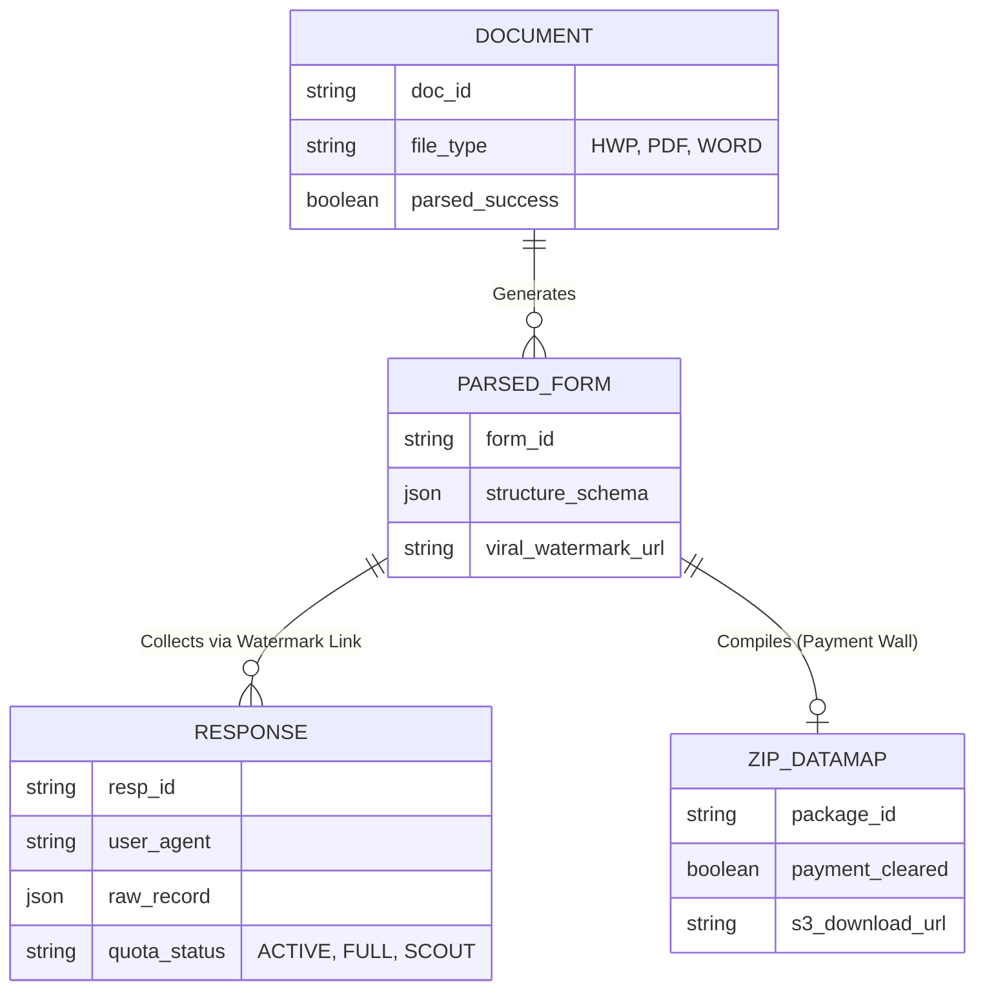

# AI 기반 문서(HWPX/Word/PDF) ➔ 설문 변환 및 무인 턴키 운영 플랫폼 PRD v0.2
- Owner 팀: Product Core Unit (Product Manager, Lead Engineer, Product Designer)
- 최종 업데이트: 2026-04-25

## 1. 개요·목표
**- 문제 정의(Pain지표 포함):**
  - **홍일반(대중):** 설문 툴의 복잡한 문항 세팅으로 인한 초기 이탈. (문항 입력 과정 중 *폼 생성 포기율 40% 이상*)
  - **최실무(기업 핵심 실무자):** 조사 종료 후 응답 엑셀 데이터를 데이터맵/할당표로 수기 코딩하는 작업 및 불성실 응답(매크로, 찍기) 수작업 클리닝. (수작업 코딩으로 인한 *야근 발생률 90% 이상*, *데이터 정제 소요 시간 일평균 4시간 초과*)
  - **유팀장(리서치 대행사):** 할당(Quota) 컨트롤 및 패널사 스크린아웃 라우팅 외주 개발. (스크립트 및 모니터링 *외부 용역비 월 평균 1,500만 원 누수*, *영업 이익률 10% 이상 타격*)
**- 목표(Desired Outcome 수치화):**
  - 3-Track 진입(문서 파싱/백지/챗봇) 및 AI 주치의 진단을 통한 폼 생성 소요 시간을 10초 이내로 단축.
  - 별도 조작 없이 대행사급 "5종 데이터맵/변수가이드/할당표 ZIP 패키지 + AI 내러티브 리포트"를 자동 산출(생성 대기시간 5초 이내).
  - AI Data Bouncer를 통한 실시간 불성실 응답 자동 차단으로 클리닝 인건비 제로화.
  - 100% 노코드 기반 쿼터 제어로 조사업체 외주 개발비 100% 절감(0원화).

**- 성공 지표(북극성/보조 KPI):**
  - **북극성 KPI (North Star KPI):** 유료 '5종 데이터맵 ZIP + AI 리포트 패키지' 다운로드 완료 건수
    - **통제/목표:** 기준선 0건 ➔ 목표 월 10,000건 달성
    - **측정 주기 및 경로:** 매주(Weekly) 집계 / PG 결제 완료 콜백 API 호출 수 및 DB상 `payment_cleared = true` 레코드 스캔 (Amplitude 대시보드에 이벤트 전송).
  - **보조 KPI 1:** 3-Track 폼 생성 완료율
    - **통제/목표:** 95% 이상 방어
    - **측정 주기 및 경로:** 매일(Daily) 집계 / 파싱 파이프라인(DataDog APM) 상 `doc_id` 인입 건수 대비 정상적으로 `form_id`가 발급된 응답 비율 확인.
  - **보조 KPI 2:** 바이럴 폼 하단 '워터마크' 유입 대비 서비스 가입 전환율
    - **통제/목표:** 기준선 0% ➔ 목표 5% 이상 달성
    - **측정 주기 및 경로:** 주간(Weekly) 집계 / 워터마크 버튼에 달린 `utm_source=watermark` 파라미터 클릭 유입 수 대비 실제 회원가입 완료 수 (GA4 퍼널 분석).
  - **보조 KPI 3:** AI Data Bouncer의 불성실 응답 자동 차단율
    - **통제/목표:** 90% 이상 무의미/매크로 응답 식별 및 차단
    - **측정 주기 및 경로:** 매일(Daily) 집계 / `quality_status`가 SUSPECT 또는 REJECTED로 마킹된 비율(Amplitude 이벤트 추적).

## 2. 사용자와 페르소나
- [홍일반] (Base / 바이럴 마케터 여정): 번거로운 수작업 입력 Pain ➔ 3-Track 기반 무료 폼 생성 Needs 충족 ➔ 결과지 하단 워터마크 노출을 통한 트래픽 배달.
- [최실무] (Core / 수익 핵심 페르소나): 결과 엑셀 정제 및 응답 클리닝 수동 야근 Pain ➔ 조사 후 대행사급 5종 데이터맵 및 AI 내러티브 리포트 즉시 획득 Needs ➔ 다운로드 직전 건당 결제.
- [유팀장] (VIP / 엔터프라이즈 락인 페르소나): 패널 라우팅 및 쿼터 외주 개발비 낭비 Pain ➔ B2B 클라우드 운영 인프라 Needs ➔ 연간 라이선스 전환.
- [송원장] (Extreme / 보안 타겟): 사내 망분리 규제로 퍼블릭 SaaS 도입 불가 Pain ➔ CSAP 통과 프라이빗망 구축 Needs.

## 3. 사용자 스토리와 수용 기준(AC, Acceptance Criteria)

**Story 1: 3-Track 진입 매직 및 AI 주치의 진단 (홍일반 / 최실무 공통)**
> **As a** 설문 작성자(기획자/일반인), **I want** 질문지가 적힌 워드/HWPX 문서를 시스템에 업로드하여 즉시 설문 폼을 자동 생성하고 싶다, **so that** 문항을 복사-붙여넣기하는 지루한 입력 노동을 없앨 수 있다.
- **AC 1 (정상 처리):** Given 50문항 이내(텍스트 5MB 이하)의 HWPX/Word/PDF 파일 또는 대화형 프롬프트가 주어졌을 때, When [3-Track 폼 생성] 버튼을 클릭하면, Then **10초(10,000ms) 이내**에 파싱/렌더링이 완료되어야 한다.
- **AC 2 (정확도 검증):** Given 변환된 폼을 검토할 때, When 원본 문서의 항목 수와 DB 스키마(`structure_schema`)를 연산 비교하면, Then 파싱 누락으로 인한 **데이터 손실률이 1% 미만**이어야 한다.
- **AC 3 (기능 검증):** Given 무료 사용자가 생성한 폼에 응답자가 접속할 때, When 화면이 로드되면, Then 하단 뷰포트에 **워터마크 배너가 100% 렌더링(노출)**되어야 한다.
- **AC 4 (예외 처리 - 🚨신규):** Given 암호가 걸려있거나 손상된 파일, 혹은 지원 범위 외의 확장자(.txt 등)를 업로드했을 때, When 파싱을 시도하면, Then **2초 이내에 명확한 실패 사유가 포함된 에러 모달(Error Code: 400)**을 띄우고 상태를 `FAILED`로 기록해야 한다.
- **AC 5 (AI 주치의 진단 - 🚨신규):** Given 업로드된 원본 문서에 논리적 오류가 존재할 때, When 파싱 완료 후 렌더링 되면, Then **UI에 문항 수정 가이드 팝업이 즉시 노출**되어야 한다.

**Story 2: 5종 산출물 ZIP 및 AI 내러티브 리포트 턴키 출하 (최실무 캐시카우 핵심)**
> **As a** 신사업 기획 실무자, **I want** 데이터 수집 종료 직후 5종 패키지와 AI 서술형 리포트를 다운로드하고 싶다, **so that** 응답 내용을 일일이 숫자와 코드로 변환하는 수작업 야근을 즉시 퇴근으로 바꿀 수 있다.
- **AC 1 (정상 연동):** Given 조사가 종료(수집 마감)되었을 때, When 대시보드에서 [보고용 데이터 패키지 다운로드] 버튼을 누르면, Then **3초 이내**에 PG사 결제 모듈 프레임이 오류 없이 팝업되어야 한다.
- **AC 2 (정확도 검증):** Given 다운로드된 데이터맵(Data Map) 파일에 대해, When 백엔드 데이터 검증을 수행했을 때, Then 전체 응답자 레코드 중 형식 불일치나 **결측치(Missing value) 처리 실패율이 0%**임이 보장되어야 한다.
- **AC 3 (AI 리포트 검증 - 🚨신규):** Given 결제 완료 후, When ZIP 패키지가 다운로드되면, Then 패키지 내부에 **마크다운 형식의 통계 요약 AI 리포트가 누락 없이 포함**되어야 한다.
- **AC 4 (예외 처리):** Given 결제 진행 중 유저가 창을 닫아 도중 이탈(Cancel) 하거나 잔액 부족으로 결제 실패 코드를 수신받았을 때, When 시스템이 이를 감지하면, Then DB의 `payment_cleared=false`를 유지하고 ZIP 파일의 **안전한 S3 다운로드 서명 URL 발급을 즉각 차단(403 Forbidden)**해야 한다.

**Story 2-1: AI 실시간 응답 품질 관리 (Data Bouncer) (🚨신규)**
> **As a** 조사를 진행 중인 실무자, **I want** 수집되는 응답 중 불성실 패턴을 AI가 실시간으로 감지하여 무효 처리해주길 원한다, **so that** 알바생의 클리닝 작업을 무인화할 수 있다.
- **AC 1 (판단 속도):** Given 폼 제출 시, When AI Data Bouncer가 검증을 수행하면, Then **500ms 이내에 응답의 유효성을 판단**하여 상태를 기록해야 한다.
- **AC 2 (UI 연동):** Given 무효 응답이 발생했을 때, When 관리자가 대시보드에 진입하면, Then 해당 응답은 카운트에서 제외되나 **'의심 응답 휴지통' 탭에서 별도로 조회 및 복원이 가능**해야 한다.

**Story 3: 동적 쿼터/라우팅 인프라 (유팀장 VIP 핵심)**
> **As a** 리서치 에이전시 운영팀장, **I want** 엑셀 파일 업로드 기반 노코드로 동적 다중 쿼터(성별x연령x지역)와 외부 패널사 라우팅(Redirect)을 제어하고 싶다, **so that** 주말 모니터링 알바비와 조사별 외주 스크립트 개발비를 지출하지 않고 마진을 100% 수취할 수 있다.
- **AC 1 (정상 처리):** Given 패널 연동을 세팅할 때, When 상태별 포스트백 링크(성공/스크린아웃/쿼터풀)를 UI에서 입력하면, Then 해당 웹훅 및 **라우팅 실패로 인한 패널 이탈률이 0.1% 미만**으로 통제되어야 한다.
- **AC 2 (쿼터 검증):** Given 교차 쿼터 목표치(예: 20대 여성 100명)에 이미 도달했을 때, When 100번째 응답자 이후 조건 합치자가 진입하면, Then 트래픽 초과로 인한 **Over-quota 수용 오차율이 1% 이내**여야 하며 즉시 '할당초과(Quota Full)' URL로 리다이렉션 시켜야 한다.
- **AC 3 (예외 처리 - 🚨신규):** Given 동시 접속자가 1,000명을 초과하는 트래픽 스파이크 상황에서, When 쿼터 카운트 로직을 수행할 때, Then 연산 병목으로 인한 **DB 데드락(Deadlock)이 발생하지 않아야 하며**, 쿼터 연산 레이턴시가 1초를 초과할 경우 모니터링 시스템(DataDog)으로 **경고(Alert)를 발송**해야 한다.

## 4. 기능 요구사항(Functional)
우선순위(MSCW) 결정 근거: 사용자가 지갑을 열게 만드는 기능(데이터 추론기) 최우선 배치, 디자인 템플릿(꾸미기) 철저 배제.

- **[Must] 3-Track 진입 매직 + AI 설문 주치의:**
  - **차별 가치 (Differential Value):** 기존 구글폼/네이버폼의 인간 수기 입력 소요 시간(50문항 기준 평균 30분) 대비, 3-Track 모듈 소요 시간을 **10초로 선형 단축하여 작업 시간 효율을 18,000% 향상**시킬 뿐만 아니라, **AI 주치의를 통한 실시간 문항 논리 교정**으로 조사의 전문성까지 보장함.
- **[Must] 5종 데이터맵 컴파일러 + AI 내러티브 리포트 (ZIP 추출기):**
  - **차별 가치 (Differential Value):** 대행사 이용 시 소요되는 데이터 맵핑 대기 시간 '최소 24시간'을 **'조사 종료 즉시(5초 이내)'로 단축**하고, 수백만 원 대의 지출을 통합 **'29,900원' 수준으로 설정해 99% 비용 절감 효과 창출**. (단순 Raw 엑셀이 아닌 5종 산출물 및 서술형 AI 리포트 포함).
- **[Must] AI 실시간 응답 품질 관리 (Data Bouncer):**
  - **차별 가치 (Differential Value):** 기존 리서치 펌에서 알바생을 고용해 수일간 수행하던 데이터 클리닝 작업을 500ms 단위 실시간 자동화로 전환하여 **데이터 정제 인건비를 100% 절감(0원화)**.
- **[Must] 다운로드 잠금 기반 결제 월(Paywall) UI:**
  - Aha-Moment(데이터맵 다운로드) 기반 강력한 록인(Lock-in) 장치 설계. 결제 미완료 시 출력 차단 기능 필수.
- **[Should] 노코드 동적 다중 쿼터 세팅 UI (B2B 에이전시 락인용):**
  - **차별 가치 (Differential Value):** 외부 스크립터 고용으로 발생하는 커스텀 쿼터 개발 리드타임(최소 2~3일)과 외주 비용(건당 최소 10만 원)을 **전면 클라우드 노코드 조작 체계(소요시간 5분, 외주비 0원)로 100% 내재화**.
- **[Won't] 화려한 에디터 템플릿 / 색상 및 폰트 변경툴:** 초기 사업 목표인 '분석 데이터 결과물 출하 자동화'에 부합하지 않으며, 구매 결정 요소와 무관하여 V1 MVP 개발 스펙에서 배제함.

## 5. 비기능 요구사항(NFR, Non-Functional Requirement)
- **성능 (Performance):** 
  - 모바일 및 웹 설문 응답 패킷 지연성: p95 응답 시간 **≤ 300ms** (동시 1,000명 접속 기준 응답 유실 방지).
  - LLM 기반 파생 레이턴시: PDF/HWP 문서 파싱 완료까지 최대 대기 시간 **≤ 15초**.
- **신뢰성 (Reliability):** 시스템 SLA 가용률 월 **≥ 99.9%**, 파싱 코어 오류 및 시스템 에러율 **≤ 0.5%**.
- **보안 및 규정 준수 (Security & Privacy):** 업로드된 파일 원본 및 임시 처리 파편은 클라우드 스토리지 로드 후 작업 종료 시점 24시간 내 영구 삭제(Zero-Retention). AES-256 디스크 암호화 사용.
- **모니터링 항목 (Monitoring):** DataDog 등 APM 적용. '과금/결제 모듈 실패율(분 단위 임계치 초과 시 PagerDuty 호출 Alert)', '쿼터 100% 도달량 (Slack 자동 알림)'.

## 6. 데이터·인터페이스 개요

- **주요 외부 리소스(API) 의존성:** 
  - **Payment API:** PG사(토스페이먼츠 등) 단건 결제 및 연간 빌링 API.
  - **Routing/Postback API:** Cint, Toluna 등 거대 패널 프로바이더 간의 상태(Status) 리다이렉션 웹훅 규격 준수.

## 7. 범위(In/Out), 리스크·가정·의존성
- **In-Scope (범위 내):** 3-Track 기반 진입 및 AI 주치의 진단 폼 렌더링, AI Data Bouncer 기반 실시간 응답 클리닝, 5종 데이터맵/코드북 ZIP 추출, AI 서술형 리포트 생성, PG 연동 단건 결제.
- **Out-of-Scope (범위 외):** 자사 응답 패널(앱테크 등) 직접 설계 미포함, 복잡한 분기(Branching) 에디터 UI 직접 수정판 고도화 설계(1차 MVP 제외).
- **리스크 (Risks):**
  1. HWP 내부의 복잡한 표나 수식을 파싱할 때 붕괴될 확률(LLM 정밀도 한계). 
  2. 돈을 쓸 실무자(최실무)가 ZIP 팩의 퀄리티 시연을 보지도 않고 '결제월' 앞에서 이탈할 우려.
  3. 바이럴 폼 급증에 따른 비례적 서버(DB R/W 및 모델 Inference) 비용 폭증.
- **가정 및 의존성 (Assumptions & Dependencies):** HWP 파싱 오픈소스/클라우드 전환 시점에서의 안정성이 보장될 것이란 가정 하에 개발 진행.

## 8. 실험·롤아웃·측정
- **실험 설계(Design): A/B 테스트 (실무자 커뮤니티 N=500명 대상)**
  - 대조군(A): 산출물 출력 버튼 클릭 시, "데이터맵/변수 패키지 결과 미리보기 샘플만 3줄 스크린에 제공" ➔ 이후 결제 유도.
  - 실험군(B): 결과 미리보기 없이 오직 "완성된 5종 압축파일 + AI 리포트 다운로드(1회권: 29,900원)" 버튼만 다이렉트 배치.
- **측정 도구(Metrics):** 
  - **KPI:** 그룹별 구매 전환율(Conversion Rate), 평균 결제 리드타임(s).
  - 성공 기준: B안 혹은 A안 중 유료 결제 전환율이 통계적 유의미(p<0.05)하게 높은 UX 채택(목표 전환율: 5% 돌파 시 PMF 도달로 판정).
- **경쟁 벤치마크 (Benchmarks):** '타입폼(Typeform)'의 모바일 폼 체류시간 및 중도 이탈률(보통 20%) 대비 자사 폼 파싱/응답 이탈률을 15% 미만으로 방어할 것.

## 9. 근거(Proof)
- **페르소나 리서치 근거:** 기존 시장 분석 TAM-SAM-SOM 문서(Q1, Q2 사분면) 및 `8번 JTBD 심층 인터뷰 결과` (기획자/마케터 그룹의 데이터 가공 수동 야근 빈도).
- **의사결정 논거:** 본 VP 전략(수익창출 2Face 전환 구조)에 따라 '예쁜 기능 개발을 배제'하고, '후처리 인건비 삭제 및 턴키 다운로드 자동화'에 MVP의 95% 역량을 투자. (Ref: 8-3_Gemini-GPT_Merged_ValueProposition.md)
