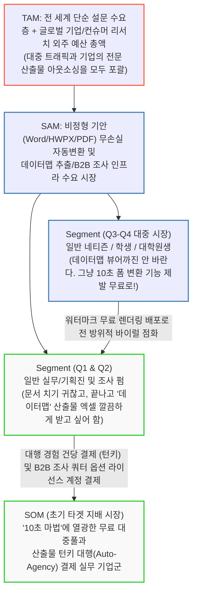

# [시장 규모 분석 보고서] TAM-SAM-SOM 타겟 선정 및 Segment Map
**– 전 국민 문서 변환 트래픽과 하이엔드 데이터 산출물 마켓의 양동 파이프라인 –**

## 1. 시장 구조 시각화 (TAM-SAM-SOM 및 피라미드 융합 생태계)

우리 비즈니스는 대중의 무료 트래픽 발 구름과 바이럴을 엔진(Engine) 삼아, 시장에 막대한 돈(예산)을 푸는 **[실무 기획진 및 마켓 리서치 대행 시장]**의 결제 파이를 집중적으로 흡입하는 3계층 피라미드 수익 생태계입니다.

## 2. TAM-SAM-SOM 입체적 상세 정의

'단순한 무료 폼(트래픽)'과 '전문 산출물(과금)'의 결합 전략으로 배제하는 타겟 없이 전선을 덮습니다.

| 구분 | 시장 정의 관점 | 타겟 수요 및 비즈니스 범위 (Scope) | 근거 및 차별 우위 |
| --- | --- | --- | --- |
| **TAM** (전체) | **전 세계 설문 트래픽 생산자 + 데이터 코드북 등 데이터마이닝 외주 시장 총합** | 단 한 푼도 쓰지 않는 전 세계 구글 폼 이용자부터, 데이터맵/코드북 명세와 패널 연동을 위해 에이전시에 집행하는 수천만 원 단위의 연구 용역 예산 시장 전체. **국내 리서치 시장만으로도 엠브레인·한국리서치·한국갤럽 등이 연 수천억 원의 프로젝트를 수행.** | 껍데기는 구글처럼 범용으로 뚫어 대중을 포용하고, 알맹이는 데이터맵부터 쿼터/라우팅까지 조사 펌 수준이라 전통적인 오프라인 대행 영역의 자산까지 TAM이 됨. |
| **SAM** (유효) | **3-Track 설문 생성(문서 파싱 + 백지 + AI 대화형) 및 프로페셔널 데이터 산출물 마켓** | 복잡한 병합 표 파일(HWPX 등)을 모바일 폼으로 고치고 싶어 앓는 시장, AI와 대화만으로 설문을 설계하고 싶은 시장, 그리고 수동으로 엑셀 데이터맵을 맞추고 외부 패널 연동 개발을 하느라 몸살을 앓는 타겟 인구의 총합. | 한국형 악성 문서를 찢는 AI 파싱 엔진 + AI 대화형 설문 설계의 '진입장벽'과 개발자 없이 엑셀 4대 세트(데이터맵 포함)를 자동 출력해주는 결과물의 '과금 혁신'이 당사 고유 점유율 파이. |
| **SOM** (초기) | **워터마크에 올라탄 기획 실무/대행 종사자 (투페이스)** | **[Base: 일반 유저]** 바이럴의 1등 공신. 예컨대 대학생 1천 명이 하단 마크가 달린 투표 폼 뿌림. **[Target: 기업 실무진 & 조사업체]** 폼을 받아보고 유입되어, 자사 서류를 등록하고 턴키 기능(데이터맵 출력/쿼터 컨트롤/라우팅)의 편의성에 압도되어 카드 결제. | "구글처럼 열어 꽁짜로 마케팅하고, 대행사처럼 깔끔하게 산출물을 납품해 돈을 받는다." 라는 완벽한 캐시 매트릭스 순환 작동. |

---

## 3. Market Segment Map (본질 중심의 3계층 지배 사분면 매트릭스)

이번 매트릭스의 축은 **"문서 기안을 자기가 세팅해야 직성이 풀리는가?(DIY 의향)"** 그리고 **"단순 차트나 엑셀 다운로드가 아니라 데이터맵/변수가이드 등 '전문 도출 파일'이 필요한가?"**로 나뉩니다.

| 구분 | **X축: 세팅 전문성 보유 / 직접 툴을 만지고 통제해야 함 (설문제작회사 층)** | **X축: 조작 극도로 귀찮음 / 내 문서 줄 테니 대행사처럼 다 해와라 (대중/실무 기획층)** |
| --- | --- | --- |
| **Y축: 프로페셔널 산출물/조사망 (데이터맵, 엑셀 가이드, 패널라우팅, 쿼터 제어 필수)** | **[Q2 영역 / B2B SaaS 구독형 락인]** 👉 **전문 설문 조사 대행사 / 리서치 펌** - **특징**: "문서 폼 배제는 기본이고, 직원들 야근시키는 데이터맵 수작업 엑셀 매핑, 그리고 쿼터 동적 통제와 패널 완료망 3단 연결을 해야만 돈이 나온다." - **당사 전략**: 무손실 파싱 바탕 위에 엑셀 동적 쿼터 서버와 통신 리다이렉트를 장착한 백엔드를 고가 연간 라이선스로 숨겨두어 인건비 지출을 완전 폐기시키는 VIP 지대. | **[Q1 영역 / 기업 B2B·B2C AI 턴키 캐시카우]** 👉 **일반 기업 기획 및 마케터 실무군** - **특징**: "툴 만지기 싫다니까? 우리 회사 품의서 문서 던질 테니 그거 폼 만들어 뿌려주고, 나중에 엑셀이랑 변수가이드 데이터맵 팩으로 싹 묶어서 납품해!" - **당사 전략**: 굳이 에디터 창을 익히지 않아도 무인 버튼(Auto)으로 최종 4대 파일 출하해 주어 단건 결제를 폭발시키는 주력 대행 층. |
| **Y축: 고도화 산출물까진 불필요 (참석 여부, 과제 조사 등 단순 엑셀로 충분/쿼터노관심)** | **(수요 없음. 전문가가 단순한 것만 하진 않음)** | **[Q3·Q4 병합 대중 무한계 지대 / 트래픽 토양]** 👉 **일반 대학생 초년층, 소상공인, 일반 네티즌** - **특징**: "10시간 걸릴 노가다를 아무 한글 문서나 툭 던져도 예쁘고 스마트폰 폼으로 단번에 바꿔주네? AI에게 '이런 조사 하고 싶어'라고 말했더니 설문이 뚝딱? 영구 무료에 개꿀!" - **당사 전략**: (절대 포기해선 안 될 바이럴 엔진) 비용 없이 무한 무료 변환·AI 대화형 설계를 허용함. 단, 폼 버튼 구석마다 지워지지 않는 **[AI 무인 10초 폼 생성 매직. 지금 해보기] 워터마크**를 부착 유포하게 하여 끊임없이 Q1/Q2 기업 실무층 고객을 물어다 주는 사냥개로 편입시킴. |

### 💡 매트릭스 및 전략 요약
결국 우리의 포지션은 일반 유저의 구글 폼, 기업의 타입폼 그리고 그 뒤에 숨어있는 조사업체들을 하나의 튜브로 연결한 것입니다. 
**1) 징그러운 문서를 10초 만에 살려내는 '파싱 마법'을 미끼로 삼아 Q3/Q4의 전 세계 무료 대중**들을 스스로 앵벌이 삼아 퍼트리게 합니다.
**2)** 그 소문을 타고 들어온 실무진(Q1)에게 오프라인 대행사가 외주비로 받던 **'4종 데이터냅 압축 패키지 출하 기능'의 턴키 결제**로 돈을 쓸어 담으며, 마침내 **3)** 소문을 듣고 유입된 컨서비 급 조사/리서치 펌(Q2)에게는 은밀하게 숨겨둔 **'동적 쿼터 및 3단 라우팅 패널 엔진'**을 과시하며 엔터프라이즈 장기 노예 계약(Lock-in)을 맺습니다. 이 모든 것이 한 흐름입니다.
