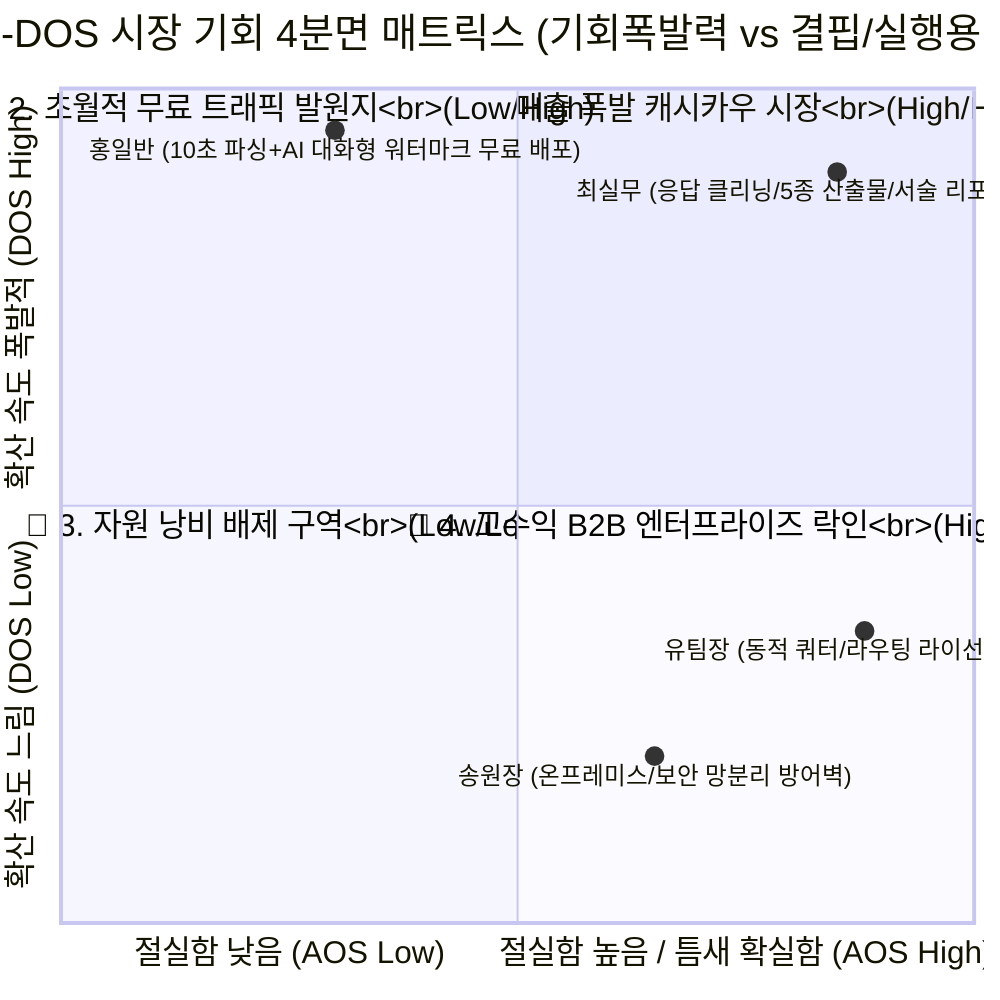

# 🚀 9. AOS-DOS 기반 시장기회 정리 (Market Opportunity Summary)

본 문서는 **"3-Track 진입(10초 문서 파싱 / 백지 커스텀 / AI 대화형 설계) ➤ 데이터맵 턴키 대행 ➤ 하이엔드 라우팅 개방"**으로 이어지는 당사의 3계층 생태계 피라미드가, 기능 수준을 넘어 '진정한 폭발력'을 지녔는지 수치적으로 입증하는 GTM(시장 진입) 최종 전략 지표입니다.

---

## 1. 페르소나별 핵심 Pain 측정 (Importance & Satisfaction 검증)

우리는 더 이상 버리는 타겟이 없습니다. 세 집단의 각기 다른 고통(결핍의 크기)이 맞물려 거대한 파이프라인 수로를 형성합니다.

| 3계층 전략 타겟 | 핵심 환호 포인트 (Aha-Moment) | Importance (중요도) | Satisfaction (대체재 만족도) | AOS/DOS 검증결과 요약 (Insight) |
| :--- | :--- | :---: | :---: | :--- |
| **[Q1] 최실무** (캐시카우 확산) | **AI 설문 주치의 10초 파싱 + 응답 클리닝 + 5종 엑셀 산출물 및 AI 내러티브 리포트 자동 납품** | **5** (필수) | **2** (어려움) | 시장 내 글로벌 폼들의 가장 큰 약점(데이터 산출물 부재)을 정조준. 절실함(AOS)도 최고, 부서 카드 소액 결제로 퍼지는 확산성(DOS)도 최고인 **1순위 황금 지대**. |
| **[Q4] 유팀장** (VIP B2B 락인) | **엑셀 UI 연동 다이나믹 쿼터 통제 / 3단 패널 라우팅** | **5** (생존) | **1.5** (극악) | 조사업체들의 가장 치명적인 알바/외주 인건비 낭비를 0원으로 파괴. 한 번 팔면 해지 불가능한 **초고수익 장벽 지대(Moat)**. 확산 속도는 비교적 보수적임. |
| **[Q2] 홍일반** (바이럴 트래픽) | **초극강의 진입 장벽 파괴 (버튼 하나로 문서 10초 변환 + AI 챗봇 대화로 설문 완성)** | **3** (보통) | **3.0** (대체있으나 아쉬움) | 이들은 구글 폼이나 왈라·틸리언 프로 등 국내 대체재로도 어느 정도 만족하지만, 당사의 **AI 대화형 설문 설계**라는 독보적 체험에 기대어 무수한 워터마크 폼을 배포함. 기능 절박성은 낮아도 **전파 확산력(DOS)은 핵폭탄급**인 지대. |
| **[Q4] 송원장** (보안 특수군) | **K-CSAP 망분리 및 문서 서식 무결성 등 프라이빗 설계** | **5** (필수) | **4** (종이) | 수익 락인은 확고하나 도입 방어벽과 보안 심사가 높아 당장 집중할 MVP는 아님. (중장기 SI 모델로 편제) |

---

## 2. AOS-DOS Combined Matrix 시각화 (3계층 매트릭스 맵)

아래 4분면은 당사가 **어떤 시장을 이용해 트래픽(마케팅)을 일으키고(Q2), 어떤 시장에서 당장 초기 현금(Q1)을 쓸어담으며, 궁극적으로 어디에 말뚝을 박아(Q4) 시장을 지배할지** 직관적으로 도식화합니다.

*   **X축 (AOS, 실행 용이성 & 결핍 절실도):** 우측으로 갈수록 대안 부재에 대한 고통이 커서 즉시 지갑을 열고 당사의 솔루션을 도입합니다 (PMF 적중).
*   **Y축 (DOS, 기회 크기 & 확산 폭발력):** 상단으로 갈수록 유저들끼리 제품을 추천하고 퍼 나르는 바이럴 K-Factor가 초월적입니다.

---

## 3. 전략 종합: GTM(Go-To-Market) 타임라인 의사결정

글로벌 SaaS들은 오로지 기능 한-두 개만 들고 시장에 돌격하지만, 당사는 이 4분면 전체를 유기적 톱니바퀴로 전환시킵니다. 

1. **🚀 Phase 1 (Q2 공격: 무한 트래픽 점화)** 
   * 최우선 런칭 기능은 거창한 B2B 옵션이 아닙니다. **누구나 파일만 던지면 모바일 폼이 나오고, AI 챗봇과 대화만으로 설문이 완성되는 '3-Track 진입 매직'**으로 Q2(홍일반) 그룹에게 던져줍니다. 이들이 폭발적인 DOS 점수를 앞세워 온 세상 직장인들의 카카오톡과 커뮤니티에 **[워터마크 폼]**을 수백만 개 살포하게 방치합니다 (마케팅비 0원의 기적 달성).
2. **💰 Phase 2 (Q1 공격: 턴키 현금 긁어오기)** 
   * 워터마크 꼬리를 밟고 유입된 수많은 사무직/실무자층에게 **"네가 지금 만든 폼에서 응답이 100개 채워졌네? 불성실 응답은 우리가 AI로 다 걸러냈고, 만 원만 결제하면 엑셀 ZIP팩(데이터맵, 할당표 포함)은 물론 서술형 AI 내러티브 리포트까지 대행사처럼 깔끔하게 내려줄게!"**라고 포위합니다 (가장 완벽한 압도적 AOS 구역 타격). 
3. **🏰 Phase 3 (Q4 공격: VIP 성벽 구축)** 
   * 이제 돈이 쌓이고 플랫폼이 소문이 났으니, 폼 빌딩 인건비와 뒷단 엑셀 쿼터 제어 때문에 고통받던 시장의 큰손 '전문 조사업체(유팀장)'들이 스스로 찾아옵니다. 이때 화면 이면에 설계되어 있던 **다이나믹 쿼터 제어망과 외부 패널 3단 라우터**를 펼쳐 보이며 수천만 원 규모의 폐쇄적 기업 라이선스를 밀어 넣어 시장에서 아무도 이탈하지 못하는 엔터프라이즈 락인(Moat)을 완성합니다.
