# Software Requirements Specification (SRS)

**Document ID:** SRS-001  
**Revision:** 1.1 (C-TEC 스택 전환 적용)  
**Date:** 2026-04-21  
**Standard:** ISO/IEC/IEEE 29148:2018  
**Tech Stack:** Next.js App Router + Vercel + Supabase + Gemini API (C-TEC-001~007)  

---

## 1. Introduction

### 1.1 Purpose

본 SRS(Software Requirements Specification)는 **AI 기반 문서(HWP/Word/PDF) → 설문 변환 및 턴키 운영 플랫폼**(이하 "시스템")에 대한 소프트웨어 요구사항을 정의한다.

본 문서가 해결하고자 하는 핵심 문제는 다음과 같다:

| 대상 사용자 | 핵심 문제(Pain) | 정량 지표 |
|---|---|---|
| 홍일반(대중) | 설문 툴의 복잡한 문항 세팅으로 인한 초기 이탈 | 폼 생성 포기율 40% 이상 |
| 최실무(핵심 실무자) | 조사 종료 후 엑셀 응답 데이터를 데이터맵/변수가이드로 매핑하는 수동 작업 | 수작업 코딩 야근 발생률 90% 이상, 데이터 정제 소요 시간 일평균 4시간 초과 |
| 유팀장(대행사) | 할당(Quota) 컨트롤 및 패널사 스크린아웃 라우팅 외주 개발 | 외부 용역비 월 평균 1,500만 원 누수, 영업 이익률 10% 이상 타격 |

본 SRS는 프로젝트의 모든 이해관계자(개발팀, QA팀, 제품 관리자, 비즈니스 이해관계자)를 대상으로 하며, 시스템 설계·구현·테스트·검증의 기준 문서로 활용된다.

### 1.2 Scope (In-Scope / Out-of-Scope)

#### 1.2.1 In-Scope

| 항목 | 설명 |
|---|---|
| IS-01 | HWP/Word/PDF 비정형 문서 파싱 및 설문 폼 자동 생성 |
| IS-02 | 모바일/웹 기반 설문 응답 수집 |
| IS-03 | 데이터맵/코드북/변수가이드/응답 원본 엑셀 4종 ZIP 패키지 자동 생성 및 다운로드 |
| IS-04 | PG사 결제 연동(Paywall) 기반 유료 산출물 판매 |
| IS-05 | 노코드 동적 다중 쿼터(성별×연령×지역) 세팅 UI |
| IS-06 | 외부 패널사(Cint/Toluna) 라우팅(Redirect) 제어 |
| IS-07 | 워터마크 기반 바이럴 트래픽 유입 메커니즘 |
| IS-08 | 모니터링·알람(Vercel Analytics, Slack Alert) 연동 |

#### 1.2.2 Out-of-Scope

| 항목 | 설명 |
|---|---|
| OS-01 | 설문 패널(앱테크) 자체 구축 사업 진출 |
| OS-02 | 브랜치(방향 분기형) 에디터 고도화 |
| OS-03 | 화려한 에디터 템플릿 / 폰트 커스터마이징 |
| OS-04 | 문서 내 이미지/수식 파싱 (V1.0 제외) |
| OS-05 | CSAP 인증 프라이빗망 구축 (향후 엔터프라이즈 로드맵) |

#### 1.2.3 Constraints (제약사항)

| ID | 유형 | 제약사항 |
|---|---|---|
| CON-01 | 기술 | HWP 문서 내부 복잡한 표/수식 파싱 시 AI 정밀도 한계 존재; 정형 텍스트 기반 파싱에 한정 |
| CON-02 | 비용 | 단건 파싱 원가 상한 20원(KRW); MVP 월간 인프라 총 예산 무료~최대 100,000원(KRW) 한도 |
| CON-03 | 운영 | 무료 계정 일일 파싱 횟수 3회 제한(Rate Limit) — ADR-02 |
| CON-04 | 보안 | 원본 문서/파편 데이터 작업 종료 후 24시간 이내 영구 삭제(Zero-Retention) |
| CON-05 | 인프라 | Vercel AI SDK + Google Gemini API를 사용하며, 환경 변수 설정만으로 모델 교체가 가능하도록 SDK 표준 인터페이스를 준수한다 |
| C-TEC-001 | 아키텍처 | 모든 서비스는 **Next.js (App Router)** 기반의 단일 풀스택 프레임워크로 구현한다. 프론트엔드와 백엔드를 별도 분리하지 않는다. |
| C-TEC-002 | 아키텍처 | 서버 측 로직(DB 접근, API 호출 등)은 Next.js의 **Server Actions 또는 Route Handlers**를 사용하여 별도의 백엔드 서버 없이 구현한다. |
| C-TEC-003 | 데이터베이스 | 데이터베이스는 **Prisma + 로컬 SQLite**(개발)를 사용하고, 배포 시 **Supabase(PostgreSQL)**를 사용하여 인프라 설정 복잡도를 최소화한다. |
| C-TEC-004 | UI | UI 및 스타일링은 **Tailwind CSS**와 **shadcn/ui**를 사용하여 일관된 디자인 코드를 생성하도록 강제한다. |
| C-TEC-005 | AI | LLM 오케스트레이션은 별도의 Python 서버 없이 **Vercel AI SDK**를 사용하여 Next.js 내부에서 직접 구현한다. |
| C-TEC-006 | AI | LLM 호출은 **Google Gemini API**를 기본으로 사용하며, 환경 변수 설정만으로 모델 교체가 가능하도록 SDK의 표준 인터페이스를 준수한다. |
| C-TEC-007 | 배포 | 배포 및 인프라 관리는 **Vercel 플랫폼**으로 단일화하며, CI/CD 설정 없이 **Git Push만으로 배포를 자동화**한다. |

#### 1.2.4 Assumptions (가정)

| ID | 가정 |
|---|---|
| ASM-01 | 업로드 문서는 50문항 이내, 텍스트 5MB 이하로 제한된다 |
| ASM-02 | PG사(토스페이먼츠 등) API는 안정적으로 제공된다 |
| ASM-03 | Supabase 서비스(PostgreSQL + Storage)의 가용성은 99.9% 이상이다 |
| ASM-04 | 외부 패널사(Cint/Toluna)의 Redirect 규격은 표준 HTTP 302 방식이다 |
| ASM-05 | Google Gemini API는 안정적으로 제공되며, Free Tier 쿼터가 MVP 초기 트래픽에 충분하다 |
| ASM-06 | Vercel Pro 플랜($20/월)의 Serverless Function 타임아웃(60초)과 동시 실행 수는 MVP 운영에 충분하다 |
| ASM-07 | Supabase Free 티어(500MB DB, 1GB Storage, 50,000 MAU)는 MVP 초기 운영에 충분하다 |
| ASM-08 | Vercel KV Free 티어(일일 3,000 요청)는 MVP 쿼터 카운트 연산에 충분하다 |

### 1.3 Definitions, Acronyms, Abbreviations

| 용어 | 정의 |
|---|---|
| **파싱(Parsing)** | 비정형 문서(HWP/Word/PDF)에서 설문 문항 구조를 자동 추출하는 과정 |
| **데이터맵(Data Map)** | 설문 응답 데이터를 분석 변수로 매핑한 코딩 가이드 문서 |
| **코드북(Codebook)** | 설문 문항 및 보기의 코드 번호와 라벨을 정의한 참조 문서 |
| **변수가이드(Variable Guide)** | 데이터 분석용 변수명·유형·값 범위를 정의한 문서 |
| **4종 ZIP 패키지** | 응답 원본 엑셀 + 변수가이드 + 코드북 + 데이터맵으로 구성된 대행사급 산출물 압축 파일 |
| **쿼터(Quota)** | 조사에서 특정 인구통계학적 그룹별로 목표 응답 수를 제한하는 할당 체계 |
| **스크린아웃(Screen-out)** | 조건 미달 응답자를 조사에서 제외하는 프로세스 |
| **워터마크(Watermark)** | 무료 생성 폼 하단에 노출되는 브랜드 배너/링크 |
| **Next.js App Router** | Next.js 13+ 에서 도입된 파일 시스템 기반 라우팅 체계; 서버 컴포넌트와 클라이언트 컴포넌트를 혼합 사용 |
| **Server Actions** | Next.js에서 서버 측 로직을 클라이언트 컴포넌트에서 직접 호출할 수 있는 함수 |
| **Route Handlers** | Next.js App Router에서 RESTful API 엔드포인트를 정의하는 서버 측 핸들러 (`/app/api/` 경로) |
| **Vercel AI SDK** | Vercel이 제공하는 LLM 통합 SDK; `generateObject()`, `streamText()` 등 표준 인터페이스로 다양한 AI 모델을 호출 |
| **Prisma** | Node.js/TypeScript용 ORM(Object-Relational Mapping); 스키마 정의 → 타입 안전 DB 쿼리 생성 |
| **Supabase** | PostgreSQL 기반 오픈소스 BaaS(Backend-as-a-Service); DB, Storage, Auth, Edge Functions 통합 제공 |
| **Vercel KV** | Vercel 플랫폼의 Redis 호환 키-밸류 저장소; 원자적 INCR 연산 지원 |
| **Vercel Cron** | Vercel 플랫폼의 예약 작업 실행 기능; `vercel.json`에서 cron 표현식으로 설정 |
| **shadcn/ui** | Tailwind CSS 기반의 재사용 가능한 React UI 컴포넌트 라이브러리 |
| **페르소나(Persona)** | 제품의 목표 사용자 유형을 대표하는 가상 인물 프로필 |
| **JTBD(Jobs to be Done)** | 사용자가 완수하고자 하는 핵심 과업(작업) 프레임워크 |
| **MoSCoW** | Must / Should / Could / Won't 우선순위 분류 기법 |
| **PMF(Product-Market Fit)** | 제품-시장 적합성이 증명된 상태 |
| **ADR(Architectural Decision Record)** | 아키텍처 관련 의사결정을 기록한 문서 |
| **SLA(Service Level Agreement)** | 서비스 수준 합의서 |
| **RPO(Recovery Point Objective)** | 데이터 복구 시점 목표 |
| **RTO(Recovery Time Objective)** | 서비스 복구 시간 목표 |
| **RBAC(Role-Based Access Control)** | 역할 기반 접근 제어 |
| **PG(Payment Gateway)** | 결제 대행 서비스 |
| **p95** | 전체 요청 중 95번째 백분위 응답 시간 |

### 1.4 References

| ID | 문서명 | 설명 |
|---|---|---|
| REF-01 | AI_Survey_Platform_PRD_v0.1 (최종 통합본) | 본 SRS의 원천(Source of Truth) PRD 문서. 아래 1.4.1에 PRD 핵심 내용 인라인 수록. |
| REF-02 | ISO/IEC/IEEE 29148:2018 | Systems and software engineering — Life cycle processes — Requirements engineering |

#### 1.4.1 PRD 핵심 내용 인라인 (Source of Truth)

> 아래는 본 SRS의 요구사항 도출 근거가 되는 PRD 핵심 내용을 직접 수록한 것으로, 별도 외부 문서 참조를 제거하고 PRD에 포함된 내용으로 치환한 것이다.

**가치 제안 (Value Proposition) 요약:**
- 기존 구글폼/네이버폼의 인간 수기 입력 소요 시간(50문항 기준 평균 30분) 대비, 파싱 모듈 소요 시간을 **10초로 선형 단축하여 작업 시간 효율을 18,000% 향상**
- 기존 리서치 대행사 이용 시 소요되는 데이터 맵핑 대기 시간 '최소 24시간'을 **'조사 종료 즉시(대기시간 5초 이내)'로 단축**, 용역 외주 비용 수백만 원 → **29,900원** 수준으로 99% 비용 절감
- 외부 스크립터 고용 커스텀 쿼터 개발 리드타임(최소 2~3일, 건당 최소 10만 원) → **전면 노코드 조작 체계(소요시간 5분, 외주비 0원)로 100% 내재화**

**페르소나 정의 (PRD §3 기반):**

| 페르소나 | 핵심 Pain | Needs | Gain |
|---|---|---|---|
| 홍일반(대중) | 설문 툴의 복잡한 문항 세팅으로 인한 초기 이탈(폼 생성 포기율 40%+) | 문서 업로드만으로 즉시 설문 폼 자동 생성 | 복사-붙여넣기 입력 노동 제거 |
| 최실무(핵심 실무자) | 조사 종료 후 엑셀→데이터맵 수작업 코딩 야근(발생률 90%+, 일평균 4시간+) | 대행사급 4종 산출물 즉시 다운로드 | 수작업 야근 → 즉시 퇴근, 비용 99% 절감 |
| 유팀장(대행사) | 할당(Quota) 컨트롤 및 패널사 라우팅 외주 개발(월 1,500만 원 누수) | 노코드 동적 다중 쿼터 및 외부 패널사 라우팅 제어 | 외주 개발비/모니터링 알바비 100% 절감 |

**JTBD 검증 결과 (PRD §3 기반):**
- Story 1 (문서 무손실 파싱): 홍일반/최실무 공통 — 문항 복사-붙여넣기 노동 제거
- Story 2 (4종 산출물 ZIP 턴키 출하): 최실무 캐시카우 — 수작업 코딩 야근 제거
- Story 3 (동적 쿼터/라우팅 인프라): 유팀장 VIP — 외주 스크립트 비용/알바비 제거

**ADR-02 Rate Limit 결정 (PRD §7 리스크 대응 기반):**
- 무료 계정 일일 파싱 횟수를 3회로 제한하여 AI 파싱 서버 비용 통제
- 캐시 서버 구축을 통해 동일 문서 해시(hash) 기반 중복 요청 비용 절감
- 업로드 전 표/이미지/수식 정확도 한계에 대한 모달 가이드 사전 노출

---

## 2. Stakeholders

| 역할(Role) | 대표 페르소나 | 책임(Responsibility) | 관심사(Interest) |
|---|---|---|---|
| 일반 설문 작성자 | 홍일반 | 비정형 문서 업로드 및 자동 생성 폼 활용 | 복잡한 문항 세팅 제거, 10초 이내 파싱 완료, 무료 사용 |
| 신사업 기획 실무자 | 최실무 | 조사 종료 후 데이터맵 ZIP 패키지 구매 및 활용 | 수작업 코딩 야근 제거, 대행사급 4종 산출물 즉시 획득, 비용 절감 |
| 리서치 에이전시 운영팀장 | 유팀장 | 노코드 쿼터/라우팅 제어, B2B 클라우드 인프라 운영 | 외주 개발비 100% 절감, 동적 다중 쿼터 자동 제어, 패널사 연동 |
| 보안 관리자 | 보안보스 | 사내 보안 규정 준수 검토 | CSAP 인증 프라이빗망 구축(향후), 망분리 규제 대응 |
| Product Manager | - | PRD 정의, 요구사항 우선순위 결정, KPI 측정 | PMF 검증, 북극성 KPI 달성 |
| Lead Engineer | - | 시스템 아키텍처 설계, 기술 구현 | 성능 목표 달성, 인프라 비용 최적화, 기술 리스크 관리 |
| Product Designer | - | UI/UX 설계, 사용자 여정 최적화 | 폼 생성 포기율 감소, 결제 전환율 향상 |
| QA Engineer | - | 요구사항 검증, 테스트 수행 | 모든 AC 충족 여부 검증, 결함 탐지 |

---

## 3. System Context and Interfaces

### 3.1 External Systems

> **스택 전환 반영:** C-TEC-001~007 기술 스택에 따라 외부 시스템 연동을 전면 재정의했다. AWS S3 → Supabase Storage, Redis → Vercel KV, OCR Engine → Gemini API 멀티모달, DataDog/PagerDuty/Amplitude → Vercel Analytics + Slack + DB 직접 집계로 전환되었다.

| ID | 외부 시스템 | 연동 방식 | 용도 | 장애 시 임시 우회 전략 (Fallback) |
|---|---|---|---|---|
| EXT-01 | PG사 (토스페이먼츠) | 토스 JS SDK + Route Handler 콜백 | 데이터맵 ZIP 패키지 결제 처리 | 내부 DB에 `payment_pending` 상태로 기록 후, PG 복구 시 재검증 처리. 사용자에게 "결제 시스템 점검 중" 안내 모달 노출. |
| EXT-02 | Supabase Storage | `@supabase/storage-js` / 서명 URL | ZIP 파일 저장 및 서명된 다운로드 URL 발급 | Vercel `/tmp` 디렉토리에 ZIP 파일 임시 저장 후 Route Handler로 직접 스트리밍 제공. Storage 복구 시 동기화. |
| EXT-03 | 패널사 (Cint/Toluna) | HTTP Redirect (302) + Postback URL | 외부 패널 라우팅(성공/스크린아웃/쿼터풀) | 라우팅 실패 시 내부 DB의 `ROUTING_CONFIG`에 사전 저장된 포스트백 URL 기반으로 재시도 큐 등록. 3회 재시도 실패 시 Slack 알림 + 응답자에게 "잠시 후 재접속" 안내 페이지 렌더링. |
| EXT-04 | Vercel Analytics + Logs | Vercel 내장 분석 | 파싱 파이프라인 모니터링, 전체 시스템 성능 추적 | 내부 DB `AUDIT_LOG` 테이블에 이벤트를 Structured JSON으로 직접 기록. Vercel 복구 시 로그 기반 역추적. |
| EXT-05 | Slack | Webhook (Route Handler에서 직접 호출) | 쿼터 100% 도달 알림, 결제 실패 알림 통합 | 내부 DB `AUDIT_LOG`에 알림 이벤트 기록 + 대시보드 UI 배너 알림 표시. 운영자 이메일 알림 대체 발송. |
| EXT-06 | GA4 | Next.js `<Script>` + utm 파라미터 / 퍼널 분석 | 워터마크 유입 대비 가입 전환율 측정 | 워터마크 클릭 이벤트를 내부 DB `AUDIT_LOG`에 `action=WATERMARK_CLICK`으로 기록. UTM 파라미터 로그 보존. |
| EXT-07 | Vercel KV | Vercel KV SDK (Redis 호환) | 쿼터 카운트 동시성 제어, 캐시, Rate Limit 카운터 | Prisma 트랜잭션(`SELECT FOR UPDATE`)으로 DB 직접 원자적 업데이트 전환. 성능 저하 허용하되 무결성 유지. KV 복구 시 DB→KV 동기화. |
| EXT-08 | Google Gemini API | Vercel AI SDK (`generateObject()`, `streamObject()`) | 문서 파싱: 텍스트 추출 + 설문 구조 분석 + structure_schema JSON 생성 | JS 텍스트 추출 라이브러리(`pdf-parse`, `mammoth`, `hwp.js`)로 Fallback 파싱 적용. 정밀도는 저하되나 기본 텍스트 추출 가능. 사용자에게 "간이 모드로 파싱됨" 안내 표시. |
| EXT-09 | Supabase PostgreSQL | Prisma ORM (개발: SQLite, 배포: PostgreSQL) | 전체 데이터 영속화(엔터티 저장, 감사 로그, KPI 이벤트 집계) | SQLite 로컬 개발 환경으로 페일오버. Supabase 복구 시 데이터 동기화. |
| EXT-10 | Vercel Cron | `vercel.json` cron 설정 | Zero-Retention 24시간 삭제 스케줄러 | 수동 삭제 스크립트(npm script) 실행으로 대체. 복구 시 자동 스케줄 재개. |

### 3.2 Client Applications

> **단일 배포 단위:** CLI-01과 CLI-02는 동일한 Next.js App 내의 라우트 그룹(`/app/(dashboard)/`, `/app/(survey)/`)으로 구현되며, 하나의 Vercel 프로젝트로 통합 배포된다.

| ID | 클라이언트 | 구현 방식 | 설명 |
|---|---|---|---|
| CLI-01 | 웹 대시보드 | Next.js App Router `/app/(dashboard)/` + shadcn/ui + Tailwind CSS | 문서 업로드, 폼 관리, 쿼터 세팅, ZIP 다운로드, 결제 |
| CLI-02 | 모바일 웹 설문 폼 | Next.js App Router `/app/(survey)/` + 반응형 Tailwind CSS | 응답자 대상 설문 응답 수집 인터페이스 (워터마크 포함) |

### 3.3 Use Case Diagram

아래 다이어그램은 3종 페르소나(홍일반, 최실무, 유팀장) 및 외부 시스템과의 상호작용을 UseCase 관점에서 정리한 것이다.

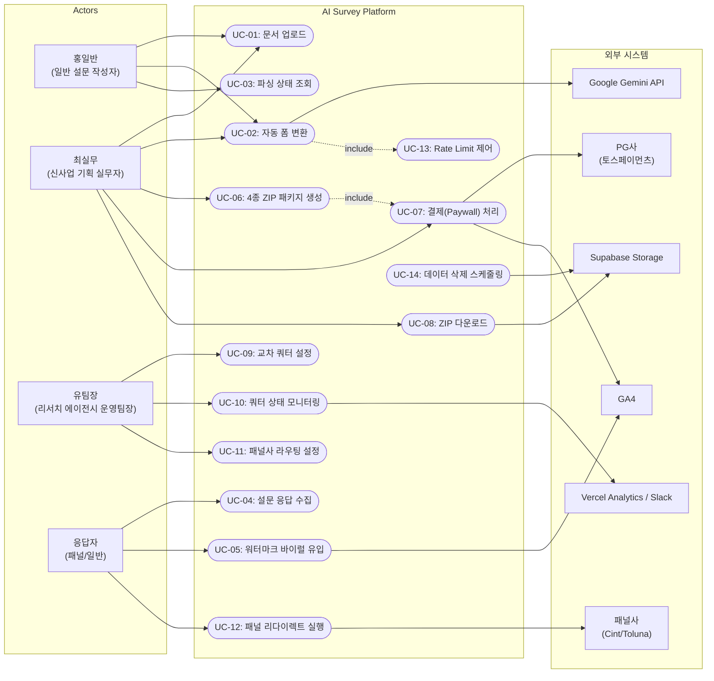

| Use Case ID | Use Case 명 | Primary Actor | 관련 REQ-FUNC |
|---|---|---|---|
| UC-01 | 문서 업로드 | 홍일반, 최실무 | REQ-FUNC-001, 005, 026, 027 |
| UC-02 | 자동 폼 변환 | 홍일반, 최실무 | REQ-FUNC-002, 003, 004, 006, 007 |
| UC-03 | 파싱 상태 조회 | 홍일반, 최실무 | REQ-FUNC-004 |
| UC-04 | 설문 응답 수집 | 응답자 | REQ-FUNC-008 |
| UC-05 | 워터마크 바이럴 유입 | 응답자 | REQ-FUNC-016, 017 |
| UC-06 | 4종 ZIP 패키지 생성 | 최실무 | REQ-FUNC-008, 009, 014, 015 |
| UC-07 | 결제(Paywall) 처리 | 최실무 | REQ-FUNC-010, 011, 012, 013 |
| UC-08 | ZIP 다운로드 | 최실무 | REQ-FUNC-011, 013 |
| UC-09 | 교차 쿼터 설정 | 유팀장 | REQ-FUNC-018 |
| UC-10 | 쿼터 상태 모니터링 | 유팀장 | REQ-FUNC-019, 020, 021, 022 |
| UC-11 | 패널사 라우팅 설정 | 유팀장 | REQ-FUNC-023 |
| UC-12 | 패널 리다이렉트 실행 | 응답자 | REQ-FUNC-024, 025 |
| UC-13 | Rate Limit 제어 | 시스템(내부) | REQ-FUNC-026, 028 |
| UC-14 | 데이터 삭제 스케줄링 | 시스템(내부) | REQ-FUNC-029 |

### 3.4 Component Diagram (시스템 컴포넌트 구조)

> **아키텍처 전환:** C-TEC-001~007에 따라 기존의 분산 마이크로서비스 구조에서 **Next.js 단일 풀스택 + Vercel 인프라** 구조로 전환되었다.

```mermaid
flowchart TB
    subgraph Vercel["Vercel Platform (C-TEC-007)"]
        subgraph NextApp["Next.js App (C-TEC-001)"]
            subgraph Pages["App Router - Pages (C-TEC-004)"]
                Dashboard["웹 대시보드\n/app/(dashboard)/*\nshadcn/ui + Tailwind CSS"]
                Survey["모바일 웹 설문 폼\n/app/(survey)/*\n반응형 Tailwind CSS"]
            end

            subgraph Handlers["Route Handlers + Server Actions (C-TEC-002)"]
                DocHandler["documents/\n문서 업로드·검증·상태 관리"]
                FormHandler["forms/\n설문 폼 관리·응답 수집"]
                PackageHandler["packages/\nZIP 4종 컴파일·다운로드"]
                PaymentHandler["payments/\n결제 요청·콜백·상태 관리"]
                QuotaHandler["quotas/\n교차 쿼터 관리·카운트 연산"]
                RoutingHandler["routing/\n패널사 포스트백·리다이렉트"]
            end

            subgraph ServiceLib["lib/services/ (비즈니스 로직)"]
                ParserModule["parser.ts\nVercel AI SDK + Gemini 파싱"]
                PackageModule["package.ts\nJSZip + exceljs 컴파일"]
                QuotaModule["quota.ts\nVercel KV 원자적 카운트"]
            end

            Middleware["middleware.ts\n인증·Rate Limit·라우팅"]
        end

        VercelAnalytics["Vercel Analytics + Logs"]
        VercelCron["Vercel Cron Jobs\nZero-Retention 스케줄러"]
        VercelKV["Vercel KV\n(Redis 호환 카운터)"]
    end

    subgraph Supabase["Supabase (C-TEC-003)"]
        DB[("PostgreSQL\n(Prisma ORM)")]
        Storage[("Supabase Storage\n(ZIP 파일 저장)")]
    end

    subgraph External["External Systems"]
        PG["PG사\n(토스페이먼츠 JS SDK)"]
        Panel["패널사\n(Cint/Toluna)"]
        Slack["Slack Webhook"]
        GA4["GA4"]
        GeminiAPI["Google Gemini API\n(C-TEC-005/006)"]
    end

    Dashboard --> Middleware
    Survey --> Middleware

    Middleware --> DocHandler
    Middleware --> FormHandler
    Middleware --> PackageHandler
    Middleware --> PaymentHandler
    Middleware --> QuotaHandler
    Middleware --> RoutingHandler

    DocHandler --> ParserModule
    ParserModule --> GeminiAPI
    ParserModule --> DB

    FormHandler --> DB
    PackageHandler --> PackageModule
    PackageModule --> DB
    PackageModule --> Storage
    PaymentHandler --> PG
    PaymentHandler --> DB

    QuotaHandler --> QuotaModule
    QuotaModule --> VercelKV
    QuotaModule --> DB
    QuotaModule --> Slack

    RoutingHandler --> Panel
    RoutingHandler --> DB

    VercelCron --> DB
    VercelCron --> Storage

    NextApp --> VercelAnalytics
    Survey -. "utm tracking" .-> GA4
```

### 3.5 API Overview

| Endpoint | Method | 설명 | 관련 요구사항 |
|---|---|---|---|
| `POST /api/v1/documents/upload` | POST | 비정형 문서 업로드 및 파싱 요청 | REQ-FUNC-001~005 |
| `GET /api/v1/documents/{doc_id}/status` | GET | 파싱 상태 조회 | REQ-FUNC-004 |
| `GET /api/v1/forms/{form_id}` | GET | 생성된 설문 폼 조회 | REQ-FUNC-006 |
| `POST /api/v1/forms/{form_id}/responses` | POST | 설문 응답 제출 | REQ-FUNC-008, 009 |
| `POST /api/v1/packages/{form_id}/payment` | POST | ZIP 패키지 결제 요청 | REQ-FUNC-010~012 |
| `GET /api/v1/packages/{package_id}/download` | GET | ZIP 패키지 다운로드 (서명 URL) | REQ-FUNC-013, 014 |
| `POST /api/v1/quotas` | POST | 쿼터 설정 생성/수정 | REQ-FUNC-016~018 |
| `GET /api/v1/quotas/{quota_id}/status` | GET | 쿼터 충족 상태 조회 | REQ-FUNC-019 |
| `POST /api/v1/routing/postback` | POST | 패널사 포스트백 URL 등록 | REQ-FUNC-020, 021 |
| `GET /api/v1/routing/redirect/{resp_id}` | GET | 패널 라우팅 리다이렉션 | REQ-FUNC-022 |
| `POST /api/v1/payments/callback` | POST | PG사 결제 콜백 수신 | REQ-FUNC-012 |

### 3.6 Interaction Sequences (핵심 시퀀스 다이어그램)

> **스택 전환 반영:** 모든 시퀀스 다이어그램의 participant가 C-TEC 스택에 맞게 변경되었다. API Server → Route Handler, OCR → Gemini API, S3 → Supabase Storage, Redis → Vercel KV, DataDog → Slack.

#### 3.6.1 문서 업로드 → 설문 폼 자동 생성 흐름

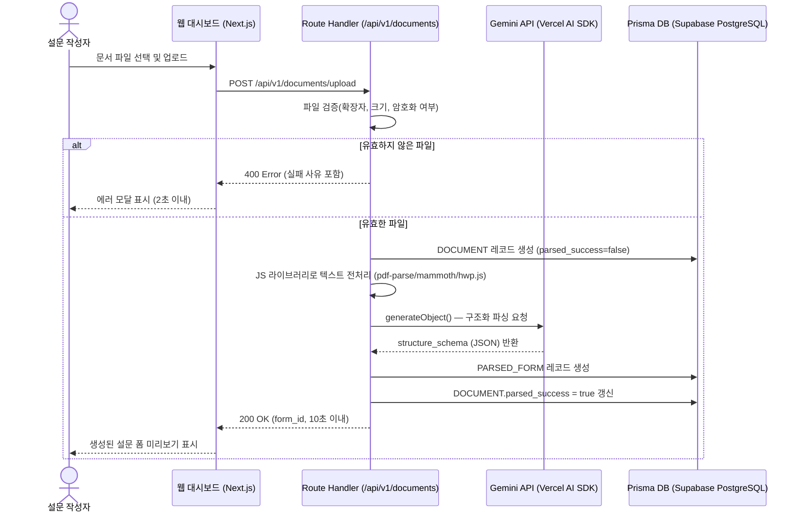

#### 3.6.2 ZIP 패키지 결제 → 다운로드 흐름

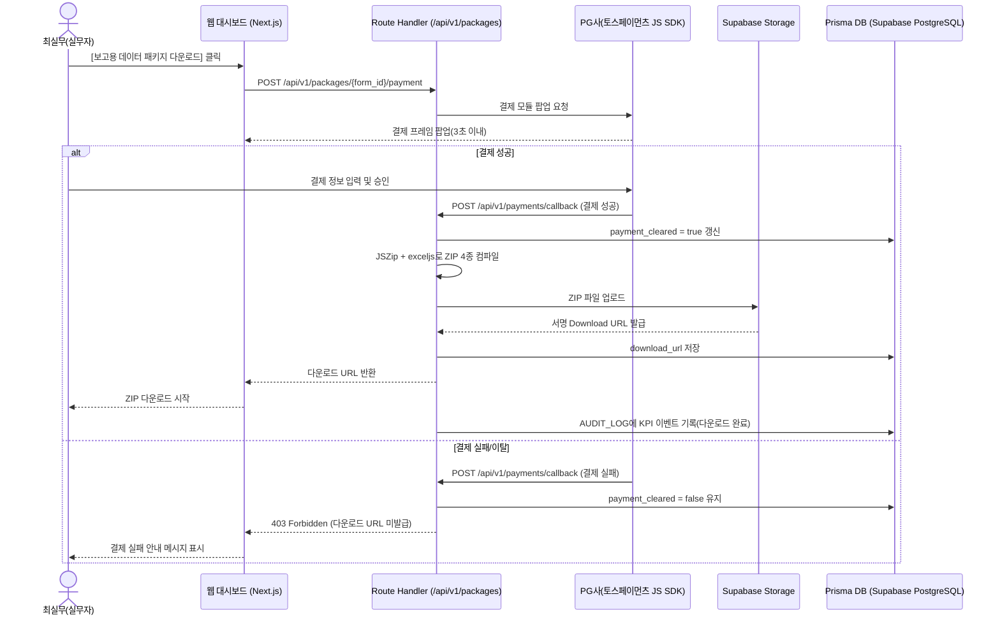

#### 3.6.3 동적 쿼터 제어 및 패널 라우팅 흐름

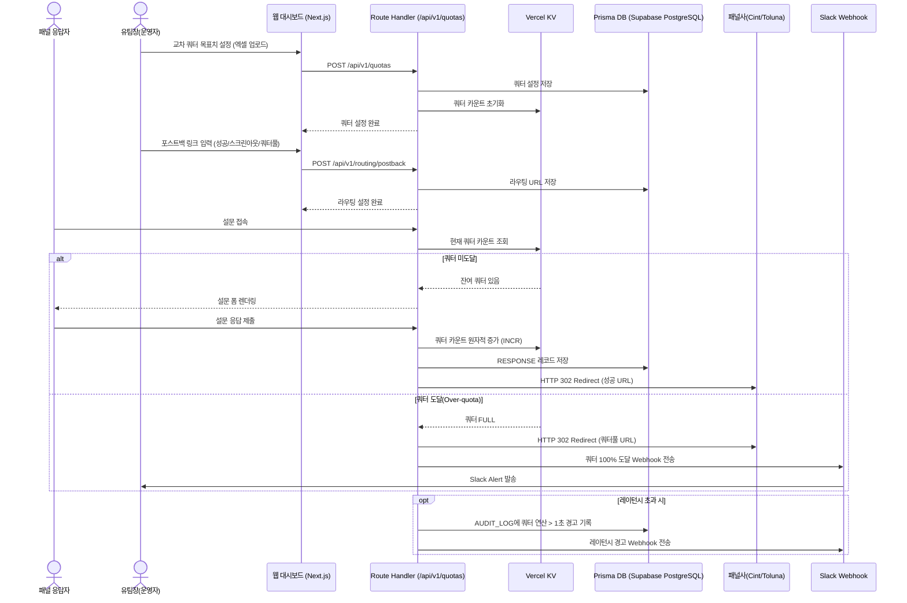

---

## 4. Specific Requirements

### 4.1 Functional Requirements

#### 4.1.1 F1 — 비정형 문서 고정밀 파서 (AI Document Parser)

| ID | 요구사항 | Source | Priority | Acceptance Criteria |
|---|---|---|---|---|
| REQ-FUNC-001 | 시스템은 HWP, Word(.docx), PDF 형식의 문서 파일 업로드를 지원해야 한다. | Story 1 | Must | **Given** 사용자가 대시보드에 접속했을 때, **When** HWP/Word/PDF 파일을 업로드 영역에 드래그하거나 파일 선택을 수행하면, **Then** 시스템은 해당 파일을 수신하고 파싱 파이프라인을 개시해야 한다. |
| REQ-FUNC-002 | 시스템은 업로드된 문서에서 텍스트 기반 설문 문항을 자동 추출하여 설문 폼(PARSED_FORM)을 생성해야 한다. | Story 1 / F1 | Must | **Given** 50문항 이내(텍스트 5MB 이하)의 유효한 HWP/Word/PDF 파일이 업로드되었을 때, **When** AI Document Parser가 파싱을 수행하면, **Then** 설문 문항 구조(`structure_schema`)가 생성되고 PARSED_FORM 레코드가 DB에 저장되어야 한다. |
| REQ-FUNC-003 | 시스템은 문서 파싱 및 모바일 웹 렌더링을 10초(10,000ms) 이내에 완료해야 한다. | Story 1 AC-1 | Must | **Given** 50문항 이내의 유효한 문서 파일이 주어졌을 때, **When** [자동 폼 변환] 버튼이 클릭되면, **Then** 파싱부터 모바일 웹 렌더링까지 전체 처리가 10,000ms 이내에 완료되어야 한다. |
| REQ-FUNC-004 | 시스템은 파싱 결과의 데이터 손실률을 1% 미만으로 보장해야 한다. | Story 1 AC-2 | Must | **Given** 변환된 설문 폼이 생성되었을 때, **When** 원본 문서의 항목 수와 DB 스키마(`structure_schema`)를 연산 비교하면, **Then** 파싱 누락으로 인한 데이터 손실률이 1% 미만이어야 한다. |
| REQ-FUNC-005 | 시스템은 유효하지 않은 파일(암호화, 손상, 지원 외 확장자) 업로드 시 2초 이내에 명확한 에러 메시지를 표시해야 한다. | Story 1 AC-4 | Must | **Given** 암호가 걸려있거나 손상된 파일, 또는 지원 외 확장자(.txt 등)의 파일이 업로드되었을 때, **When** 파싱을 시도하면, **Then** 2초 이내에 실패 사유가 포함된 에러 모달(HTTP 400)을 표시하고 DOCUMENT 상태를 `FAILED`로 기록해야 한다. |
| REQ-FUNC-006 | 시스템은 문서 종류(PDF/Word/HWP)별 JS 텍스트 추출 라이브러리(`pdf-parse`, `mammoth`, `hwp.js`)로 전처리하고, Vercel AI SDK + Gemini API `generateObject()`로 구조화 파싱을 수행해야 한다. | C-TEC-005/006; F1 의존성 | Must | **Given** 각 문서 형식(PDF, Word, HWP)의 파일이 업로드되었을 때, **When** 파싱 파이프라인이 실행되면, **Then** 해당 문서 타입에 맞는 JS 라이브러리로 텍스트를 추출한 후 Gemini API로 구조화된 structure_schema를 생성해야 한다. |
| REQ-FUNC-007 | 시스템은 파싱 시 이미지/수식 요소가 포함된 경우 해당 요소를 건너뛰고 텍스트 기반 문항만 추출해야 한다. | F1 구현성; CON-01 | Must | **Given** 이미지 또는 수식이 포함된 문서가 업로드되었을 때, **When** 파싱을 수행하면, **Then** 이미지/수식 요소는 건너뛰고 텍스트 기반 문항만 정상 추출되어야 하며, 건너뛴 요소에 대한 알림 메시지를 사용자에게 제공해야 한다. |

#### 4.1.2 F2 — 데이터맵 컴파일러(ZIP 산출물 추출기) & Paywall

| ID | 요구사항 | Source | Priority | Acceptance Criteria |
|---|---|---|---|---|
| REQ-FUNC-008 | 시스템은 조사 종료(수집 마감) 후 응답 원본 엑셀, 변수가이드, 코드북, 데이터맵의 4종 산출물을 자동 생성하여 ZIP 파일로 패키징해야 한다. | Story 2 / F2 | Must | **Given** 조사가 종료(수집 마감)되었을 때, **When** ZIP 컴파일러가 실행되면, **Then** 응답 원본 엑셀, 변수가이드, 코드북, 데이터맵 4종 파일이 생성되어 단일 ZIP 파일로 패키징되어야 한다. |
| REQ-FUNC-009 | 시스템은 ZIP 패키지 생성을 5초 이내에 완료해야 한다. | PRD 목표 | Must | **Given** 조사 종료 후 ZIP 패키지 생성이 요청되었을 때, **When** 컴파일러가 4종 산출물을 생성하면, **Then** ZIP 파일 생성 완료까지 5초 이내여야 한다. |
| REQ-FUNC-010 | 시스템은 ZIP 다운로드 전 PG사 결제 모듈을 팝업하여 결제를 요구해야 한다(Paywall). | Story 2 AC-1 / F2 | Must | **Given** 사용자가 대시보드에서 [보고용 데이터 패키지 다운로드] 버튼을 클릭했을 때, **When** API가 결제 요청을 처리하면, **Then** 3초 이내에 PG사 결제 모듈 프레임이 오류 없이 팝업되어야 한다. |
| REQ-FUNC-011 | 시스템은 결제 완료 후 Supabase Storage 서명 URL을 발급하여 ZIP 다운로드를 허용해야 한다. | Story 2 / F2 의존성 | Must | **Given** PG사로부터 결제 성공 콜백이 수신되었을 때, **When** 시스템이 결제 상태를 검증하면, **Then** DB의 `payment_cleared`를 `true`로 갱신하고 Supabase Storage 서명 Download URL을 발급해야 한다. |
| REQ-FUNC-012 | 시스템은 PG사 결제 콜백을 Route Handler로 수신하여 결제 성공/실패 상태를 DB에 기록해야 한다. | Story 2 / F2 | Must | **Given** PG사에서 결제 콜백 API를 호출했을 때, **When** 시스템이 콜백 데이터를 수신하면, **Then** 결제 성공 시 `payment_cleared=true`, 실패 시 `payment_cleared=false`를 DB에 기록하고 AUDIT_LOG에 KPI 이벤트를 기록해야 한다. |
| REQ-FUNC-013 | 시스템은 결제 실패 또는 이탈 시 ZIP 다운로드 URL 발급을 차단(403 Forbidden)해야 한다. | Story 2 AC-3 | Must | **Given** 결제 진행 중 사용자가 창을 닫거나 잔액 부족으로 결제 실패 코드를 수신했을 때, **When** 시스템이 이를 감지하면, **Then** DB의 `payment_cleared=false`를 유지하고 Supabase Storage 다운로드 서명 URL 발급을 차단(403 Forbidden 응답)해야 한다. |
| REQ-FUNC-014 | 시스템은 다운로드된 데이터맵의 결측치(Missing Value) 처리 실패율 0%를 보장해야 한다. | Story 2 AC-2 | Must | **Given** 다운로드된 데이터맵 파일에 대해 백엔드 데이터 검증이 수행되었을 때, **When** 전체 응답자 레코드를 검사하면, **Then** 형식 불일치 또는 결측치 처리 실패율이 0%여야 한다. |
| REQ-FUNC-015 | 시스템은 Paywall 팝업에 실제 추출된 데이터맵 샘플(모자이크 이미지) 및 더미데이터 스키마 엑셀 무료 다운로드를 제공해야 한다. | PRD 리스크 대응 #2 | Must | **Given** 사용자가 ZIP 다운로드 결제 화면에 접근했을 때, **When** Paywall 팝업이 표시되면, **Then** 모자이크 처리된 실제 데이터맵 샘플 이미지와 임시 더미데이터 스키마 엑셀 1개의 무료 다운로드 링크가 함께 제공되어야 한다. |

#### 4.1.3 F3 — 워터마크 기반 바이럴 메커니즘

| ID | 요구사항 | Source | Priority | Acceptance Criteria |
|---|---|---|---|---|
| REQ-FUNC-016 | 시스템은 무료 사용자가 생성한 설문 폼의 하단 뷰포트에 워터마크 배너를 100% 렌더링해야 한다. | Story 1 AC-3 | Must | **Given** 무료 사용자가 생성한 폼에 응답자가 접속했을 때, **When** 화면이 로드되면, **Then** 하단 뷰포트에 워터마크 배너가 100% 렌더링(노출)되어야 한다. |
| REQ-FUNC-017 | 시스템은 워터마크 링크에 `utm_source=watermark` 파라미터를 포함하여 GA4 퍼널 추적이 가능하도록 해야 한다. | PRD KPI (보조 KPI 2) | Must | **Given** 워터마크 배너가 렌더링되었을 때, **When** 응답자가 워터마크를 클릭하면, **Then** `utm_source=watermark` 파라미터가 포함된 URL로 서비스 가입 페이지에 랜딩되어야 한다. |

#### 4.1.4 F4 — 노코드 동적 다중 쿼터 세팅 UI

| ID | 요구사항 | Source | Priority | Acceptance Criteria |
|---|---|---|---|---|
| REQ-FUNC-018 | 시스템은 엑셀 파일 업로드 기반으로 교차 쿼터(성별×연령×지역) 목표치를 설정할 수 있는 노코드 UI를 제공해야 한다. | Story 3 / F3(PRD) | Should | **Given** 운영자가 쿼터 설정 화면에 접근했을 때, **When** 교차 쿼터 목표치가 포함된 엑셀 파일을 업로드하면, **Then** 시스템이 파일을 파싱하여 성별×연령×지역 교차 쿼터 설정을 자동 반영해야 한다. |
| REQ-FUNC-019 | 시스템은 교차 쿼터 목표치 도달 시 초과 응답자(Over-quota)의 수용 오차율을 1% 이내로 제어해야 한다. | Story 3 AC-2 | Should | **Given** 교차 쿼터 목표치(예: 20대 여성 100명)에 이미 도달했을 때, **When** 목표 도달 이후 조건 합치 응답자가 진입하면, **Then** Over-quota 수용 오차율이 1% 이내여야 하며 즉시 '할당초과(Quota Full)' URL로 리다이렉션해야 한다. |
| REQ-FUNC-020 | 시스템은 쿼터 카운트 연산 시 DB 데드락(Deadlock)을 방지해야 한다. | Story 3 AC-3 | Should | **Given** 동시 접속자가 1,000명을 초과하는 트래픽 스파이크 상황에서, **When** 쿼터 카운트 로직을 수행할 때, **Then** Vercel KV 기반 원자적(Atomic) INCR 연산을 사용하여 DB 데드락이 발생하지 않아야 한다. |
| REQ-FUNC-021 | 시스템은 쿼터 연산 레이턴시가 1초를 초과할 경우 Slack Webhook으로 경고(Alert)를 발송해야 한다. | Story 3 AC-3 | Should | **Given** 쿼터 카운트 연산이 수행 중일 때, **When** 연산 레이턴시가 1,000ms를 초과하면, **Then** AUDIT_LOG에 기록하고 Slack Webhook을 통해 운영자에게 경고(Alert)를 즉시 발송해야 한다. |
| REQ-FUNC-022 | 시스템은 쿼터 100% 도달 시 Slack Alert를 발송해야 한다. | PRD NFR 모니터링 | Should | **Given** 특정 쿼터 셀이 목표치의 100%에 도달했을 때, **When** 시스템이 이를 감지하면, **Then** Slack Webhook을 통해 운영자에게 '쿼터 100% 도달' 알림을 즉시 발송해야 한다. |

#### 4.1.5 F5 — 외부 패널사 라우팅(Redirect) 제어

| ID | 요구사항 | Source | Priority | Acceptance Criteria |
|---|---|---|---|---|
| REQ-FUNC-023 | 시스템은 패널 연동 시 상태별 포스트백 링크(성공/스크린아웃/쿼터풀)를 UI에서 입력·관리할 수 있어야 한다. | Story 3 AC-1 | Should | **Given** 운영자가 패널 연동 세팅 화면에 접근했을 때, **When** 상태별 포스트백 링크(성공/스크린아웃/쿼터풀)를 UI에서 입력하면, **Then** 시스템이 해당 URL을 DB에 저장하고 라우팅에 적용해야 한다. |
| REQ-FUNC-024 | 시스템은 패널 라우팅 시 HTTP 302 Redirect를 사용하여 응답자를 적절한 상태 URL로 전송해야 한다. | Story 3 / F5 | Should | **Given** 패널 응답자가 설문을 완료하거나 스크린아웃/쿼터풀 조건에 해당했을 때, **When** 라우팅이 수행되면, **Then** HTTP 302 Redirect를 통해 해당 상태의 포스트백 URL로 전송되어야 한다. |
| REQ-FUNC-025 | 시스템은 라우팅 실패로 인한 패널 이탈률을 0.1% 미만으로 유지해야 한다. | Story 3 AC-1 | Should | **Given** 패널 라우팅이 실행 중일 때, **When** 전체 라우팅 건수를 집계하면, **Then** 라우팅 실패(타임아웃, 잘못된 URL 등)로 인한 패널 이탈률이 0.1% 미만이어야 한다. |

#### 4.1.6 F6 — 무료 계정 Rate Limit 및 기대치 관리

| ID | 요구사항 | Source | Priority | Acceptance Criteria |
|---|---|---|---|---|
| REQ-FUNC-026 | 시스템은 무료 계정에 대해 일일 파싱 횟수를 3회로 제한(Rate Limit)해야 한다. | PRD 리스크 대응 #3; ADR-02 | Must | **Given** 무료 계정 사용자가 당일 3회 파싱을 완료했을 때, **When** 4번째 파싱을 시도하면, **Then** 시스템이 파싱 요청을 거부(HTTP 429)하고 일일 한도 초과 안내 메시지를 표시해야 한다. |
| REQ-FUNC-027 | 시스템은 업로드 전 표/이미지/수식 정확도 한계에 대한 모달 가이드를 표시해야 한다. | PRD 리스크 대응 #1 | Must | **Given** 사용자가 문서 업로드를 시도할 때, **When** 업로드 화면이 로드되면, **Then** "표, 이미지, 수식은 정확한 폼 변환이 어려울 수 있습니다" 안내 모달과 AI 최적화 템플릿 다운로드 링크를 제공해야 한다. |
| REQ-FUNC-028 | 시스템은 파싱 요청 앞단에 Vercel KV 기반 캐시를 구축하여 중복 요청에 대한 비용을 절감해야 한다. | PRD 리스크 대응 #3 | Should | **Given** 동일한 문서 해시(hash)로 파싱 요청이 수신되었을 때, **When** Vercel KV 캐시에 해당 결과가 존재하면, **Then** 파싱 파이프라인을 재실행하지 않고 캐시된 결과를 반환해야 한다. |

#### 4.1.7 F7 — 보안 및 데이터 관리

| ID | 요구사항 | Source | Priority | Acceptance Criteria |
|---|---|---|---|---|
| REQ-FUNC-029 | 시스템은 작업 종료 후 원본 문서 및 파편 데이터를 24시간 이내에 영구 삭제해야 한다. | PRD NFR 보안 | Must | **Given** 문서 파싱 및 관련 작업이 종료된 후 24시간이 경과했을 때, **When** Vercel Cron 삭제 스케줄러가 실행되면, **Then** 해당 원본 문서와 모든 파편 데이터가 Supabase Storage 및 DB에서 영구 삭제되어야 하며 삭제 로그가 기록되어야 한다. |
| REQ-FUNC-030 | 시스템은 디스크에 저장되는 모든 데이터에 암호화를 적용해야 한다. | PRD NFR 보안 | Must | **Given** 문서, 응답, 산출물 등의 데이터가 디스크에 기록될 때, **When** 저장 연산이 수행되면, **Then** Supabase PostgreSQL at-rest encryption 및 HTTPS(TLS 1.2+) 전송 암호화가 적용된 상태로 저장되어야 한다. |

### 4.2 Non-Functional Requirements

#### 4.2.1 성능(Performance)

| ID | 요구사항 | 측정 기준 | Source | Priority |
|---|---|---|---|---|
| REQ-NF-001 | 모바일 및 웹 설문 응답 패킷의 p95 응답 시간은 300ms 이하여야 한다. | p95 latency ≤ 300ms (동시 1,000명 기준) | PRD NFR 성능 | Must |
| REQ-NF-002 | 문서 파싱 완료 레이턴시는 15초 이하여야 한다. | 파싱 대기 시간 ≤ 15,000ms | PRD NFR 성능 | Must |
| REQ-NF-003 | 폼 생성(파싱부터 렌더링까지) 소요 시간은 10초 이내여야 한다. | 전체 파이프라인 ≤ 10,000ms | PRD 목표 / Story 1 AC-1 | Must |
| REQ-NF-004 | ZIP 패키지(4종 산출물) 생성 대기 시간은 5초 이내여야 한다. | 패키지 컴파일 ≤ 5,000ms | PRD 목표 | Must |
| REQ-NF-005 | PG사 결제 모듈 프레임 팝업은 3초 이내에 완료되어야 한다. | 결제 UI 로드 ≤ 3,000ms | Story 2 AC-1 | Must |
| REQ-NF-006 | 쿼터 카운트 연산 레이턴시는 1초 이하여야 한다 (정상 운영 기준). | 쿼터 연산 ≤ 1,000ms | Story 3 AC-3 | Should |
| REQ-NF-007 | 파일 유효성 검증 실패 시 에러 모달 표시는 2초 이내에 완료되어야 한다. | 에러 응답 ≤ 2,000ms | Story 1 AC-4 | Must |

#### 4.2.2 가용성(Availability) 및 신뢰성(Reliability)

| ID | 요구사항 | 측정 기준 | Source | Priority |
|---|---|---|---|---|
| REQ-NF-008 | 시스템 SLA 가용률은 월 99.9% 이상이어야 한다. | 월간 다운타임 ≤ 43.8분 | PRD NFR 신뢰성 | Must |
| REQ-NF-009 | 파싱 및 운영 치명률(Critical Failure Rate)은 0.5% 이하여야 한다. | 치명적 오류 발생률 ≤ 0.5% | PRD NFR 신뢰성 | Must |
| REQ-NF-010 | 업로드된 비정형 문서 대비 폼 파싱 완료율은 95% 이상을 유지해야 한다. | `form_id` 발급률 / `doc_id` 인입률 ≥ 95% | PRD 보조 KPI 1 | Must |
| REQ-NF-011 | 데이터맵의 결측치(Missing Value) 처리 실패율은 0%여야 한다. | 결측치 처리 실패 건수 = 0 | Story 2 AC-2 | Must |
| REQ-NF-012 | 라우팅 실패로 인한 패널 이탈률은 0.1% 미만이어야 한다. | 라우팅 실패율 < 0.1% | Story 3 AC-1 | Should |
| REQ-NF-013 | Over-quota 수용 오차율은 1% 이내여야 한다. | Over-quota 초과 응답 비율 ≤ 1% | Story 3 AC-2 | Should |
| REQ-NF-014 | RPO(Recovery Point Objective)는 1시간 이내여야 한다. | 데이터 손실 허용 시점 ≤ 60분 | 시스템 표준 | Should |
| REQ-NF-015 | RTO(Recovery Time Objective)는 4시간 이내여야 한다. | 서비스 복구 시간 ≤ 4시간 | 시스템 표준 | Should |

#### 4.2.3 보안(Security)

| ID | 요구사항 | 측정 기준 | Source | Priority |
|---|---|---|---|---|
| REQ-NF-016 | 모든 클라이언트-서버 간 통신은 TLS 1.2 이상을 사용해야 한다. | TLS 1.2+ 적용률 100% | 시스템 표준 | Must |
| REQ-NF-017 | 디스크 저장 데이터에 Supabase PostgreSQL at-rest encryption을 적용해야 한다. | 암호화 미적용 데이터 = 0 | PRD NFR 보안 | Must |
| REQ-NF-018 | 원본 문서 및 파편 데이터는 작업 종료 후 24시간 이내에 영구 삭제(Zero-Retention)해야 한다. | 24시간 초과 문서 잔존 건수 = 0 | PRD NFR 보안 | Must |
| REQ-NF-019 | 역할 기반 접근 제어(RBAC)를 적용하여 사용자 권한을 분리해야 한다. | 권한 미설정 기능 접근 차단률 100% | 시스템 표준 | Must |
| REQ-NF-020 | 결제 관련 모든 트랜잭션에 대한 감사 로그(Audit Log)를 생성·보관해야 한다. | 감사 로그 누락률 = 0% | 시스템 표준 | Must |

#### 4.2.4 비용(Cost Efficiency)

> **비용 변경 이력:** 기존 PRD에 명시된 월간 서버 예산 500 USD(약 680,000 KRW)에서, C-TEC 스택 전환에 따라 **무료~최대 100,000원(KRW)**(약 75 USD)으로 대폭 하향 조정됨. Next.js + Vercel + Supabase + Gemini API Free Tier 활용 전략에 기반한 것임.

| 비용 항목 | 기존 PRD 기준 | 수정 후 MVP 기준 (C-TEC 스택) | 변경률 |
|---|---|---|---|
| 월간 인프라(서버) 예산 | 500 USD (≈ 680,000 KRW) | **무료 ~ 최대 100,000 KRW** (≈ 75 USD) | **▼ 85% 감축** |
| 단건 파싱 원가 상한 | 20 KRW | 20 KRW (유지) | 변경 없음 |

| 서비스 | 티어 | 월 예상 비용 | 비고 |
|---|---|---|---|
| Vercel | Pro ($20/월) | ~27,000 KRW | 60s 함수 타임아웃, 1TB 대역폭, Cron Jobs 포함 |
| Supabase | Free | 0 KRW | 500MB DB, 1GB Storage, 50,000 MAU |
| Vercel KV | Free (기본 포함) | 0 KRW | 3,000 req/day |
| Google Gemini API | Free Tier / Pay-as-you-go | 0 ~ 30,000 KRW | 무료 쿼터 활용 후 종량제 |
| 토스페이먼츠 | 건당 수수료 | 매출 연동 | 기본 사용료 없음 |
| Slack / GA4 | Free | 0 KRW | |
| **합계** | | **27,000 ~ 57,000 KRW** | **✅ 100,000 KRW 이내** |

| ID | 요구사항 | 측정 기준 | Source | Priority |
|---|---|---|---|---|
| REQ-NF-021 | 단건 문서 파싱 원가는 20원(KRW)을 초과하지 않아야 한다. | 파싱 1건당 비용 ≤ 20 KRW | PRD NFR 비용 | Must |
| REQ-NF-022 | MVP 월간 인프라 총 예산은 무료~최대 100,000원(KRW)을 초과하지 않아야 한다. | 월 인프라 비용 ≤ 100,000 KRW | MVP 비용 재책정 | Must |
| REQ-NF-023 | 클라우드 예산 초과 시 자동 알람이 설정되어야 한다. | 알람 설정 완료 여부 = Yes | PRD NFR 비용 | Must |

#### 4.2.5 운영/모니터링(Monitoring & Observability)

> **스택 전환 반영:** DataDog → Vercel Analytics + Logs, PagerDuty → Slack 통합, Amplitude → DB 직접 집계로 변경되었다.

| ID | 요구사항 | 측정 기준 | Source | Priority |
|---|---|---|---|---|
| REQ-NF-024 | 결제 모듈 실패율이 임계치를 초과하면 Slack Webhook으로 알림을 발송해야 한다. | Slack 알림 발송 지연 ≤ 60초 | PRD NFR 모니터링 | Must |
| REQ-NF-025 | 쿼터 100% 도달 시 Slack Alert를 자동 발송해야 한다. | Slack 알림 발송 지연 ≤ 30초 | PRD NFR 모니터링 | Should |
| REQ-NF-026 | 파싱 파이프라인의 모든 단계에 대해 Vercel Analytics + AUDIT_LOG 기반 추적이 가능해야 한다. | 모니터링 trace 커버리지 = 100% | PRD NFR 모니터링; PRD 보조 KPI 1 측정 | Must |
| REQ-NF-027 | 북극성 KPI(유료 데이터맵 ZIP 다운로드 완료 건수)를 DB `AUDIT_LOG` 테이블에 기록하고, Vercel Analytics 또는 Prisma 쿼리로 대시보드 집계가 가능해야 한다. | 이벤트 기록 지연 ≤ 5초 | PRD 북극성 KPI | Must |
| REQ-NF-028 | 워터마크 유입 대비 서비스 가입 전환율을 GA4 퍼널에서 주간 집계 가능해야 한다. | GA4 퍼널 설정 완료 여부 = Yes | PRD 보조 KPI 2 | Must |

#### 4.2.6 확장성(Scalability)

| ID | 요구사항 | 측정 기준 | Source | Priority |
|---|---|---|---|---|
| REQ-NF-029 | 시스템은 동시 접속자 1,000명 이상을 DB 데드락 없이 처리할 수 있어야 한다. | 동시 1,000명 부하 테스트 통과 | Story 3 AC-3 | Should |
| REQ-NF-030 | 시스템은 Vercel Serverless 자동 스케일링을 활용하며, Stateless 설계를 준수해야 한다. | Vercel 자동 스케일링 활성화 여부 = Yes | C-TEC-007 | Should |

#### 4.2.7 유지보수성(Maintainability)

| ID | 요구사항 | 측정 기준 | Source | Priority |
|---|---|---|---|---|
| REQ-NF-031 | API 엔드포인트는 버전 관리(`/api/v{N}/`)를 적용하여 하위 호환성을 보장해야 한다. | API 버전 관리 적용률 = 100% | 시스템 표준 | Must |
| REQ-NF-032 | 시스템의 모든 모듈은 Next.js App Router 내에서 도메인별 폴더/레이어 분리 구조를 따르며, 모듈 간 순환 의존성이 없어야 한다. | 모듈 간 순환 의존성 = 0 | C-TEC-001 | Should |

#### 4.2.8 KPI 목표(Desired Outcome)

| ID | 요구사항 | 측정 기준 | Source | Priority |
|---|---|---|---|---|
| REQ-NF-033 | 북극성 KPI: 유료 '데이터맵 ZIP 패키지' 다운로드 완료 건수는 월 10,000건 달성을 목표로 한다. | 월간 `payment_cleared=true` 건수 ≥ 10,000 | PRD 북극성 KPI | Must |
| REQ-NF-034 | 보조 KPI 1: 업로드 문서 대비 폼 파싱 완료율 95% 이상을 방어해야 한다. | 일간 파싱 완료율 ≥ 95% | PRD 보조 KPI 1 | Must |
| REQ-NF-035 | 보조 KPI 2: 워터마크 유입 대비 서비스 가입 전환율 5% 이상을 달성해야 한다. | 주간 전환율 ≥ 5% | PRD 보조 KPI 2 | Should |
| REQ-NF-036 | 유료 구매 전환율(Conversion Rate) 5% 달성 시 PMF 증명으로 판단하고 MVP Open 베타 론칭을 개시한다. | 전환율 ≥ 5% | PRD 실험·롤아웃 | Must |
| REQ-NF-037 | 파싱 후 수정 이탈률은 Typeform 폼 체류 이탈률 대비 15% 이하를 유지해야 한다. | 수정 이탈률 ≤ 15% | PRD 경쟁 벤치마킹 | Should |

---

## 5. Traceability Matrix

### 5.1 Story ↔ Requirement ID ↔ Test Case ID

| Story | PRD Section | Requirement ID(s) | Test Case ID |
|---|---|---|---|
| Story 1: 문서 무손실 파싱 | PRD §3 Story 1 | REQ-FUNC-001, REQ-FUNC-002, REQ-FUNC-003, REQ-FUNC-004, REQ-FUNC-005, REQ-FUNC-006, REQ-FUNC-007 | TC-FUNC-001 ~ TC-FUNC-007 |
| Story 1 AC-3 (워터마크) | PRD §3 Story 1 | REQ-FUNC-016, REQ-FUNC-017 | TC-FUNC-016, TC-FUNC-017 |
| Story 2: 4종 산출물 ZIP 턴키 출하 | PRD §3 Story 2 | REQ-FUNC-008, REQ-FUNC-009, REQ-FUNC-010, REQ-FUNC-011, REQ-FUNC-012, REQ-FUNC-013, REQ-FUNC-014, REQ-FUNC-015 | TC-FUNC-008 ~ TC-FUNC-015 |
| Story 3: 동적 쿼터/라우팅 인프라 | PRD §3 Story 3 | REQ-FUNC-018, REQ-FUNC-019, REQ-FUNC-020, REQ-FUNC-021, REQ-FUNC-022, REQ-FUNC-023, REQ-FUNC-024, REQ-FUNC-025 | TC-FUNC-018 ~ TC-FUNC-025 |
| F1: 비정형 문서 고정밀 파서 | PRD §4 F1 | REQ-FUNC-001 ~ REQ-FUNC-007 | TC-FUNC-001 ~ TC-FUNC-007 |
| F2: 데이터맵 컴파일러 & Paywall | PRD §4 F2 | REQ-FUNC-008 ~ REQ-FUNC-015 | TC-FUNC-008 ~ TC-FUNC-015 |
| F3 (PRD): 노코드 쿼터 세팅 | PRD §4 F3 | REQ-FUNC-018 ~ REQ-FUNC-022 | TC-FUNC-018 ~ TC-FUNC-022 |
| 리스크 대응 | PRD §7 | REQ-FUNC-026, REQ-FUNC-027, REQ-FUNC-028 | TC-FUNC-026 ~ TC-FUNC-028 |
| 보안 요건 | PRD §5 | REQ-FUNC-029, REQ-FUNC-030 | TC-FUNC-029, TC-FUNC-030 |

### 5.2 KPI/성능 지표 ↔ NFR ID ↔ Test Case ID

| KPI/성능 지표 | PRD Section | NFR ID(s) | Test Case ID |
|---|---|---|---|
| p95 응답 시간 ≤ 300ms | PRD §5 성능 | REQ-NF-001 | TC-NF-001 |
| 파싱 레이턴시 ≤ 15초 | PRD §5 성능 | REQ-NF-002 | TC-NF-002 |
| 폼 생성 ≤ 10초 | PRD §1 목표 | REQ-NF-003 | TC-NF-003 |
| ZIP 생성 ≤ 5초 | PRD §1 목표 | REQ-NF-004 | TC-NF-004 |
| SLA ≥ 99.9% | PRD §5 신뢰성 | REQ-NF-008 | TC-NF-008 |
| 치명률 ≤ 0.5% | PRD §5 신뢰성 | REQ-NF-009 | TC-NF-009 |
| 파싱 완료율 ≥ 95% | PRD §1 보조 KPI 1 | REQ-NF-010, REQ-NF-034 | TC-NF-010 |
| 결측치 실패율 = 0% | PRD §3 Story 2 AC-2 | REQ-NF-011 | TC-NF-011 |
| 단건 원가 ≤ 20원 | PRD §5 비용 | REQ-NF-021 | TC-NF-021 |
| 월간 인프라 ≤ 100,000 KRW | MVP 비용 재책정 | REQ-NF-022 | TC-NF-022 |
| 북극성 KPI ≥ 월 10,000건 | PRD §1 북극성 KPI | REQ-NF-033 | TC-NF-033 |
| 가입 전환율 ≥ 5% | PRD §1 보조 KPI 2 | REQ-NF-035 | TC-NF-035 |
| PMF 전환율 ≥ 5% | PRD §8 실험 | REQ-NF-036 | TC-NF-036 |

---

## 6. Appendix

### 6.1 API Endpoint List

| # | Endpoint | Method | Request Body / Params | Response | 성공 코드 | 에러 코드 | 관련 요구사항 |
|---|---|---|---|---|---|---|---|
| 1 | `POST /api/v1/documents/upload` | POST | `multipart/form-data` (file: HWP/Word/PDF, ≤ 5MB) | `{ doc_id, status }` | 200 | 400 (유효하지 않은 파일), 429 (Rate Limit 초과) | REQ-FUNC-001~005, REQ-FUNC-026 |
| 2 | `GET /api/v1/documents/{doc_id}/status` | GET | `doc_id` (path) | `{ doc_id, parsed_success, form_id, error_code }` | 200 | 404 | REQ-FUNC-004 |
| 3 | `GET /api/v1/forms/{form_id}` | GET | `form_id` (path) | `{ form_id, structure_schema, viral_watermark_url }` | 200 | 404 | REQ-FUNC-006, REQ-FUNC-016 |
| 4 | `POST /api/v1/forms/{form_id}/responses` | POST | `{ resp_id, user_agent, raw_record, quota_group }` | `{ resp_id, status }` | 201 | 400, 429 | REQ-FUNC-008, REQ-FUNC-019 |
| 5 | `POST /api/v1/packages/{form_id}/payment` | POST | `{ form_id, payment_method }` | `{ payment_url, session_id }` | 200 | 400, 500 | REQ-FUNC-010 |
| 6 | `POST /api/v1/payments/callback` | POST | `{ session_id, status, pg_transaction_id }` | `{ result }` | 200 | 400 | REQ-FUNC-012 |
| 7 | `GET /api/v1/packages/{package_id}/download` | GET | `package_id` (path) | `{ presigned_url }` 또는 Redirect | 200 | 403 (미결제), 404 | REQ-FUNC-011, REQ-FUNC-013 |
| 8 | `POST /api/v1/quotas` | POST | `{ form_id, quota_matrix (JSON or Excel) }` | `{ quota_id, status }` | 201 | 400 | REQ-FUNC-018 |
| 9 | `GET /api/v1/quotas/{quota_id}/status` | GET | `quota_id` (path) | `{ quota_id, cells: [{ group, target, current, is_full }] }` | 200 | 404 | REQ-FUNC-019, REQ-FUNC-022 |
| 10 | `POST /api/v1/routing/postback` | POST | `{ form_id, success_url, screenout_url, quotafull_url }` | `{ routing_id, status }` | 201 | 400 | REQ-FUNC-023 |
| 11 | `GET /api/v1/routing/redirect/{resp_id}` | GET | `resp_id` (path) | HTTP 302 Redirect | 302 | 404, 500 | REQ-FUNC-024, REQ-FUNC-025 |

### 6.2 Entity & Data Model

#### 6.2.1 DOCUMENT

| 필드명 | 데이터 타입 | 제약 조건 | 설명 |
|---|---|---|---|
| `doc_id` | VARCHAR(36) | PK, NOT NULL, UUID | 문서 고유 식별자 |
| `user_id` | VARCHAR(36) | FK → USER.user_id, NOT NULL | 업로드 사용자 ID |
| `file_type` | ENUM('HWP','PDF','WORD') | NOT NULL | 문서 파일 형식 |
| `file_name` | VARCHAR(255) | NOT NULL | 원본 파일명 |
| `file_size_bytes` | BIGINT | NOT NULL, ≤ 5,242,880 | 파일 크기(바이트) |
| `file_hash` | VARCHAR(64) | NOT NULL | SHA-256 파일 해시 (캐시 키) |
| `parsed_success` | BOOLEAN | NOT NULL, DEFAULT false | 파싱 성공 여부 |
| `error_code` | VARCHAR(10) | NULLABLE | 실패 시 에러 코드 |
| `error_message` | TEXT | NULLABLE | 실패 사유 상세 메시지 |
| `created_at` | TIMESTAMP | NOT NULL, DEFAULT NOW() | 생성 시각 |
| `expires_at` | TIMESTAMP | NOT NULL | 삭제 예정 시각 (created_at + 24h) |
| `status` | ENUM('PENDING','PARSING','COMPLETED','FAILED') | NOT NULL, DEFAULT 'PENDING' | 처리 상태 |

#### 6.2.2 PARSED_FORM

| 필드명 | 데이터 타입 | 제약 조건 | 설명 |
|---|---|---|---|
| `form_id` | VARCHAR(36) | PK, NOT NULL, UUID | 설문 폼 고유 식별자 |
| `doc_id` | VARCHAR(36) | FK → DOCUMENT.doc_id, NOT NULL | 원본 문서 참조 |
| `structure_schema` | JSON | NOT NULL | 파싱된 문항 구조 스키마 |
| `question_count` | INTEGER | NOT NULL | 추출된 문항 수 |
| `skipped_elements` | JSON | NULLABLE | 건너뛴 비텍스트 요소 목록 |
| `viral_watermark_url` | VARCHAR(512) | NOT NULL | 워터마크 링크 URL (utm_source=watermark 포함) |
| `is_paid_user` | BOOLEAN | NOT NULL, DEFAULT false | 유료 사용자 여부 (워터마크 표시 제어) |
| `created_at` | TIMESTAMP | NOT NULL, DEFAULT NOW() | 생성 시각 |
| `updated_at` | TIMESTAMP | NOT NULL | 최종 수정 시각 |

#### 6.2.3 RESPONSE

| 필드명 | 데이터 타입 | 제약 조건 | 설명 |
|---|---|---|---|
| `resp_id` | VARCHAR(36) | PK, NOT NULL, UUID | 응답 고유 식별자 |
| `form_id` | VARCHAR(36) | FK → PARSED_FORM.form_id, NOT NULL | 설문 폼 참조 |
| `user_agent` | VARCHAR(512) | NOT NULL | 응답자 브라우저 정보 |
| `raw_record` | JSON | NOT NULL | 응답 원본 데이터 |
| `quota_status` | ENUM('ACTIVE','FULL','SCREENOUT') | NOT NULL, DEFAULT 'ACTIVE' | 쿼터 상태 |
| `quota_group` | JSON | NULLABLE | 해당 응답자의 쿼터 그룹 정보 |
| `routing_status` | ENUM('SUCCESS','SCREENOUT','QUOTAFULL','PENDING') | NOT NULL, DEFAULT 'PENDING' | 라우팅 결과 상태 |
| `created_at` | TIMESTAMP | NOT NULL, DEFAULT NOW() | 응답 시각 |
| `ip_hash` | VARCHAR(64) | NOT NULL | 응답자 IP 해시 (개인정보 비식별화) |

#### 6.2.4 ZIP_DATAMAP

| 필드명 | 데이터 타입 | 제약 조건 | 설명 |
|---|---|---|---|
| `package_id` | VARCHAR(36) | PK, NOT NULL, UUID | 패키지 고유 식별자 |
| `form_id` | VARCHAR(36) | FK → PARSED_FORM.form_id, NOT NULL | 설문 폼 참조 |
| `payment_cleared` | BOOLEAN | NOT NULL, DEFAULT false | 결제 완료 여부 |
| `pg_transaction_id` | VARCHAR(100) | NULLABLE | PG사 거래 ID |
| `payment_amount` | INTEGER | NULLABLE | 결제 금액 (KRW) |
| `download_url` | VARCHAR(1024) | NULLABLE | Supabase Storage 서명 다운로드 URL |
| `url_expires_at` | TIMESTAMP | NULLABLE | 다운로드 URL 만료 시각 |
| `download_count` | INTEGER | NOT NULL, DEFAULT 0 | 다운로드 횟수 |
| `created_at` | TIMESTAMP | NOT NULL, DEFAULT NOW() | 생성 시각 |
| `updated_at` | TIMESTAMP | NOT NULL | 최종 수정 시각 |

#### 6.2.5 QUOTA_SETTING

| 필드명 | 데이터 타입 | 제약 조건 | 설명 |
|---|---|---|---|
| `quota_id` | VARCHAR(36) | PK, NOT NULL, UUID | 쿼터 설정 고유 식별자 |
| `form_id` | VARCHAR(36) | FK → PARSED_FORM.form_id, NOT NULL | 설문 폼 참조 |
| `quota_matrix` | JSON | NOT NULL | 교차 쿼터 매트릭스 (성별×연령×지역) |
| `is_active` | BOOLEAN | NOT NULL, DEFAULT true | 쿼터 활성 상태 |
| `created_at` | TIMESTAMP | NOT NULL, DEFAULT NOW() | 생성 시각 |
| `updated_at` | TIMESTAMP | NOT NULL | 최종 수정 시각 |

#### 6.2.6 QUOTA_CELL

| 필드명 | 데이터 타입 | 제약 조건 | 설명 |
|---|---|---|---|
| `cell_id` | VARCHAR(36) | PK, NOT NULL, UUID | 쿼터 셀 고유 식별자 |
| `quota_id` | VARCHAR(36) | FK → QUOTA_SETTING.quota_id, NOT NULL | 쿼터 설정 참조 |
| `group_key` | VARCHAR(100) | NOT NULL | 그룹 키 (예: "F_20_Seoul") |
| `gender` | ENUM('M','F','OTHER') | NULLABLE | 성별 |
| `age_range` | VARCHAR(20) | NULLABLE | 연령대 (예: "20-29") |
| `region` | VARCHAR(50) | NULLABLE | 지역 |
| `target_count` | INTEGER | NOT NULL | 목표 응답 수 |
| `current_count` | INTEGER | NOT NULL, DEFAULT 0 | 현재 응답 수 |
| `is_full` | BOOLEAN | NOT NULL, DEFAULT false | 목표 도달 여부 |

#### 6.2.7 ROUTING_CONFIG

| 필드명 | 데이터 타입 | 제약 조건 | 설명 |
|---|---|---|---|
| `routing_id` | VARCHAR(36) | PK, NOT NULL, UUID | 라우팅 설정 고유 식별자 |
| `form_id` | VARCHAR(36) | FK → PARSED_FORM.form_id, NOT NULL | 설문 폼 참조 |
| `success_url` | VARCHAR(1024) | NOT NULL | 성공 포스트백 URL |
| `screenout_url` | VARCHAR(1024) | NOT NULL | 스크린아웃 포스트백 URL |
| `quotafull_url` | VARCHAR(1024) | NOT NULL | 쿼터풀 포스트백 URL |
| `created_at` | TIMESTAMP | NOT NULL, DEFAULT NOW() | 생성 시각 |

#### 6.2.8 AUDIT_LOG

| 필드명 | 데이터 타입 | 제약 조건 | 설명 |
|---|---|---|---|
| `log_id` | VARCHAR(36) | PK, NOT NULL, UUID | 감사 로그 고유 식별자 |
| `user_id` | VARCHAR(36) | FK → USER.user_id | 수행 사용자 |
| `action` | VARCHAR(100) | NOT NULL | 수행된 작업 (예: PAYMENT_SUCCESS, FILE_DELETE) |
| `resource_type` | VARCHAR(50) | NOT NULL | 대상 리소스 유형 |
| `resource_id` | VARCHAR(36) | NOT NULL | 대상 리소스 ID |
| `details` | JSON | NULLABLE | 상세 정보 |
| `ip_address_hash` | VARCHAR(64) | NOT NULL | 요청 IP 해시 |
| `created_at` | TIMESTAMP | NOT NULL, DEFAULT NOW() | 기록 시각 |

#### 6.2.9 Entity-Relationship Diagram (ERD)

아래 ERD는 6.2절에 정의된 모든 엔터티의 관계를 시각화한 것이다. USER 엔터티는 인증 모듈에서 관리되며 본 ERD에서는 참조 관계만 표시한다.

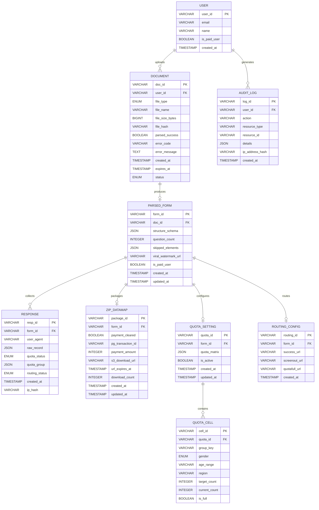

#### 6.2.10 Class Diagram (핵심 도메인 객체)

아래 다이어그램은 시스템의 핵심 도메인 객체와 서비스 클래스의 구조 및 의존 관계를 나타낸다.

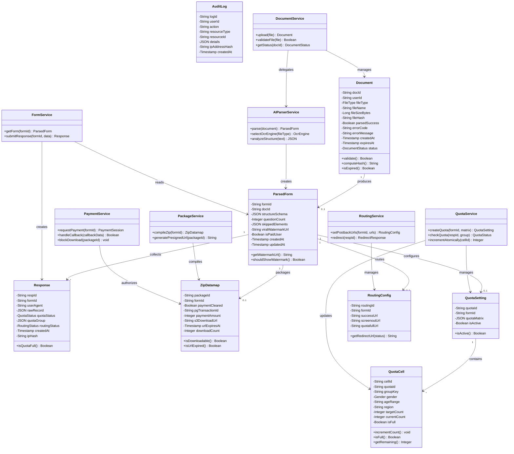

| 열거형(Enum) | 값 | 설명 |
|---|---|---|
| `FileType` | HWP, PDF, WORD | 지원 문서 파일 형식 |
| `DocumentStatus` | PENDING, PARSING, COMPLETED, FAILED | 문서 처리 상태 |
| `QuotaStatus` | ACTIVE, FULL, SCREENOUT | 응답자 쿼터 상태 |
| `RoutingStatus` | SUCCESS, SCREENOUT, QUOTAFULL, PENDING | 패널 라우팅 결과 상태 |
| `Gender` | M, F, OTHER | 쿼터 성별 구분 |

### 6.3 Detailed Interaction Models (상세 시퀀스 다이어그램)

#### 6.3.1 문서 업로드 → 파싱 → 폼 생성 상세 흐름

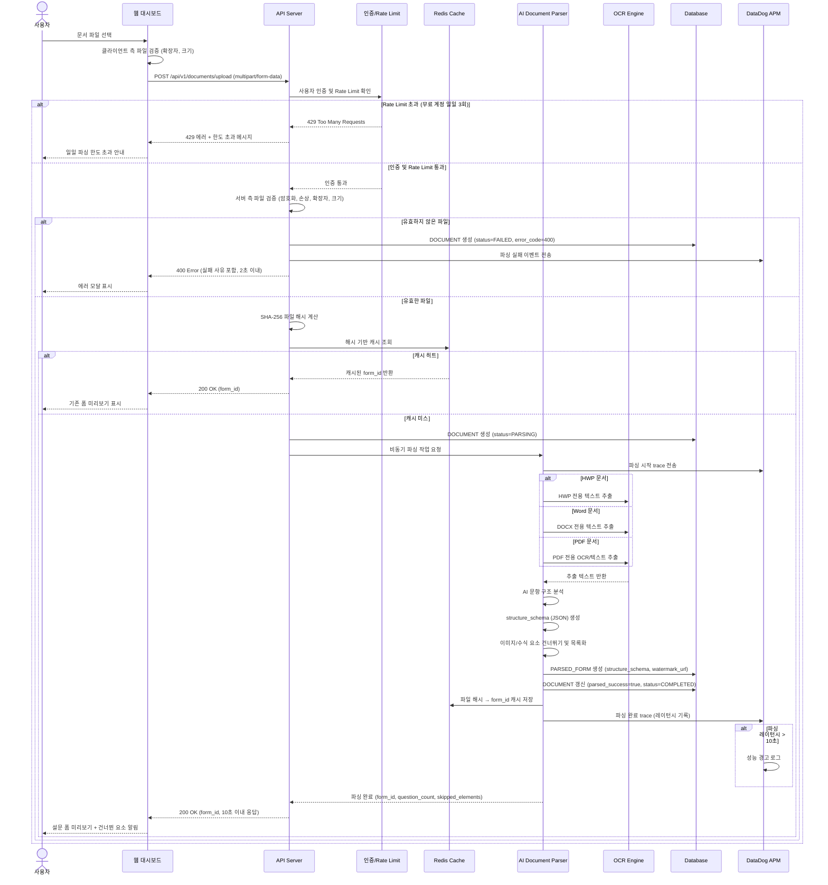

#### 6.3.2 설문 응답 수집 및 워터마크 바이럴 상세 흐름

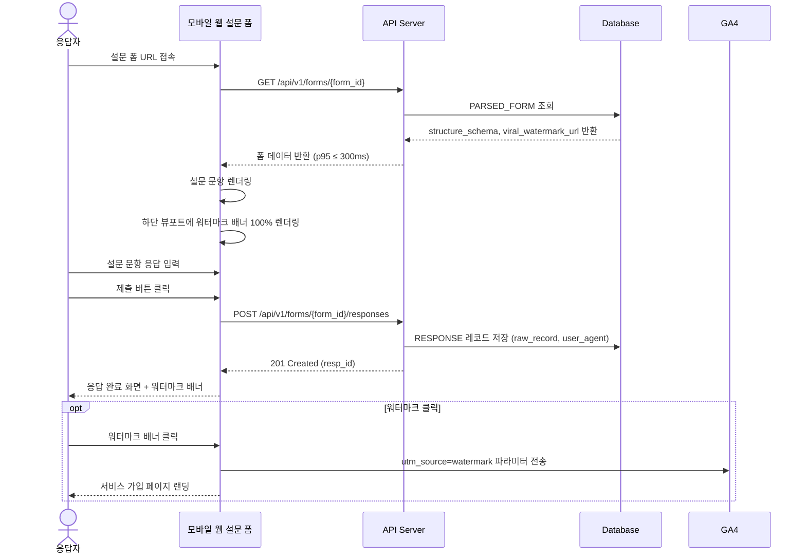

#### 6.3.3 동적 쿼터 제어 및 패널 라우팅 상세 흐름

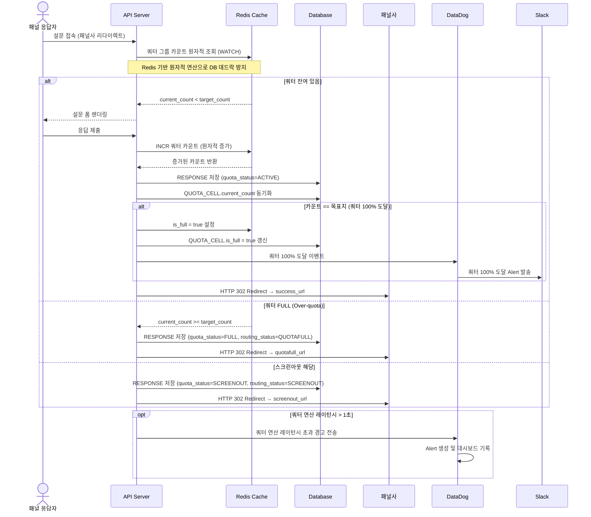

#### 6.3.4 데이터 삭제 스케줄러(Zero-Retention) 상세 흐름

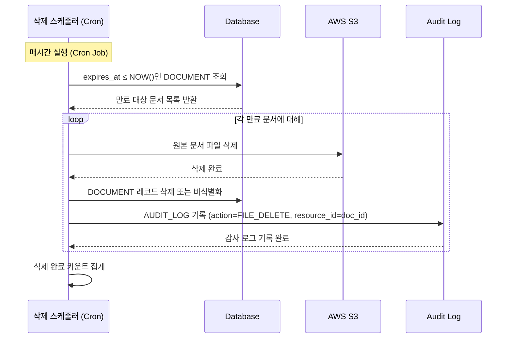

#### 6.3.5 A/B 테스트 (Paywall 전환율 최적화) 흐름

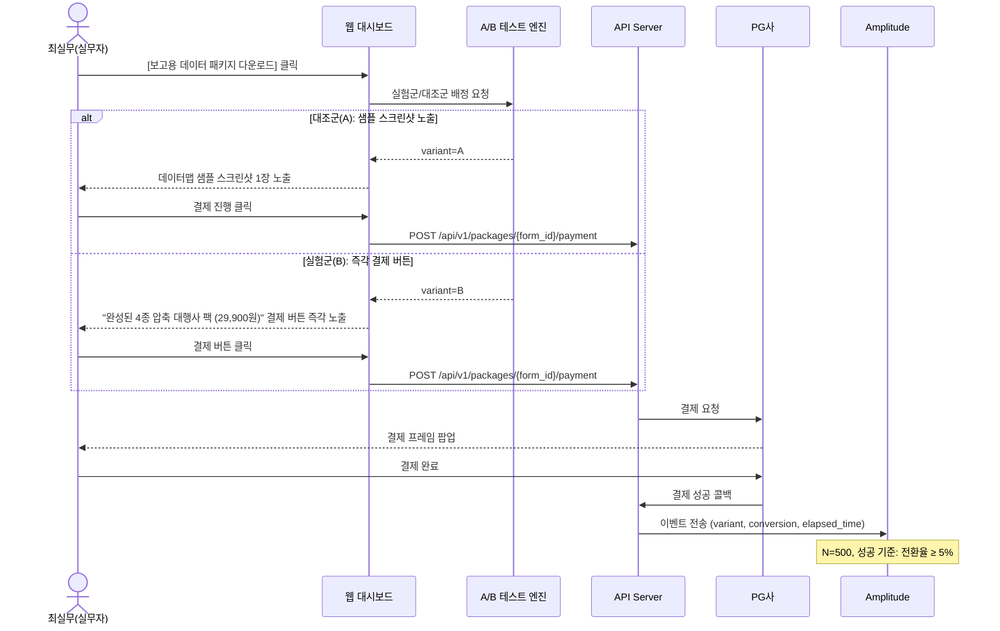

#### 6.3.6 사용자 커스텀 빌드(폼 편집 및 커스터마이징) 흐름

사용자가 AI 자동 파싱으로 생성된 설문 폼을 직접 검토·수정·커스터마이징한 후 배포하는 흐름이다. 파싱된 문항의 순서 변경, 보기 추가/삭제, 문항 유형(단일선택→복수선택) 변경, 스킵 로직 설정 등의 커스텀 빌드 기능을 포함한다.

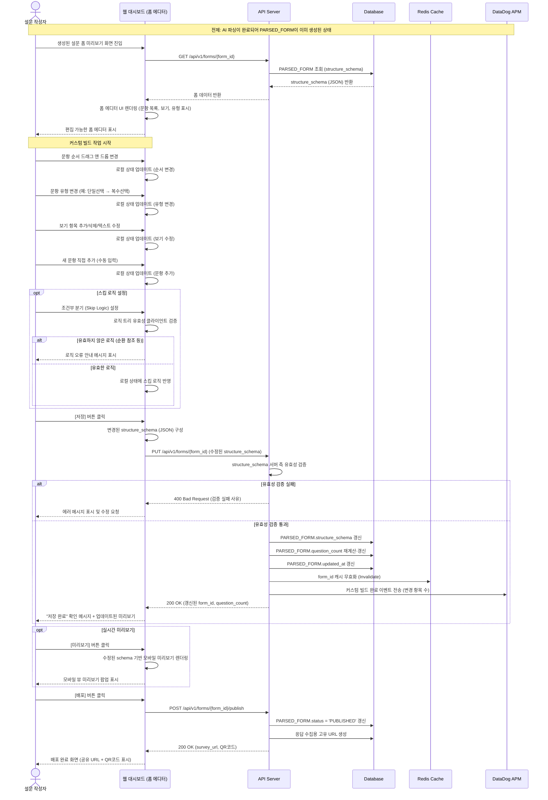

> **커스텀 빌드 관련 API (신규):**
>
> | Endpoint | Method | 설명 | 관련 요구사항 |
> |---|---|---|---|
> | `PUT /api/v1/forms/{form_id}` | PUT | 설문 폼 structure_schema 수정 (커스텀 빌드) | REQ-FUNC-006 |
> | `POST /api/v1/forms/{form_id}/publish` | POST | 수정 완료된 설문 폼 배포(Public URL 생성) | REQ-FUNC-006 |

### 6.4 Validation Plan (검증 계획)

#### 6.4.1 A/B 테스트 설계

| 항목 | 내용 |
|---|---|
| 샘플 크기 | N=500 (폐쇄 테스트) |
| 대조군(A) | 결제 버튼 클릭 시 데이터맵 샘플 스크린샷 1장 노출 후 결제 유도 |
| 실험군(B) | 스크린샷 없이 "완성된 4종 압축 대행사 팩 (29,900원)" 결제 버튼만 즉각 노출 |
| 측정 KPI | 유료 구매 전환율(Conversion Rate), 평균 결제 도달 소요 시간(초) |
| 성공 기준 | 전환율 5% 달성 시 PMF 증명 → MVP Open 베타 론칭 개시 |
| 벤치마크 | Typeform 폼 체류 이탈률 대비 파싱 후 수정 이탈률 15% 이하 유지 |

#### 6.4.2 KPI 측정 체계

| KPI | 측정 주기 | 측정 경로 | 목표 |
|---|---|---|---|
| 북극성 KPI: 유료 ZIP 다운로드 완료 건수 | 매주(Weekly) | PG 결제 완료 콜백 API 호출 수 + DB `payment_cleared=true` 레코드 스캔 → Amplitude 대시보드 | 월 10,000건 |
| 보조 KPI 1: 폼 파싱 완료율 | 매일(Daily) | DataDog APM `doc_id` 인입 건수 대비 `form_id` 발급 비율 | ≥ 95% |
| 보조 KPI 2: 워터마크 유입 가입 전환율 | 매주(Weekly) | GA4 `utm_source=watermark` 클릭 유입 수 대비 회원가입 완료 수 퍼널 분석 | ≥ 5% |

---

*End of Document — SRS-001 Rev 1.0*
