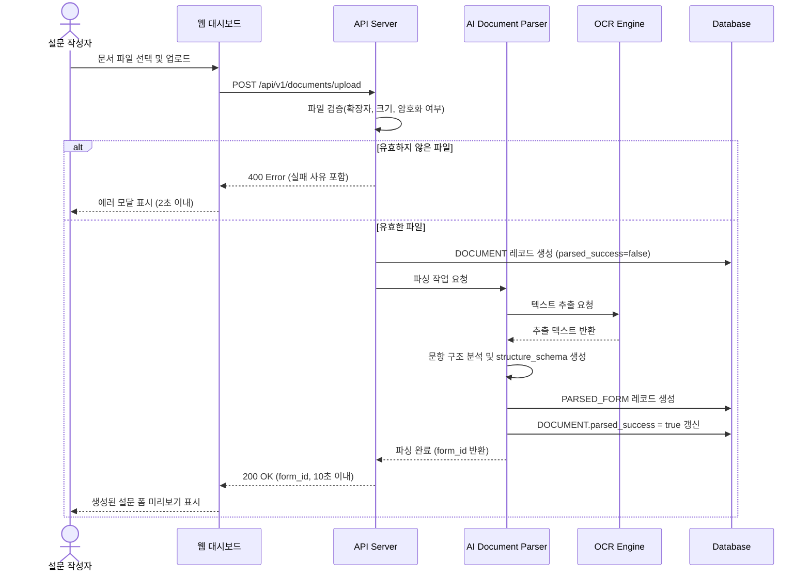
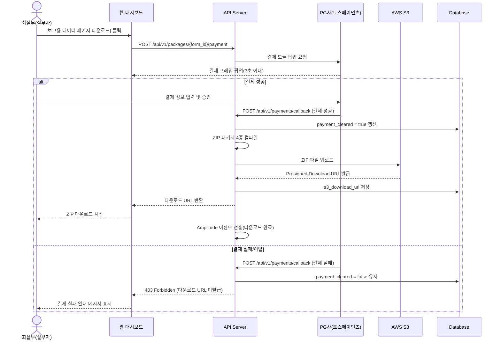
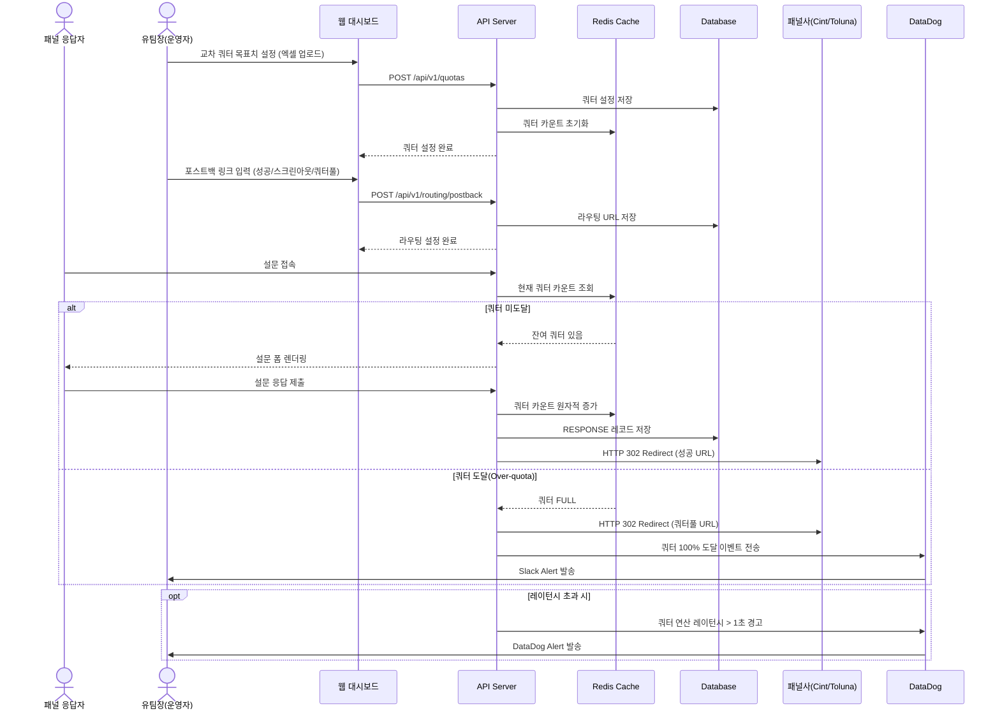
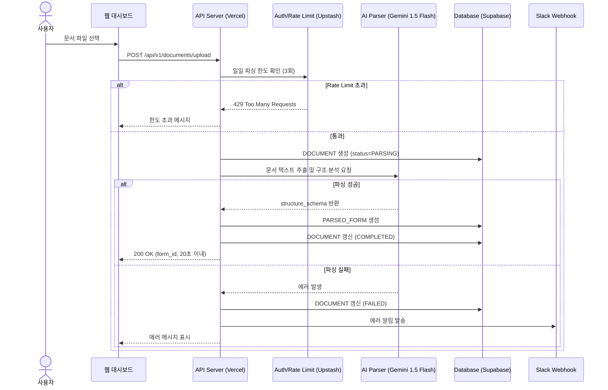
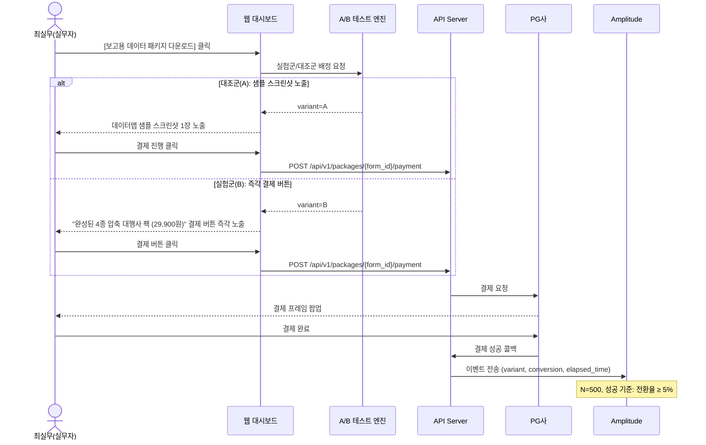

# Software Requirements Specification (SRS)

**Document ID:** SRS-001  
**Revision:** 1.0  
**Date:** 2026-04-16  
**Standard:** ISO/IEC/IEEE 29148:2018  

---

## 1. Introduction

### 1.1 Purpose

본 SRS(Software Requirements Specification)는 **1인 개발자를 위한 AI 기반 문서(Word/PDF) → 설문 변환 및 턴키 운영 플랫폼**(이하 "시스템")에 대한 소프트웨어 요구사항을 정의한다.

본 문서의 핵심 목표는 **"월 인프라 비용 0원(Free Tier)"** 및 **"1인 개발 가능 범위"**로 기능을 극도로 단순화하면서도 가치 제안을 유지하는 것이다.

| 대상 사용자 | 핵심 문제(Pain) | 정량 지표 |
26: |---|---|---|
27: | 홍일반(대중) | 설문 툴의 복잡한 문항 세팅으로 인한 초기 이탈 | 폼 생성 포기율 40% 이상 |
28: | 최실무(핵심 실무자) | 조사 종료 후 엑셀 응답 데이터를 데이터맵/변수가이드로 매핑하는 수동 작업 | 수작업 코딩 야근 발생률 90% 이상, 데이터 정제 소요 시간 일평균 4시간 초과 |
29: 
30: 본 SRS는 1인 프로젝트의 설계·구현·테스트·검증의 기준 문서로 활용된다.

### 1.2 Scope (In-Scope / Out-of-Scope)

#### 1.2.1 In-Scope

| 항목 | 설명 |
33: |---|---|
34: | IS-01 | Word/PDF 비정형 문서 파싱 및 설문 폼 자동 생성 |
35: | IS-02 | 모바일/웹 기반 설문 응답 수집 |
36: | IS-03 | 데이터맵/코드북/변수가이드/응답 원본 엑셀 4종 ZIP 패키지 자동 생성 및 다운로드 |
37: | IS-04 | PG사 결제 연동(Paywall) 기반 유료 산출물 판매 |
38: | IS-07 | 워터마크 기반 바이럴 트래픽 유입 메커니즘 |
39: | IS-08 | 기본적인 서버 에러 알림 (Slack Webhook) |

#### 1.2.2 Out-of-Scope

| 항목 | 설명 |
44: |---|---|
45: | OS-01 | 설문 패널(앱테크) 자체 구축 사업 진출 |
46: | OS-02 | 브랜치(방향 분기형) 에디터 고도화 |
47: | OS-03 | 화려한 에디터 템플릿 / 폰트 커스터마이징 |
48: | OS-04 | 문서 내 이미지/수식 파싱 (V1.0 제외) |
49: | OS-06 | HWP 파싱 지원 (Phase 2로 연기) |
50: | OS-07 | 동적 쿼터 설정 및 패널사 라우팅 제어 (Phase 2로 연기) |

#### 1.2.3 Constraints (제약사항)

| ID | 유형 | 제약사항 |
54: |---|---|---|
55: | CON-01 | 기술 | HWP를 제외한 Word/PDF 텍스트 기반 파싱에 한정 (표/수식 정밀도 한계 존재) |
56: | CON-02 | 비용 | MVP 기간 내 월간 인프라 운영 예산 0원 (Vercel, Supabase 등 Serverless Free Tier 적극 활용) |
57: | CON-03 | 운영 | 무료 계정 일일 파싱 횟수 3회 제한(Rate Limit) |
58: | CON-04 | 보안 | 원본 문서 데이터는 작업 종료 후 일 단위 일괄 삭제 (Edge Cron Job 활용) |
59: | CON-05 | 인프라 | 비용 0원 달성을 위해 LLM API의 무료 티어 (Gemini 1.5 Flash 등)를 적극 활용 |

#### 1.2.4 Assumptions (가정)

| ID | 가정 |
|---|---|
| ASM-01 | 업로드 문서는 50문항 이내, 텍스트 5MB 이하로 제한된다 |
| ASM-02 | PG사(토스페이먼츠 등) API는 안정적으로 제공된다 |
| ASM-03 | AWS S3 서비스의 가용성은 99.99% 이상이다 |
| ASM-04 | 외부 패널사(Cint/Toluna)의 Redirect 규격은 표준 HTTP 302 방식이다 |
| ASM-05 | AI 파서 도입 및 클라우드 과금 체계 최적화에 대한 제품/전략 Align이 완료되었다(ADR) |

### 1.3 Definitions, Acronyms, Abbreviations

| 용어 | 정의 |
|---|---|
| **파싱(Parsing)** | 비정형 문서(HWP/Word/PDF)에서 설문 문항 구조를 자동 추출하는 과정 |
| **데이터맵(Data Map)** | 설문 응답 데이터를 분석 변수로 매핑한 코딩 가이드 문서 |
| **코드북(Codebook)** | 설문 문항 및 보기의 코드 번호와 라벨을 정의한 참조 문서 |
| **변수가이드(Variable Guide)** | 데이터 분석용 변수명·유형·값 범위를 정의한 문서 |
| **4종 ZIP 패키지** | 응답 원본 엑셀 + 변수가이드 + 코드북 + 데이터맵으로 구성된 대행사급 산출물 압축 파일 |
| **쿼터(Quota)** | 조사에서 특정 인구통계학적 그룹별로 목표 응답 수를 제한하는 할당 체계 |
| **스크린아웃(Screen-out)** | 조건 미달 응답자를 조사에서 제외하는 프로세스 |
| **워터마크(Watermark)** | 무료 생성 폼 하단에 노출되는 브랜드 배너/링크 |
| **페르소나(Persona)** | 제품의 목표 사용자 유형을 대표하는 가상 인물 프로필 |
| **JTBD(Jobs to be Done)** | 사용자가 완수하고자 하는 핵심 과업(작업) 프레임워크 |
| **AOS(Adjusted Opportunity Score)** | 조정된 기회 점수; 사용자 니즈의 우선순위를 정량화한 지표 |
| **DOS(Discovered Opportunity Score)** | 발견된 기회 점수; 인터뷰 기반으로 도출된 기회의 크기 지표 |
| **Validator** | 요구사항 또는 가설 검증을 수행하는 검증자(역할) |
| **MoSCoW** | Must / Should / Could / Won't 우선순위 분류 기법 |
| **PMF(Product-Market Fit)** | 제품-시장 적합성이 증명된 상태 |
| **ADR(Architectural Decision Record)** | 아키텍처 관련 의사결정을 기록한 문서 |
| **SLA(Service Level Agreement)** | 서비스 수준 합의서 |
| **RPO(Recovery Point Objective)** | 데이터 복구 시점 목표 |
| **RTO(Recovery Time Objective)** | 서비스 복구 시간 목표 |
| **RBAC(Role-Based Access Control)** | 역할 기반 접근 제어 |
| **APM(Application Performance Monitoring)** | 애플리케이션 성능 모니터링 도구 |
| **PG(Payment Gateway)** | 결제 대행 서비스 |
| **p95** | 전체 요청 중 95번째 백분위 응답 시간 |

### 1.4 References

| ID | 문서명 | 설명 |
|---|---|---|
| REF-01 | AI_Survey_Platform_PRD_v0.1 (최종 통합본) | 본 SRS의 원천(Source of Truth) PRD 문서 |
| REF-02 | Value Proposition Sheet 종합본 | 가치 제안 및 비즈니스 전략 근거 문서 |
| REF-03 | 페르소나 설계 (6번 문서) | 페르소나별 Pain/Needs/Gain 정의 문서 |
| REF-04 | JTBD 고통 증명 (8번 문서) | Jobs to be Done 인터뷰 및 검증 결과 문서 |
| REF-05 | ISO/IEC/IEEE 29148:2018 | Systems and software engineering — Life cycle processes — Requirements engineering |
| REF-06 | ADR-02 (Rate Limit 결정) | 무료 계정 일일 파싱 3회 제한 아키텍처 결정 기록 |

---

## 2. Stakeholders

| 역할(Role) | 대표 페르소나 | 책임(Responsibility) | 관심사(Interest) |
115: |---|---|---|---|
116: | 일반 설문 작성자 | 홍일반 | 비정형 문서 업로드 및 자동 생성 폼 활용 | 복잡한 문항 세팅 제거, 10초 이내 파싱 완료, 무료 사용 |
117: | 신사업 기획 실무자 | 최실무 | 조사 종료 후 데이터맵 ZIP 패키지 구매 및 활용 | 수작업 코딩 야근 제거, 대행사급 4종 산출물 즉시 획득, 비용 절감 |
118: | 1인 개발자 (Owner) | - | 시스템 아키텍처 설계, 구현, 운영 | 비용 0원 유지, 개발 공수 최소화, 기술적 단순성 |
119: | Product Designer | - | UI/UX 설계 (부차적) | 폼 생성 포기율 감소, 결제 전환율 향상 |

---

## 3. System Context and Interfaces

### 3.1 External Systems

| ID | 외부 시스템 | 연동 방식 | 용도 |
132: |---|---|---|---|
133: | EXT-01 | PG사 (토스페이먼츠) | REST API (결제 콜백) | 데이터맵 ZIP 패키지 결제 처리 |
134: | EXT-02 | Supabase Storage | Supabase SDK / URL | ZIP 파일 저장 및 다운로드 URL 제공 |
135: | EXT-06 | Slack | Webhook | 서버 에러 및 주요 알림용 Slack Webhook |
136: | EXT-07 | Amplitude | Event API | 북극성 KPI 이벤트 전송 (무료 티어) |
137: | EXT-08 | GA4 | utm 파라미터 / 퍼널 분석 | 워터마크 유입 대비 가입 전환율 측정 |
138: | EXT-09 | Upstash (Redis) | Serverless Redis API | Rate Limit 및 간단한 캐시용 |
139: | EXT-10 | Gemini 1.5 Flash | API | 문서 파싱 및 문항 구조 분석 (AI 엔진) |

### 3.2 Client Applications

| ID | 클라이언트 | 설명 |
|---|---|---|
| CLI-01 | 웹 대시보드 | 문서 업로드, 폼 관리, 쿼터 세팅, ZIP 다운로드, 결제 |
| CLI-02 | 모바일 웹 설문 폼 | 응답자 대상 설문 응답 수집 인터페이스 (워터마크 포함) |

### 3.3 API Overview

| Endpoint | Method | 설명 | 관련 요구사항 |
154: |---|---|---|---|
155: | `POST /api/v1/documents/upload` | POST | 비정형 문서 업로드 및 파싱 요청 | REQ-FUNC-001~005 |
156: | `GET /api/v1/documents/{doc_id}/status` | GET | 파싱 상태 조회 | REQ-FUNC-004 |
157: | `GET /api/v1/forms/{form_id}` | GET | 생성된 설문 폼 조회 | REQ-FUNC-006 |
158: | `POST /api/v1/forms/{form_id}/responses` | POST | 설문 응답 제출 | REQ-FUNC-008, 009 |
159: | `POST /api/v1/packages/{form_id}/payment` | POST | ZIP 패키지 결제 요청 | REQ-FUNC-010~012 |
160: | `GET /api/v1/packages/{package_id}/download` | GET | ZIP 패키지 다운로드 URL | REQ-FUNC-013, 014 |
161: | `POST /api/v1/payments/callback` | POST | PG사 결제 콜백 수신 | REQ-FUNC-012 |

### 3.4 Interaction Sequences (핵심 시퀀스 다이어그램)

#### 3.4.1 문서 업로드 → 설문 폼 자동 생성 흐름



#### 3.4.2 ZIP 패키지 결제 → 다운로드 흐름



#### 3.4.3 동적 쿼터 제어 및 패널 라우팅 흐름



---

## 4. Specific Requirements

### 4.1 Functional Requirements

#### 4.1.1 F1 — 비정형 문서 파서 (AI Document Parser)

| ID | 요구사항 | Source | Priority | Acceptance Criteria |
|---|---|---|---|---|
| REQ-FUNC-001 | 시스템은 Word(.docx), PDF 형식의 문서 파일 업로드를 지원해야 한다. | Story 1 | Must | **Given** 사용자가 대시보드에 접속했을 때, **When** Word/PDF 파일을 업로드 영역에 드래그하거나 파일 선택을 수행하면, **Then** 시스템은 해당 파일을 수신하고 파싱 파이프라인을 개시해야 한다. |
| REQ-FUNC-002 | 시스템은 업로드된 문서에서 텍스트 기반 설문 문항을 자동 추출하여 설문 폼(PARSED_FORM)을 생성해야 한다. | Story 1 / F1 | Must | **Given** 50문항 이내(텍스트 5MB 이하)의 유효한 Word/PDF 파일이 업로드되었을 때, **When** AI Document Parser가 파싱을 수행하면, **Then** 설문 문항 구조(`structure_schema`)가 생성되고 PARSED_FORM 레코드가 DB에 저장되어야 한다. |
| REQ-FUNC-003 | 시스템은 문서 파싱 및 모바일 웹 렌더링을 20초 이내에 완료해야 한다. (Cold Start 포함) | Story 1 AC-1 | Must | **Given** 50문항 이내의 유효한 문서 파일이 주어졌을 때, **When** [자동 폼 변환] 버튼이 클릭되면, **Then** 파싱부터 모바일 웹 렌더링까지 전체 처리가 20,000ms 이내에 완료되어야 한다. |
| REQ-FUNC-004 | 시스템은 핵심 문항 텍스트 인식률 90% 이상을 보장해야 한다. | Story 1 AC-2 | Must | **Given** 변환된 설문 폼이 생성되었을 때, **When** 원본 문서의 텍스트와 비교하면, **Then** 핵심 문항 텍스트 인식률이 90% 이상이어야 한다. |
| REQ-FUNC-005 | 시스템은 유효하지 않은 파일 업로드 시 명확한 에러 메시지를 표시해야 한다. | Story 1 AC-4 | Must | **Given** 암호화/손상된 파일 업로드 시, **When** 파싱 시도하면, **Then** 에러 메시지를 표시하고 DOCUMENT 상태를 `FAILED`로 기록해야 한다. |
| REQ-FUNC-006 | 시스템은 Gemini 1.5 Flash API를 활용하여 문항 구조를 분석해야 한다. | F1 의존성 | Must | **Given** 문서 텍스트가 추출되었을 때, **When** 구조 분석이 수행되면, **Then** Gemini 1.5 Flash API를 호출하여 `structure_schema`를 생성해야 한다. |
| REQ-FUNC-007 | 시스템은 이미지/수식 요소가 포함된 경우 해당 요소를 건너뛰고 텍스트 기반 문항만 추출해야 한다. | F1 구현성; CON-01 | Must | **Given** 이미지/수식이 포함된 문서 업로드 시, **When** 파싱 수행하면, **Then** 텍스트 기반 문항만 정상 추출되어야 한다. |

#### 4.1.2 F2 — 데이터맵 컴파일러(ZIP 산출물 추출기) & Paywall

| ID | 요구사항 | Source | Priority | Acceptance Criteria |
|---|---|---|---|---|
| REQ-FUNC-008 | 시스템은 조사 종료(수집 마감) 후 응답 원본 엑셀, 변수가이드, 코드북, 데이터맵의 4종 산출물을 자동 생성하여 ZIP 파일로 패키징해야 한다. | Story 2 / F2 | Must | **Given** 조사가 종료(수집 마감)되었을 때, **When** ZIP 컴파일러가 실행되면, **Then** 응답 원본 엑셀, 변수가이드, 코드북, 데이터맵 4종 파일이 생성되어 단일 ZIP 파일로 패키징되어야 한다. |
| REQ-FUNC-009 | 시스템은 ZIP 패키지 생성을 5초 이내에 완료해야 한다. | PRD 목표 | Must | **Given** 조사 종료 후 ZIP 패키지 생성이 요청되었을 때, **When** 컴파일러가 4종 산출물을 생성하면, **Then** ZIP 파일 생성 완료까지 5초 이내여야 한다. |
| REQ-FUNC-010 | 시스템은 ZIP 다운로드 전 PG사 결제 모듈을 팝업하여 결제를 요구해야 한다(Paywall). | Story 2 AC-1 / F2 | Must | **Given** 사용자가 대시보드에서 [보고용 데이터 패키지 다운로드] 버튼을 클릭했을 때, **When** API가 결제 요청을 처리하면, **Then** 3초 이내에 PG사 결제 모듈 프레임이 오류 없이 팝업되어야 한다. |
| REQ-FUNC-011 | 시스템은 결제 완료 후 AWS S3 서명(Presigned) URL을 발급하여 ZIP 다운로드를 허용해야 한다. | Story 2 / F2 의존성 | Must | **Given** PG사로부터 결제 성공 콜백이 수신되었을 때, **When** 시스템이 결제 상태를 검증하면, **Then** DB의 `payment_cleared`를 `true`로 갱신하고 AWS S3 Presigned Download URL을 발급해야 한다. |
| REQ-FUNC-012 | 시스템은 PG사 결제 콜백을 수신하여 결제 성공/실패 상태를 DB에 기록해야 한다. | Story 2 / F2 | Must | **Given** PG사에서 결제 콜백 API를 호출했을 때, **When** 시스템이 콜백 데이터를 수신하면, **Then** 결제 성공 시 `payment_cleared=true`, 실패 시 `payment_cleared=false`를 DB에 기록하고 Amplitude로 이벤트를 전송해야 한다. |
| REQ-FUNC-013 | 시스템은 결제 실패 또는 이탈 시 ZIP 다운로드 URL 발급을 차단(403 Forbidden)해야 한다. | Story 2 AC-3 | Must | **Given** 결제 진행 중 사용자가 창을 닫거나 잔액 부족으로 결제 실패 코드를 수신했을 때, **When** 시스템이 이를 감지하면, **Then** DB의 `payment_cleared=false`를 유지하고 S3 다운로드 서명 URL 발급을 차단(403 Forbidden 응답)해야 한다. |
| REQ-FUNC-014 | 시스템은 다운로드된 데이터맵의 결측치(Missing Value) 처리 실패율 0%를 보장해야 한다. | Story 2 AC-2 | Must | **Given** 다운로드된 데이터맵 파일에 대해 백엔드 데이터 검증이 수행되었을 때, **When** 전체 응답자 레코드를 검사하면, **Then** 형식 불일치 또는 결측치 처리 실패율이 0%여야 한다. |
| REQ-FUNC-015 | 시스템은 Paywall 팝업에 실제 추출된 데이터맵 샘플(모자이크 이미지) 및 더미데이터 스키마 엑셀 무료 다운로드를 제공해야 한다. | PRD 리스크 대응 #2 | Must | **Given** 사용자가 ZIP 다운로드 결제 화면에 접근했을 때, **When** Paywall 팝업이 표시되면, **Then** 모자이크 처리된 실제 데이터맵 샘플 이미지와 임시 더미데이터 스키마 엑셀 1개의 무료 다운로드 링크가 함께 제공되어야 한다. |

#### 4.1.3 F3 — 워터마크 기반 바이럴 메커니즘

| ID | 요구사항 | Source | Priority | Acceptance Criteria |
|---|---|---|---|---|
| REQ-FUNC-016 | 시스템은 무료 사용자가 생성한 설문 폼의 하단 뷰포트에 워터마크 배너를 100% 렌더링해야 한다. | Story 1 AC-3 | Must | **Given** 무료 사용자가 생성한 폼에 응답자가 접속했을 때, **When** 화면이 로드되면, **Then** 하단 뷰포트에 워터마크 배너가 100% 렌더링(노출)되어야 한다. |
| REQ-FUNC-017 | 시스템은 워터마크 링크에 `utm_source=watermark` 파라미터를 포함하여 GA4 퍼널 추적이 가능하도록 해야 한다. | PRD KPI (보조 KPI 2) | Must | **Given** 워터마크 배너가 렌더링되었을 때, **When** 응답자가 워터마크를 클릭하면, **Then** `utm_source=watermark` 파라미터가 포함된 URL로 서비스 가입 페이지에 랜딩되어야 한다. |

#### 4.1.3 F3 — 워터마크 기반 바이럴 메커니즘 (유지)

#### 4.1.6 F6 — 무료 계정 Rate Limit 및 기대치 관리

| ID | 요구사항 | Source | Priority | Acceptance Criteria |
|---|---|---|---|---|
| REQ-FUNC-026 | 시스템은 무료 계정에 대해 일일 파싱 횟수를 3회로 제한(Rate Limit)해야 한다. | PRD 리스크 대응 #3; ADR-02 | Must | **Given** 무료 계정 사용자가 당일 3회 파싱을 완료했을 때, **When** 4번째 파싱을 시도하면, **Then** 시스템이 파싱 요청을 거부(HTTP 429)하고 일일 한도 초과 안내 메시지를 표시해야 한다. |
| REQ-FUNC-027 | 시스템은 업로드 전 표/이미지/수식 정확도 한계에 대한 모달 가이드를 표시해야 한다. | PRD 리스크 대응 #1 | Must | **Given** 사용자가 문서 업로드를 시도할 때, **When** 업로드 화면이 로드되면, **Then** "표, 이미지, 수식은 정확한 폼 변환이 어려울 수 있습니다" 안내 모달과 AI 최적화 템플릿 다운로드 링크를 제공해야 한다. |
| REQ-FUNC-028 | 시스템은 파싱 서버 앞단에 캐시 서버를 구축하여 중복 요청에 대한 비용을 절감해야 한다. | PRD 리스크 대응 #3 | Should | **Given** 동일한 문서 해시(hash)로 파싱 요청이 수신되었을 때, **When** 캐시에 해당 결과가 존재하면, **Then** 파싱 파이프라인을 재실행하지 않고 캐시된 결과를 반환해야 한다. |

#### 4.1.5 F7 — 보안 및 데이터 관리

| ID | 요구사항 | Source | Priority | Acceptance Criteria |
|---|---|---|---|---|
| REQ-FUNC-029 | 시스템은 작업 종료 후 24시간이 경가한 원본 문서 데이터를 Edge Cron Job을 활용하여 일 단위로 영구 삭제해야 한다. | PRD NFR 보안 | Must | **Given** 문서 파싱 작업 후 24시간이 경과했을 때, **When** 일 단위 삭제 스케줄러가 실행되면, **Then** 해당 데이터를 영구 삭제해야 한다. |
| REQ-FUNC-030 | 시스템은 디스크에 저장되는 모든 데이터에 암호화(At-rest)를 적용해야 한다 (Supabase Storage 기본 기능 활용 가능). | PRD NFR 보안 | Must | **Given** 데이터가 저장될 때, **When** 저장 연산이 수행되면, **Then** 암호화가 적용된 상태로 저장되어야 한다. |

### 4.2 Non-Functional Requirements

#### 4.2.1 성능(Performance)

| ID | 요구사항 | 측정 기준 | Source | Priority |
|---|---|---|---|---|
| REQ-NF-001 | 모바일 및 웹 설문 응답 패킷의 p95 응답 시간은 2,000ms 이하여야 한다. | p95 latency ≤ 2,000ms (서버리스 콜드 스타트 허용) | PRD NFR 성능 | Must |
| REQ-NF-002 | 문서 파싱 완료 레이턴시는 20초 이하여야 한다. | 파싱 대기 시간 ≤ 20,000ms | PRD NFR 성능 | Must |
| REQ-NF-003 | 폼 생성(파싱부터 렌더링까지) 소요 시간은 25초 이내여야 한다. | 전체 파이프라인 ≤ 25,000ms | PRD 목표 / Story 1 AC-1 | Must |
| REQ-NF-004 | ZIP 패키지(4종 산출물) 생성 대기 시간은 10초 이내여야 한다. | 패키지 컴파일 ≤ 10,000ms | PRD 목표 | Must |
| REQ-NF-005 | PG사 결제 모듈 프레임 팝업은 5초 이내에 완료되어야 한다. | 결제 UI 로드 ≤ 5,000ms | Story 2 AC-1 | Must |
| REQ-NF-007 | 파일 유효성 검증 실패 시 에러 모달 표시는 3초 이내에 완료되어야 한다. | 에러 응답 ≤ 3,000ms | Story 1 AC-4 | Must |

#### 4.2.2 가용성(Availability) 및 신뢰성(Reliability)

| ID | 요구사항 | 측정 기준 | Source | Priority |
|---|---|---|---|---|
| REQ-NF-008 | 시스템 가용성은 Best Effort 원칙을 따른다. | 의존하는 BaaS(Vercel, Supabase) 무료 티어 가용성에 따름 | PRD NFR 신뢰성 | Must |
| REQ-NF-009 | 파싱 및 운영 치명률(Critical Failure Rate)은 1.0% 이하여야 한다. | 치명적 오류 발생률 ≤ 1.0% | PRD NFR 신뢰성 | Must |
| REQ-NF-010 | 업로드된 비정형 문서 대비 폼 파싱 완료율은 90% 이상을 유지해야 한다. | `form_id` 발급률 / `doc_id` 인입률 ≥ 90% | PRD 보조 KPI 1 | Must |
| REQ-NF-011 | 데이터맵의 결측치(Missing Value) 처리 실패율은 0.1% 이하여야 한다. | 결측치 처리 실패 건수 ≤ 0.1% | Story 2 AC-2 | Must |

#### 4.2.3 보안(Security)

| ID | 요구사항 | 측정 기준 | Source | Priority |
|---|---|---|---|---|
| REQ-NF-016 | 모든 클라이언트-서버 간 통신은 TLS 1.2 이상을 사용해야 한다. | TLS 1.2+ 적용률 100% | 시스템 표준 | Must |
| REQ-NF-017 | 디스크 저장 데이터에 AES-256 암호화를 적용해야 한다. | 암호화 미적용 데이터 = 0 | PRD NFR 보안 | Must |
| REQ-NF-018 | 원본 문서 및 파편 데이터는 작업 종료 후 24시간 이내에 영구 삭제(Zero-Retention)해야 한다. | 24시간 초과 문서 잔존 건수 = 0 | PRD NFR 보안 | Must |
| REQ-NF-019 | 역할 기반 접근 제어(RBAC)를 적용하여 사용자 권한을 분리해야 한다. | 권한 미설정 기능 접근 차단률 100% | 시스템 표준 | Must |
| REQ-NF-020 | 결제 관련 모든 트랜잭션에 대한 감사 로그(Audit Log)를 생성·보관해야 한다. | 감사 로그 누락률 = 0% | 시스템 표준 | Must |

#### 4.2.4 비용(Cost Efficiency)

| ID | 요구사항 | 측정 기준 | Source | Priority |
|---|---|---|---|---|
| REQ-NF-021 | 월간 인프라 운영 예산은 0원임을 보장해야 한다 (Free Tier 한도 내 방어). | 월 비용 = 0 KRW | PRD NFR 비용 | Must |
| REQ-NF-023 | BaaS(Supabase, Vercel) 사용량 임계치 도달 시 Slack 알림을 설정해야 한다. | 알림 설정 완료 여부 = Yes | PRD NFR 비용 | Must |

#### 4.2.5 운영/모니터링 (Monitoring)

| ID | 요구사항 | 측정 기준 | Source | Priority |
|---|---|---|---|---|
| REQ-NF-024 | 주요 에러 및 결제 실패 발생 시 Slack Webhook을 통해 실시간 알림을 발송해야 한다. | Slack 알림 발송 지연 ≤ 60초 | PRD NFR 모니터링 | Must |
| REQ-NF-027 | 북극성 KPI 이벤트를 Amplitude(무료 티어) 대시보드에 전송해야 한다. | 이벤트 전송 성공률 ≥ 99% | PRD 북극성 KPI | Must |
| REQ-NF-028 | 워터마크 유입 추적을 위해 GA4 파라미터를 활용해야 한다. | 퍼널 설정 완료 여부 = Yes | PRD 보조 KPI 2 | Must |

#### 4.2.6 확장성(Scalability)

| ID | 요구사항 | 측정 기준 | Source | Priority |
|---|---|---|---|---|
| REQ-NF-029 | 시스템은 동시 접속자 50~100명 수준을 처리할 수 있어야 한다 (Supabase 무료 티어 커넥션 한계 반영). | 동시 접속자 50~100명 안정성 유지 | Story 3 AC-3 | Should |

#### 4.2.7 유지보수성(Maintainability)

| ID | 요구사항 | 측정 기준 | Source | Priority |
|---|---|---|---|---|
| REQ-NF-031 | API 엔드포인트는 버전 관리(`/api/v{N}/`)를 적용하여 하위 호환성을 보장해야 한다. | API 버전 관리 적용률 = 100% | 시스템 표준 | Must |
| REQ-NF-032 | 시스템의 모든 모듈은 독립적으로 배포 가능한 마이크로서비스 또는 모듈화된 모놀리스 구조를 따라야 한다. | 모듈 간 순환 의존성 = 0 | 시스템 표준 | Should |

#### 4.2.8 KPI 목표(Desired Outcome)

| ID | 요구사항 | 측정 기준 | Source | Priority |
|---|---|---|---|---|
| REQ-NF-033 | 북극성 KPI: 유료 '데이터맵 ZIP 패키지' 다운로드 완료 건수는 월 10,000건 달성을 목표로 한다. | 월간 `payment_cleared=true` 건수 ≥ 10,000 | PRD 북극성 KPI | Must |
| REQ-NF-034 | 보조 KPI 1: 업로드 문서 대비 폼 파싱 완료율 95% 이상을 방어해야 한다. | 일간 파싱 완료율 ≥ 95% | PRD 보조 KPI 1 | Must |
| REQ-NF-035 | 보조 KPI 2: 워터마크 유입 대비 서비스 가입 전환율 5% 이상을 달성해야 한다. | 주간 전환율 ≥ 5% | PRD 보조 KPI 2 | Should |
| REQ-NF-036 | 유료 구매 전환율(Conversion Rate) 5% 달성 시 PMF 증명으로 판단하고 MVP Open 베타 론칭을 개시한다. | 전환율 ≥ 5% | PRD 실험·롤아웃 | Must |
| REQ-NF-037 | 파싱 후 수정 이탈률은 Typeform 폼 체류 이탈률 대비 15% 이하를 유지해야 한다. | 수정 이탈률 ≤ 15% | PRD 경쟁 벤치마킹 | Should |

---

## 5. Traceability Matrix

### 5.1 Story ↔ Requirement ID ↔ Test Case ID

| Story | PRD Section | Requirement ID(s) | Test Case ID |
439: |---|---|---|---|
440: | Story 1: 문서 파싱 | PRD §3 Story 1 | REQ-FUNC-001 ~ REQ-FUNC-007 | TC-FUNC-001 ~ TC-FUNC-007 |
441: | Story 1 AC-3 (워터마크) | PRD §3 Story 1 | REQ-FUNC-016, REQ-FUNC-017 | TC-FUNC-016, TC-FUNC-017 |
442: | Story 2: 4종 산출물 ZIP 출하 | PRD §3 Story 2 | REQ-FUNC-008 ~ REQ-FUNC-015 | TC-FUNC-008 ~ TC-FUNC-015 |
443: | 리스크 대응 (Rate Limit) | PRD §7 | REQ-FUNC-026, REQ-FUNC-027, REQ-FUNC-028 | TC-FUNC-026 ~ TC-FUNC-028 |
444: | 보안 요건 | PRD §5 | REQ-FUNC-029, REQ-FUNC-030 | TC-FUNC-029, TC-FUNC-030 |

### 5.2 KPI/성능 지표 ↔ NFR ID ↔ Test Case ID

| KPI/성능 지표 | PRD Section | NFR ID(s) | Test Case ID |
452: |---|---|---|---|
453: | p95 응답 시간 ≤ 2,000ms | PRD §5 성능 | REQ-NF-001 | TC-NF-001 |
454: | 파싱 레이턴시 ≤ 20초 | PRD §5 성능 | REQ-NF-002 | TC-NF-002 |
455: | 가용성: Best Effort | PRD §5 신뢰성 | REQ-NF-008 | TC-NF-008 |
456: | 인프라 예산 = 0원 | PRD §5 비용 | REQ-NF-021 | TC-NF-021 |
457: | 북극성 KPI 전송 | PRD §1 북극성 KPI | REQ-NF-027, REQ-NF-033 | TC-NF-033 |
458: | 가입 전환율 ≥ 5% | PRD §1 보조 KPI 2 | REQ-NF-035 | TC-NF-035 |
| PMF 전환율 ≥ 5% | PRD §8 실험 | REQ-NF-036 | TC-NF-036 |

---

## 6. Appendix

### 6.1 API Endpoint List

| # | Endpoint | Method | Request Body / Params | Response | 성공 코드 | 에러 코드 | 관련 요구사항 |
475: |---|---|---|---|---|---|---|---|
476: | 1 | `POST /api/v1/documents/upload` | POST | `multipart/form-data` (file: Word/PDF, ≤ 5MB) | `{ doc_id, status }` | 200 | 400, 429 | REQ-FUNC-001~005, REQ-FUNC-026 |
477: | 2 | `GET /api/v1/documents/{doc_id}/status` | GET | `doc_id` (path) | `{ doc_id, parsed_success, form_id, error_code }` | 200 | 404 | REQ-FUNC-004 |
478: | 3 | `GET /api/v1/forms/{form_id}` | GET | `form_id` (path) | `{ form_id, structure_schema, viral_watermark_url }` | 200 | 404 | REQ-FUNC-006, REQ-FUNC-016 |
479: | 4 | `POST /api/v1/forms/{form_id}/responses` | POST | `{ resp_id, user_agent, raw_record }` | `{ resp_id, status }` | 201 | 400 | REQ-FUNC-008 |
480: | 5 | `POST /api/v1/packages/{form_id}/payment` | POST | `{ form_id, payment_method }` | `{ payment_url, session_id }` | 200 | 400 | REQ-FUNC-010 |
481: | 6 | `POST /api/v1/payments/callback` | POST | `{ session_id, status, pg_transaction_id }` | `{ result }` | 200 | 400 | REQ-FUNC-012 |
482: | 7 | `GET /api/v1/packages/{package_id}/download` | GET | `package_id` (path) | `{ download_url }` | 200 | 403, 404 | REQ-FUNC-011, REQ-FUNC-013 |

### 6.2 Entity & Data Model

#### 6.2.1 DOCUMENT

| 필드명 | 데이터 타입 | 제약 조건 | 설명 |
|---|---|---|---|
| `doc_id` | VARCHAR(36) | PK, NOT NULL, UUID | 문서 고유 식별자 |
| `user_id` | VARCHAR(36) | FK → USER.user_id, NOT NULL | 업로드 사용자 ID |
| `file_type` | ENUM('HWP','PDF','WORD') | NOT NULL | 문서 파일 형식 |
| `file_name` | VARCHAR(255) | NOT NULL | 원본 파일명 |
| `file_size_bytes` | BIGINT | NOT NULL, ≤ 5,242,880 | 파일 크기(바이트) |
| `file_hash` | VARCHAR(64) | NOT NULL | SHA-256 파일 해시 (캐시 키) |
| `parsed_success` | BOOLEAN | NOT NULL, DEFAULT false | 파싱 성공 여부 |
| `error_code` | VARCHAR(10) | NULLABLE | 실패 시 에러 코드 |
| `error_message` | TEXT | NULLABLE | 실패 사유 상세 메시지 |
| `created_at` | TIMESTAMP | NOT NULL, DEFAULT NOW() | 생성 시각 |
| `expires_at` | TIMESTAMP | NOT NULL | 삭제 예정 시각 (created_at + 24h) |
| `status` | ENUM('PENDING','PARSING','COMPLETED','FAILED') | NOT NULL, DEFAULT 'PENDING' | 처리 상태 |

#### 6.2.2 PARSED_FORM

| 필드명 | 데이터 타입 | 제약 조건 | 설명 |
|---|---|---|---|
| `form_id` | VARCHAR(36) | PK, NOT NULL, UUID | 설문 폼 고유 식별자 |
| `doc_id` | VARCHAR(36) | FK → DOCUMENT.doc_id, NOT NULL | 원본 문서 참조 |
| `structure_schema` | JSON | NOT NULL | 파싱된 문항 구조 스키마 |
| `question_count` | INTEGER | NOT NULL | 추출된 문항 수 |
| `skipped_elements` | JSON | NULLABLE | 건너뛴 비텍스트 요소 목록 |
| `viral_watermark_url` | VARCHAR(512) | NOT NULL | 워터마크 링크 URL (utm_source=watermark 포함) |
| `is_paid_user` | BOOLEAN | NOT NULL, DEFAULT false | 유료 사용자 여부 (워터마크 표시 제어) |
| `created_at` | TIMESTAMP | NOT NULL, DEFAULT NOW() | 생성 시각 |
| `updated_at` | TIMESTAMP | NOT NULL | 최종 수정 시각 |

#### 6.2.3 RESPONSE

| 필드명 | 데이터 타입 | 제약 조건 | 설명 |
|---|---|---|---|
| `resp_id` | VARCHAR(36) | PK, NOT NULL, UUID | 응답 고유 식별자 |
| `form_id` | VARCHAR(36) | FK → PARSED_FORM.form_id, NOT NULL | 설문 폼 참조 |
| `user_agent` | VARCHAR(512) | NOT NULL | 응답자 브라우저 정보 |
| `raw_record` | JSON | NOT NULL | 응답 원본 데이터 |
| `created_at` | TIMESTAMP | NOT NULL, DEFAULT NOW() | 응답 시각 |
| `ip_hash` | VARCHAR(64) | NOT NULL | 응답자 IP 해시 (개인정보 비식별화) |

#### 6.2.4 ZIP_DATAMAP

| 필드명 | 데이터 타입 | 제약 조건 | 설명 |
|---|---|---|---|
| `package_id` | VARCHAR(36) | PK, NOT NULL, UUID | 패키지 고유 식별자 |
| `form_id` | VARCHAR(36) | FK → PARSED_FORM.form_id, NOT NULL | 설문 폼 참조 |
| `payment_cleared` | BOOLEAN | NOT NULL, DEFAULT false | 결제 완료 여부 |
| `pg_transaction_id` | VARCHAR(100) | NULLABLE | PG사 거래 ID |
| `payment_amount` | INTEGER | NULLABLE | 결제 금액 (KRW) |
| `download_url` | VARCHAR(1024) | NULLABLE | Supabase Storage 다운로드 URL |
| `url_expires_at` | TIMESTAMP | NULLABLE | 다운로드 URL 만료 시각 |
| `download_count` | INTEGER | NOT NULL, DEFAULT 0 | 다운로드 횟수 |
| `created_at` | TIMESTAMP | NOT NULL, DEFAULT NOW() | 생성 시각 |
| `updated_at` | TIMESTAMP | NOT NULL | 최종 수정 시각 |

#### 6.2.8 AUDIT_LOG

| 필드명 | 데이터 타입 | 제약 조건 | 설명 |
|---|---|---|---|
| `log_id` | VARCHAR(36) | PK, NOT NULL, UUID | 감사 로그 고유 식별자 |
| `user_id` | VARCHAR(36) | FK → USER.user_id | 수행 사용자 |
| `action` | VARCHAR(100) | NOT NULL | 수행된 작업 (예: PAYMENT_SUCCESS, FILE_DELETE) |
| `resource_type` | VARCHAR(50) | NOT NULL | 대상 리소스 유형 |
| `resource_id` | VARCHAR(36) | NOT NULL | 대상 리소스 ID |
| `details` | JSON | NULLABLE | 상세 정보 |
| `ip_address_hash` | VARCHAR(64) | NOT NULL | 요청 IP 해시 |
| `created_at` | TIMESTAMP | NOT NULL, DEFAULT NOW() | 기록 시각 |

### 6.3 Detailed Interaction Models (상세 시퀀스 다이어그램)

#### 6.3.1 문서 업로드 → 파싱 → 폼 생성 상세 흐름



#### 6.3.2 설문 응답 수집 상세 흐름

626: ```mermaid
627: sequenceDiagram
628:     actor Respondent as 응답자
629:     participant Form as 모바일 웹 설문 폼
630:     participant API as API Server (Vercel)
631:     participant DB as Database (Supabase)
632: 
633:     Respondent->>Form: 설문 폼 URL 접속
634:     Form->>API: GET /api/v1/forms/{form_id}
635:     API->>DB: PARSED_FORM 조회
636:     DB-->>API: structure_schema 반환
637:     API-->>Form: 폼 데이터 반환 (p95 ≤ 2,000ms)
638:     
639:     Form->>Form: 설문 문항 및 워터마크 렌더링
640:     
641:     Respondent->>Form: 응답 입력 및 제출
642:     Form->>API: POST /api/v1/forms/{form_id}/responses
643:     API->>DB: RESPONSE 레코드 저장
644:     API-->>Form: 201 Created
645: ```


#### 6.3.4 데이터 삭제 스케줄러 (Edge Cron Job) 상세 흐름

712: ```mermaid
713: sequenceDiagram
714:     participant Scheduler as Edge Cron Job (Vercel)
715:     participant DB as Database (Supabase)
716:     participant S3 as Supabase Storage
717: 
718:     Note over Scheduler: 일 단위 실행
719:     
720:     Scheduler->>DB: 24시간 경과한 만료 대상 조회
721:     DB-->>Scheduler: 만료 대상 목록 반환
722:     
723:     loop 각 대상에 대해
724:         Scheduler->>S3: 데이터 삭제
725:         Scheduler->>DB: 레코드 삭제/비식별화
726:     end
727: ```

#### 6.3.5 A/B 테스트 (Paywall 전환율 최적화) 흐름



### 6.4 Validation Plan (검증 계획)

#### 6.4.1 A/B 테스트 설계

| 항목 | 내용 |
|---|---|
| 샘플 크기 | N=500 (폐쇄 테스트) |
| 대조군(A) | 결제 버튼 클릭 시 데이터맵 샘플 스크린샷 1장 노출 후 결제 유도 |
| 실험군(B) | 스크린샷 없이 "완성된 4종 압축 대행사 팩 (29,900원)" 결제 버튼만 즉각 노출 |
| 측정 KPI | 유료 구매 전환율(Conversion Rate), 평균 결제 도달 소요 시간(초) |
| 성공 기준 | 전환율 5% 달성 시 PMF 증명 → MVP Open 베타 론칭 개시 |
| 벤치마크 | Typeform 폼 체류 이탈률 대비 파싱 후 수정 이탈률 15% 이하 유지 |

#### 6.4.2 KPI 측정 체계

785: | KPI | 측정 주기 | 측정 경로 | 목표 |
786: |---|---|---|---|
787: | 북극성 KPI: 유료 ZIP 다운로드 완료 건수 | 매주(Weekly) | API 호출 수 + DB `payment_cleared=true` 집계 | 월 1,000건 (초기 타겟) |
788: | 보조 KPI 1: 폼 파싱 완료율 | 매일(Daily) | `doc_id` 인입 대비 `form_id` 발급 비율 | ≥ 90% |
789: | 보조 KPI 2: 워터마크 유입 가입 전환율 | 매주(Weekly) | GA4 퍼널 분석 | ≥ 5% |

---

*End of Document — SRS-001 Rev 1.0*
