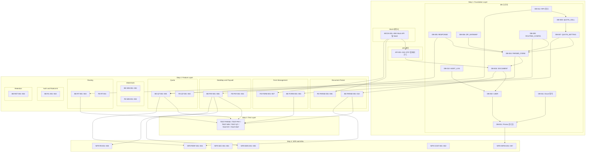

# 📋 개발 태스크 목록 명세서 v2 (Task Breakdown from SRS_v1)

**문서 ID:** TASK-001 Rev 2  
**원천 문서:** SRS-001 Rev 1.2 (SRS_v1.md)  
**작성일:** 2026-04-21 (v1) / 2026-04-23 (v2 최신화)  
**작성 방법론:** Contract-First → CQRS → TDD → NFR 순차 추출  
**v2 변경사항:** Dashboard·Auth·Admin 도메인 추가, TEST-FORM·TEST-ADMIN 추가, 요약 통계 보정 (141 → 166개)  

---

## 목차

1. [Step 1. 계약·데이터 명세 Task (Foundation Layer)](#step-1-계약데이터-명세-task-foundation-layer)
2. [Step 2. 로직·상태 변경 Task (Feature Layer — CQRS 분해)](#step-2-로직상태-변경-task-feature-layer--cqrs-분해)
3. [Step 3. 테스트 Task (AC 기반 자동화 검증)](#step-3-테스트-task-ac-기반-자동화-검증)
4. [Step 4. 비기능 제약(NFR) 및 인프라 Task](#step-4-비기능-제약nfr-및-인프라-task)
5. [전체 태스크 의존성 맵 (Dependency Graph)](#전체-태스크-의존성-맵-dependency-graph)
6. [전체 태스크 요약 통계](#전체-태스크-요약-통계)

---

## Step 1. 계약·데이터 명세 Task (Foundation Layer)

> **목표:** 백엔드·프론트엔드가 공유할 **단일 진실 공급원(SSOT)** 구축.  
> DB 스키마, API DTO, Mock 데이터를 가장 먼저 확정하여 후속 모든 태스크의 기반으로 삼는다.

### 1-A. 데이터베이스(DB) 스키마 및 마이그레이션 Task

| Task ID | Epic (도메인) | Feature (기능명) | 관련 SRS 섹션 | 선행 태스크 (Dependencies) | 복잡도 (H/M/L) |
|---|---|---|---|---|---|
| DB-001 | Foundation | Prisma 스키마 초기화 및 개발 환경 구성 (SQLite 로컬 / Supabase PostgreSQL 배포) | §1.2.3 C-TEC-003 | None | M |
| DB-002 | Foundation | USER 테이블 스키마 및 마이그레이션 작성 (user_id, email, name, is_paid_user, created_at) | §6.2.9 ERD | DB-001 | L |
| DB-003 | Foundation | DOCUMENT 테이블 스키마 및 마이그레이션 작성 (doc_id, user_id FK, file_type ENUM, file_hash, status ENUM, expires_at 등) | §6.2.1 | DB-002 | M |
| DB-004 | Foundation | PARSED_FORM 테이블 스키마 및 마이그레이션 작성 (form_id, doc_id FK, structure_schema JSON, viral_watermark_url, is_paid_user 등) | §6.2.2 | DB-003 | M |
| DB-005 | Foundation | RESPONSE 테이블 스키마 및 마이그레이션 작성 (resp_id, form_id FK, raw_record JSON, quota_status ENUM, routing_status ENUM, ip_hash 등) | §6.2.3 | DB-004 | M |
| DB-006 | Foundation | ZIP_DATAMAP 테이블 스키마 및 마이그레이션 작성 (package_id, form_id FK, payment_cleared, pg_transaction_id, download_url, download_count 등) | §6.2.4 | DB-004 | M |
| DB-007 | Foundation | QUOTA_SETTING 테이블 스키마 및 마이그레이션 작성 (quota_id, form_id FK, quota_matrix JSON, is_active 등) | §6.2.5 | DB-004 | L |
| DB-008 | Foundation | QUOTA_CELL 테이블 스키마 및 마이그레이션 작성 (cell_id, quota_id FK, group_key, gender ENUM, target_count, current_count, is_full 등) | §6.2.6 | DB-007 | M |
| DB-009 | Foundation | ROUTING_CONFIG 테이블 스키마 및 마이그레이션 작성 (routing_id, form_id FK, success_url, screenout_url, quotafull_url 등) | §6.2.7 | DB-004 | L |
| DB-010 | Foundation | AUDIT_LOG 테이블 스키마 및 마이그레이션 작성 (log_id, user_id FK, action, resource_type, resource_id, details JSON 등) | §6.2.8 | DB-002 | L |
| DB-011 | Foundation | Enum 타입 정의 (FileType, DocumentStatus, QuotaStatus, RoutingStatus, Gender) 및 Prisma enum 매핑 | §6.2.10 | DB-001 | L |
| DB-012 | Foundation | 쿼터 카운트 원자적 증가를 위한 Supabase RPC(PL/pgSQL) 함수 작성 (`increment_quota_cell`) | §6.2.6, §3.6.3 | DB-008 | H |

### 1-B. API 통신 계약(Contract) 및 DTO 정의 Task

| Task ID | Epic (도메인) | Feature (기능명) | 관련 SRS 섹션 | 선행 태스크 (Dependencies) | 복잡도 (H/M/L) |
|---|---|---|---|---|---|
| API-001 | Foundation | Document 도메인 API 계약 정의: `POST /api/v1/documents/upload` Request(multipart/form-data) / Response DTO (`{ doc_id, status }`) 및 에러 코드(400, 429) | §6.1 #1 | DB-003 | M |
| API-002 | Foundation | Document 도메인 API 계약 정의: `GET /api/v1/documents/{doc_id}/status` Response DTO (`{ doc_id, parsed_success, form_id, error_code }`) 및 에러 코드(404) | §6.1 #2 | DB-003 | L |
| API-003 | Foundation | Form 도메인 API 계약 정의: `GET /api/v1/forms/{form_id}` Response DTO (`{ form_id, structure_schema, viral_watermark_url }`) 및 에러 코드(404) | §6.1 #3 | DB-004 | L |
| API-004 | Foundation | Form 도메인 API 계약 정의: `POST /api/v1/forms/{form_id}/responses` Request DTO (`{ resp_id, user_agent, raw_record, quota_group }`) / Response DTO (`{ resp_id, status }`) 및 에러 코드(400, 429) | §6.1 #4 | DB-005 | M |
| API-005 | Foundation | Form 커스텀 빌드 API 계약 정의: `PUT /api/v1/forms/{form_id}` Request DTO (수정된 structure_schema) / Response DTO 및 에러 코드(400) | §6.3.6 | DB-004 | M |
| API-006 | Foundation | Form 배포 API 계약 정의: `POST /api/v1/forms/{form_id}/publish` Response DTO (`{ survey_url, qr_code }`) | §6.3.6 | DB-004 | L |
| API-007 | Foundation | Package/Payment 도메인 API 계약 정의: `POST /api/v1/packages/{form_id}/payment` Request/Response DTO 및 에러 코드(400, 500) | §6.1 #5 | DB-006 | M |
| API-008 | Foundation | Package/Payment 도메인 API 계약 정의: `POST /api/v1/payments/callback` Request DTO (`{ session_id, status, pg_transaction_id }`) / Response DTO 및 에러 코드(400) | §6.1 #6 | DB-006 | M |
| API-009 | Foundation | Package 도메인 API 계약 정의: `GET /api/v1/packages/{package_id}/download` Response DTO (`{ presigned_url }`) 및 에러 코드(403 미결제, 404) | §6.1 #7 | DB-006 | L |
| API-010 | Foundation | Quota 도메인 API 계약 정의: `POST /api/v1/quotas` Request DTO (`{ form_id, quota_matrix }`) / Response DTO 및 에러 코드(400) | §6.1 #8 | DB-007, DB-008 | M |
| API-011 | Foundation | Quota 도메인 API 계약 정의: `GET /api/v1/quotas/{quota_id}/status` Response DTO (`{ quota_id, cells: [...] }`) 및 에러 코드(404) | §6.1 #9 | DB-007, DB-008 | L |
| API-012 | Foundation | Routing 도메인 API 계약 정의: `POST /api/v1/routing/postback` Request DTO (`{ form_id, success_url, screenout_url, quotafull_url }`) / Response DTO 및 에러 코드(400) | §6.1 #10 | DB-009 | L |
| API-013 | Foundation | Routing 도메인 API 계약 정의: `GET /api/v1/routing/redirect/{resp_id}` Response(HTTP 302) 및 에러 코드(404, 500) | §6.1 #11 | DB-009 | L |
| API-014 | Foundation | 공통 에러 응답 형식(Error Response Schema) 및 HTTP 상태 코드 규약 정의 (400, 403, 404, 429, 500 통합) | §6.1 전체 | None | L |
| API-015 | Foundation | API 버전 관리 체계 (`/api/v{N}/`) Route Handler 디렉토리 구조 설계 | §4.2.7 REQ-NF-031 | None | L |
| API-016 | Foundation | Admin 도메인 API 계약 정의: `GET /api/v1/admin/stats` 통계 집계 Response DTO 및 권한 검증 | §4.2.8 REQ-NF-033 | DB-010 | L |

### 1-C. Mock 데이터 및 프론트엔드 독립 개발 지원 Task

| Task ID | Epic (도메인) | Feature (기능명) | 관련 SRS 섹션 | 선행 태스크 (Dependencies) | 복잡도 (H/M/L) |
|---|---|---|---|---|---|
| MOCK-001 | Foundation | 문서 업로드 성공/실패 Mock API 엔드포인트 및 시드 데이터 작성 (HWPX/Word/PDF 샘플, 에러 응답 포함) | §6.1 #1, §4.1.1 | API-001 | M |
| MOCK-002 | Foundation | 파싱 완료 상태 조회 Mock API 및 structure_schema 샘플 JSON 작성 | §6.1 #2, #3 | API-002, API-003 | M |
| MOCK-003 | Foundation | 설문 응답 수집 Mock API 및 raw_record 샘플 데이터 작성 | §6.1 #4 | API-004 | L |
| MOCK-004 | Foundation | 결제 요청/콜백 Mock API 및 PG 응답 시뮬레이션 데이터 작성 (성공/실패 케이스) | §6.1 #5, #6 | API-007, API-008 | M |
| MOCK-005 | Foundation | ZIP 다운로드 Mock API 및 서명 URL 시뮬레이션 데이터 작성 | §6.1 #7 | API-009 | L |
| MOCK-006 | Foundation | 쿼터 설정/조회 Mock API 및 교차 쿼터 매트릭스 샘플 데이터 작성 | §6.1 #8, #9 | API-010, API-011 | M |
| MOCK-007 | Foundation | 패널 라우팅 포스트백 등록/리다이렉트 Mock API 및 시뮬레이션 데이터 작성 | §6.1 #10, #11 | API-012, API-013 | L |
| MOCK-008 | Foundation | Prisma DB Seed 스크립트 작성 (전체 테이블 초기 데이터 일괄 인서트) | §6.2 전체 | DB-002 ~ DB-010 | M |

---

## Step 2. 로직·상태 변경 Task (Feature Layer — CQRS 분해)

> **목표:** 기능적 요구사항을 **Read(Query)** 와 **Write(Command)** 로 철저히 분리.  
> 에이전트가 오직 하나의 데이터 흐름에만 집중하도록 격리(Isolation) 한다.

### 2-A. Epic: AI Document Parser (문서 파싱)

| Task ID | Epic (도메인) | Feature (기능명) | 관련 SRS 섹션 | 선행 태스크 (Dependencies) | 복잡도 (H/M/L) |
|---|---|---|---|---|---|
| FE-PARSE-001 | Document Parser | [UI] 문서 업로드 드래그 앤 드롭 영역 + 클라이언트 측 파일 검증(확장자, 크기) UI 구현 (shadcn/ui) | §4.1.1 REQ-FUNC-001 | MOCK-001 | M |
| FE-PARSE-002 | Document Parser | [UI] 파싱 대기 로딩 스켈레톤 UI 구현 (10초 이상 시 연장 표시) | §4.2.1 REQ-NF-003 | FE-PARSE-001 | L |
| FE-PARSE-003 | Document Parser | [UI] HWPX 전환 안내 모달 구현 (.hwp 확장자 감지 시 1초 이내 표시) | §4.1.1 REQ-FUNC-031 | FE-PARSE-001 | L |
| FE-PARSE-004 | Document Parser | [UI] 업로드 전 표/이미지/수식 정확도 한계 안내 모달 + AI 최적화 템플릿 다운로드 링크 구현 | §4.1.6 REQ-FUNC-027 | FE-PARSE-001 | L |
| FE-PARSE-005 | Document Parser | [UI] 파일 유효성 검증 실패 에러 모달 구현 (2초 이내 표시, 실패 사유 포함) | §4.1.1 REQ-FUNC-005 | FE-PARSE-001 | L |
| FE-PARSE-006 | Document Parser | [UI] 파싱 완료 후 생성된 설문 폼 미리보기 화면 + 건너뛴 요소 알림 표시 | §4.1.1 REQ-FUNC-007 | MOCK-002 | M |
| BE-PARSE-001 | Document Parser | [Command] 문서 파일 서버 측 검증 로직 구현 (확장자·크기·암호화·손상 체크) → DOCUMENT 레코드 생성 (status=FAILED 또는 PARSING) | §4.1.1 REQ-FUNC-001, 005 | DB-003, API-001 | M |
| BE-PARSE-002 | Document Parser | [Command] HWPX 문서 전처리 구현: jszip 압축 해제 → section0.xml 텍스트 노드 추출 | §4.1.1 REQ-FUNC-006 | BE-PARSE-001 | H |
| BE-PARSE-003 | Document Parser | [Command] Word(.docx) 문서 전처리 구현: mammoth 라이브러리 텍스트 추출 | §4.1.1 REQ-FUNC-006 | BE-PARSE-001 | M |
| BE-PARSE-004 | Document Parser | [Command] PDF 문서 전처리 구현: pdf-parse 라이브러리 텍스트 추출 | §4.1.1 REQ-FUNC-006 | BE-PARSE-001 | M |
| BE-PARSE-005 | Document Parser | [Command] Vercel AI SDK + Gemini API 연동: generateObject()로 structure_schema JSON 생성 + PARSED_FORM 레코드 저장 | §4.1.1 REQ-FUNC-002, §3.6.1 | BE-PARSE-002, BE-PARSE-003, BE-PARSE-004, DB-004 | H |
| BE-PARSE-006 | Document Parser | [Command] 이미지/수식 요소 스킵 처리 및 skipped_elements 목록 기록 로직 구현 | §4.1.1 REQ-FUNC-007 | BE-PARSE-005 | M |
| BE-PARSE-007 | Document Parser | [Command] 파싱 완료 후 DOCUMENT.parsed_success = true 갱신 및 DOCUMENT.status = COMPLETED 처리 | §3.6.1 | BE-PARSE-005 | L |
| BE-PARSE-008 | Document Parser | [Query] GET /api/v1/documents/{doc_id}/status 파싱 상태 조회 Route Handler 구현 | §4.1.1 REQ-FUNC-004, §6.1 #2 | DB-003, API-002 | L |
| BE-PARSE-009 | Document Parser | [Command] Gemini API Fallback: JS 텍스트 추출 라이브러리(pdf-parse, mammoth, hwp.js)로 대체 파싱 경로 구현 | §3.1 EXT-07 | BE-PARSE-005 | H |
| BE-PARSE-010 | Document Parser | [Command] 파일 해시(SHA-256) 기반 캐시 조회: Supabase DB에서 동일 해시 파싱 결과 존재 시 재사용 | §4.1.6 REQ-FUNC-028 | BE-PARSE-001, DB-003 | M |

### 2-B. Epic: Form Management (설문 폼 관리)

| Task ID | Epic (도메인) | Feature (기능명) | 관련 SRS 섹션 | 선행 태스크 (Dependencies) | 복잡도 (H/M/L) |
|---|---|---|---|---|---|
| FE-FORM-001 | Form Management | [UI] 폼 에디터 화면 구현: 문항 목록 표시, 드래그 앤 드롭 순서 변경 UI | §6.3.6 | MOCK-002 | H |
| FE-FORM-002 | Form Management | [UI] 폼 에디터: 문항 유형 변경(단일선택→복수선택 등) + 보기 추가/삭제/수정 UI | §6.3.6 | FE-FORM-001 | H |
| FE-FORM-003 | Form Management | [UI] 폼 에디터: 새 문항 수동 추가 입력 UI | §6.3.6 | FE-FORM-001 | M |
| FE-FORM-004 | Form Management | [UI] 폼 에디터: 스킵 로직(조건부 분기) 설정 UI + 클라이언트 측 순환 참조 검증 | §6.3.6 | FE-FORM-001 | H |
| FE-FORM-005 | Form Management | [UI] 폼 에디터: 실시간 모바일 미리보기 팝업 | §6.3.6 | FE-FORM-001 | M |
| FE-FORM-006 | Form Management | [UI] 폼 배포 화면: 배포 버튼 + 공유 URL 및 QR코드 표시 | §6.3.6 | FE-FORM-001 | M |
| FE-FORM-007 | Form Management | [UI] 모바일 웹 설문 응답 폼 렌더링 (반응형 Tailwind CSS, /app/(survey)/*) | §3.2 CLI-02, §6.3.2 | MOCK-002, MOCK-003 | H |
| BE-FORM-001 | Form Management | [Query] GET /api/v1/forms/{form_id} 설문 폼 조회 Route Handler 구현 (structure_schema + viral_watermark_url 반환) | §4.1.1 REQ-FUNC-006, §6.1 #3 | DB-004, API-003 | L |
| BE-FORM-002 | Form Management | [Command] PUT /api/v1/forms/{form_id} 폼 수정(커스텀 빌드) Route Handler 구현: structure_schema 서버 측 유효성 검증 + DB 갱신 (question_count 재계산) | §6.3.6 | DB-004, API-005 | H |
| BE-FORM-003 | Form Management | [Command] POST /api/v1/forms/{form_id}/publish 폼 배포 Route Handler 구현: status='PUBLISHED' 갱신 + 응답 수집용 고유 URL 생성 | §6.3.6 | DB-004, API-006 | M |
| BE-FORM-004 | Form Management | [Command] POST /api/v1/forms/{form_id}/responses 설문 응답 제출 Route Handler 구현: RESPONSE 레코드 저장 (raw_record, user_agent, ip_hash) | §4.1.2 REQ-FUNC-008, §6.1 #4 | DB-005, API-004 | M |

### 2-C. Epic: DataMap Compiler & Paywall (ZIP 산출물 및 결제)

| Task ID | Epic (도메인) | Feature (기능명) | 관련 SRS 섹션 | 선행 태스크 (Dependencies) | 복잡도 (H/M/L) |
|---|---|---|---|---|---|
| FE-PAY-001 | DataMap & Paywall | [UI] 대시보드 '보고용 데이터 패키지 다운로드' 버튼 및 Paywall 팝업 UI 구현 | §4.1.2 REQ-FUNC-010 | MOCK-004 | M |
| FE-PAY-002 | DataMap & Paywall | [UI] 결제 모듈 PG사(토스페이먼츠) JS SDK 프레임 팝업 연동 UI | §4.1.2 REQ-FUNC-010, §3.6.2 | FE-PAY-001 | H |
| FE-PAY-003 | DataMap & Paywall | [UI] Paywall 팝업 내 모자이크 처리된 데이터맵 샘플 이미지 + 더미 스키마 엑셀 무료 다운로드 링크 표시 | §4.1.2 REQ-FUNC-015 | FE-PAY-001 | M |
| FE-PAY-004 | DataMap & Paywall | [UI] 결제 실패 안내 메시지 UI + 결제 성공 후 ZIP 다운로드 시작 UI | §4.1.2 REQ-FUNC-013, §3.6.2 | FE-PAY-002 | L |
| BE-PAY-001 | DataMap & Paywall | [Command] POST /api/v1/packages/{form_id}/payment 결제 요청 Route Handler 구현: PG사 결제 세션 생성 및 결제 모듈 URL 반환 | §4.1.2 REQ-FUNC-010, §6.1 #5 | DB-006, API-007 | H |
| BE-PAY-002 | DataMap & Paywall | [Command] POST /api/v1/payments/callback PG 결제 콜백 Route Handler 구현: payment_cleared 상태 갱신 + AUDIT_LOG KPI 이벤트 기록 | §4.1.2 REQ-FUNC-012, §6.1 #6 | DB-006, DB-010, API-008 | H |
| BE-PAY-003 | DataMap & Paywall | [Command] ZIP 4종 산출물 컴파일 로직 구현: JSZip + exceljs 기반 응답 원본 엑셀, 변수가이드, 코드북, 데이터맵 자동 생성 | §4.1.2 REQ-FUNC-008, 009 | DB-005, DB-006, BE-PAY-002 | H |
| BE-PAY-004 | DataMap & Paywall | [Command] 생성된 ZIP 파일 Supabase Storage 업로드 + 서명 Download URL 발급 및 DB 저장 | §4.1.2 REQ-FUNC-011, §3.6.2 | BE-PAY-003 | M |
| BE-PAY-005 | DataMap & Paywall | [Query] GET /api/v1/packages/{package_id}/download ZIP 다운로드 Route Handler 구현: 결제 상태 검증(payment_cleared=true) 후 서명 URL 반환, 미결제 시 403 차단 | §4.1.2 REQ-FUNC-011, 013, §6.1 #7 | DB-006, API-009, BE-PAY-002 | M |
| BE-PAY-006 | DataMap & Paywall | [Command] 데이터맵 결측치(Missing Value) 검증 로직 구현: ZIP 컴파일 시 전체 응답자 레코드 결측치 0% 보장 | §4.1.2 REQ-FUNC-014 | BE-PAY-003 | H |

### 2-D. Epic: Watermark & Viral (워터마크 바이럴)

| Task ID | Epic (도메인) | Feature (기능명) | 관련 SRS 섹션 | 선행 태스크 (Dependencies) | 복잡도 (H/M/L) |
|---|---|---|---|---|---|
| FE-WM-001 | Watermark & Viral | [UI] 무료 사용자 설문 폼 하단 뷰포트 워터마크 배너 100% 렌더링 구현 | §4.1.3 REQ-FUNC-016 | FE-FORM-007 | M |
| FE-WM-002 | Watermark & Viral | [UI] 워터마크 클릭 시 utm_source=watermark 포함 URL로 서비스 가입 페이지 랜딩 구현 | §4.1.3 REQ-FUNC-017 | FE-WM-001 | L |
| BE-WM-001 | Watermark & Viral | [Command] PARSED_FORM 생성 시 viral_watermark_url 자동 생성(utm_source=watermark 파라미터 포함) | §4.1.3 REQ-FUNC-017, §6.2.2 | BE-PARSE-005 | L |
| BE-WM-002 | Watermark & Viral | [Command] 워터마크 클릭 이벤트 AUDIT_LOG 기록 (action=WATERMARK_CLICK) — GA4 장애 시 Fallback | §3.1 EXT-06 | DB-010 | L |

### 2-E. Epic: Quota Management (쿼터 관리)

| Task ID | Epic (도메인) | Feature (기능명) | 관련 SRS 섹션 | 선행 태스크 (Dependencies) | 복잡도 (H/M/L) |
|---|---|---|---|---|---|
| FE-QT-001 | Quota Management | [UI] 교차 쿼터 설정 화면: 엑셀 파일 업로드 + 성별×연령×지역 매트릭스 자동 반영 노코드 UI | §4.1.4 REQ-FUNC-018 | MOCK-006 | H |
| FE-QT-002 | Quota Management | [UI] 쿼터 충족 상태 실시간 모니터링 대시보드 (셀별 진행률 시각화) | §4.1.4 REQ-FUNC-019, 022 | MOCK-006 | H |
| FE-QT-003 | Quota Management | [UI] 쿼터 마감(QUOTAFULL) 안내 화면: 응답자에게 조사 참여 불가 안내 메시지 표시 | §4.1.4 REQ-FUNC-020 | FE-FORM-007 | M |
| BE-QT-001 | Quota Management | [Command] POST /api/v1/quotas 쿼터 설정 생성 Route Handler 구현: 엑셀 파일 파싱 → QUOTA_SETTING + QUOTA_CELL 레코드 일괄 생성 | §4.1.4 REQ-FUNC-018, §6.1 #8 | DB-007, DB-008, API-010 | H |
| BE-QT-002 | Quota Management | [Query] GET /api/v1/quotas/{quota_id}/status 쿼터 상태 조회 Route Handler 구현 (셀별 target/current/is_full 반환) | §4.1.4 REQ-FUNC-019, §6.1 #9 | DB-008, API-011 | M |
| BE-QT-003 | Quota Management | [Command] 응답 제출 시 쿼터 카운트 원자적 증가 로직 구현: Supabase RPC 호출 → Over-quota 시 즉시 QUOTAFULL 리다이렉션 (오차율 1% 이내) | §4.1.4 REQ-FUNC-019, 020 | DB-012, BE-FORM-004 | H |
| BE-QT-004 | Quota Management | [Command] 쿼터 100% 도달 감지 시 QUOTA_CELL.is_full=true 갱신 + Slack Webhook 발송 | §4.1.4 REQ-FUNC-022 | BE-QT-003 | M |
| BE-QT-005 | Quota Management | [Command] 쿼터 연산 레이턴시 > 1초 시 AUDIT_LOG 기록 + Slack Webhook 경고 발송 | §4.1.4 REQ-FUNC-021 | BE-QT-003, DB-010 | M |

### 2-F. Epic: Panel Routing (패널사 라우팅)

| Task ID | Epic (도메인) | Feature (기능명) | 관련 SRS 섹션 | 선행 태스크 (Dependencies) | 복잡도 (H/M/L) |
|---|---|---|---|---|---|
| FE-RT-001 | Panel Routing | [UI] 패널 연동 세팅 화면: 상태별 포스트백 링크(성공/스크린아웃/쿼터풀) 입력·관리 UI | §4.1.5 REQ-FUNC-023 | MOCK-007 | M |
| FE-RT-002 | Panel Routing | [UI] 패널 리다이렉트 로딩 화면: 외부 사이트 이동 전 안내 메시지 + 로딩 스피너 구현 | §4.1.5 REQ-FUNC-024 | FE-RT-001 | L |
| BE-RT-001 | Panel Routing | [Command] POST /api/v1/routing/postback 포스트백 URL 등록 Route Handler 구현: ROUTING_CONFIG 레코드 생성/수정 | §4.1.5 REQ-FUNC-023, §6.1 #10 | DB-009, API-012 | M |
| BE-RT-002 | Panel Routing | [Command] GET /api/v1/routing/redirect/{resp_id} 패널 리다이렉트 Route Handler 구현: 응답 상태(SUCCESS/SCREENOUT/QUOTAFULL)에 따른 HTTP 302 리다이렉트 | §4.1.5 REQ-FUNC-024, §6.1 #11 | DB-009, DB-005, API-013, BE-QT-003 | H |
| BE-RT-003 | Panel Routing | [Command] 라우팅 실패 시 재시도 큐 등록(3회 재시도) + 3회 실패 시 Slack 알림 + 응답자 안내 페이지 렌더링 | §3.1 EXT-03 | BE-RT-002 | H |

### 2-G. Epic: Rate Limit & Auth (인증 및 제한)

| Task ID | Epic (도메인) | Feature (기능명) | 관련 SRS 섹션 | 선행 태스크 (Dependencies) | 복잡도 (H/M/L) |
|---|---|---|---|---|---|
| FE-RL-001 | Rate Limit & Auth | [UI] 일일 파싱 한도 초과(429) 안내 화면 구현 | §4.1.6 REQ-FUNC-026 | FE-PARSE-001 | L |
| BE-RL-001 | Rate Limit & Auth | [Command] middleware.ts 인증·Rate Limit 미들웨어 구현: Supabase DB 기반 무료 계정 일일 파싱 3회 제한 (IP 체크 또는 유저별 카운트) | §4.1.6 REQ-FUNC-026, §3.4 | DB-002, DB-010 | H |
| BE-RL-002 | Rate Limit & Auth | [Command] RBAC(역할 기반 접근 제어) 미들웨어 구현: 사용자 권한 분리 (일반/유료/운영자) | §4.2.3 REQ-NF-019 | DB-002 | H |

### 2-H. Epic: Data Retention (데이터 삭제)

| Task ID | Epic (도메인) | Feature (기능명) | 관련 SRS 섹션 | 선행 태스크 (Dependencies) | 복잡도 (H/M/L) |
|---|---|---|---|---|---|
| BE-RET-001 | Data Retention | [Command] Vercel Cron 기반 Zero-Retention 삭제 스케줄러 구현: expires_at ≤ NOW() 문서 조회 → Storage 파일 삭제 → DB 레코드 삭제/비식별화 → AUDIT_LOG 기록 | §4.1.7 REQ-FUNC-029, §6.3.4 | DB-003, DB-010 | H |
| BE-RET-002 | Data Retention | [Command] vercel.json cron 설정 작성 (매시간 실행) + 수동 삭제 npm script Fallback 구현 | §3.1 EXT-09 | BE-RET-001 | M |

### 2-I. Epic: Dashboard (대시보드 통계) — v2 추가

| Task ID | Epic (도메인) | Feature (기능명) | 관련 SRS 섹션 | 선행 태스크 (Dependencies) | 복잡도 (H/M/L) |
|---|---|---|---|---|---|
| FE-DASH-001 | Dashboard | [UI] 설문 목록 대시보드: 내 설문 카드 목록 + 상태 필터링 + 검색 기능 구현 | §6.3.5 | MOCK-002 | M |
| FE-DASH-002 | Dashboard | [UI] 기본 통계 시각화: 응답 수 추이 차트 + 완료율 표시 (Recharts/Chart.js) | §4.2.8 REQ-NF-035 | FE-DASH-001 | M |
| FE-DASH-003 | Dashboard | [UI] 응답 원본 데이터 테이블: 페이지네이션 + 정렬 + CSV 내보내기 기능 | §4.2.8 REQ-NF-036 | FE-DASH-001 | M |
| BE-DASH-001 | Dashboard | [Query] 설문별 응답 통계 집계 Route Handler: 일별/주별 응답 수, 완료율, 평균 소요 시간 등 | §4.2.8 REQ-NF-035 | DB-005, DB-004 | M |
| BE-DASH-002 | Dashboard | [Query] 사용자별 대시보드 데이터 조회: 내 설문 목록 + 각 설문 요약 정보 반환 | §6.3.5 | DB-004, DB-002 | M |

### 2-J. Epic: Authentication (인증 체계) — v2 추가

| Task ID | Epic (도메인) | Feature (기능명) | 관련 SRS 섹션 | 선행 태스크 (Dependencies) | 복잡도 (H/M/L) |
|---|---|---|---|---|---|
| FE-AUTH-001 | Authentication | [UI] 로그인/회원가입 화면: Supabase Auth 이메일 기반 인증 폼 + 소셜 로그인 버튼 구현 | §4.2.3 REQ-NF-018 | NFR-INFRA-004 | M |
| FE-AUTH-002 | Authentication | [UI] 프로필 설정 화면: 사용자 정보 수정 + 비밀번호 변경 + 계정 삭제 기능 | §4.2.3 REQ-NF-018 | FE-AUTH-001 | M |
| FE-AUTH-003 | Authentication | [UI] Auth Guard HOC/미들웨어: 비인증 사용자 자동 리다이렉트 + 세션 만료 안내 모달 | §4.2.3 REQ-NF-019 | FE-AUTH-001 | M |
| BE-AUTH-001 | Authentication | [Command] Supabase Auth 통합: 이메일 가입/로그인 서버 측 검증 + JWT 토큰 발급/갱신 처리 | §4.2.3 REQ-NF-018, §3.1 EXT-08 | NFR-INFRA-004 | M |
| BE-AUTH-002 | Authentication | [Command] 사용자 세션 핸들러: 서버 컴포넌트/미들웨어에서 Supabase 세션 검증 + 세션 갱신 로직 구현 | §4.2.3 REQ-NF-019 | BE-AUTH-001, DB-002 | M |

### 2-K. Epic: Admin (관리자 기능) — v2 추가

| Task ID | Epic (도메인) | Feature (기능명) | 관련 SRS 섹션 | 선행 태스크 (Dependencies) | 복잡도 (H/M/L) |
|---|---|---|---|---|---|
| FE-ADMIN-001 | Admin | [UI] 관리자 대시보드 레이아웃: /app/(admin)/ 라우트 구조 + 사이드바 네비게이션 구현 | §4.2.8 REQ-NF-033 | NFR-INFRA-001, BE-RL-002 | M |
| FE-ADMIN-002 | Admin | [UI] 관리자 통계 화면: 전체 사용자 수, 파싱 건수, 결제 현황 등 KPI 카드 + 트렌드 차트 | §4.2.8 REQ-NF-037 | FE-ADMIN-001, API-016 | M |
| BE-ADMIN-001 | Admin | [Query] 관리자 통계 집계 로직: 전체 서비스 KPI 데이터 수집 및 가공 (Prisma groupBy 활용) | §4.2.8 REQ-NF-033 | DB-010, BE-RL-002 | M |

---

## Step 3. 테스트 Task (AC 기반 자동화 검증)

> **목표:** SRS의 Acceptance Criteria를 **실행 가능한 테스트 코드**로 변환.  
> "이 테스트가 통과할 때까지 비즈니스 로직을 수정하라"는 명령이 가능한 수준으로 작성한다.

### 3-A. Document Parser 테스트

| Task ID | Epic (도메인) | Feature (기능명) | 관련 SRS 섹션 | 선행 태스크 (Dependencies) | 복잡도 (H/M/L) |
|---|---|---|---|---|---|
| TEST-PARSE-001 | Document Parser | [Test] 유효한 HWPX/Word/PDF 파일 업로드 시 PARSED_FORM 생성 성공 GWT 시나리오 테스트 (TC-FUNC-001, TC-FUNC-002) | §4.1.1 REQ-FUNC-001, 002 | BE-PARSE-005 | M |
| TEST-PARSE-002 | Document Parser | [Test] 파싱 완료 레이턴시 ≤ 10초 성능 검증 테스트 (TC-FUNC-003, TC-NF-003) | §4.1.1 REQ-FUNC-003, §4.2.1 REQ-NF-003 | BE-PARSE-005 | M |
| TEST-PARSE-003 | Document Parser | [Test] 파싱 데이터 손실률 < 1% 검증 테스트: 원본 문항 수 vs structure_schema 문항 수 비교 (TC-FUNC-004) | §4.1.1 REQ-FUNC-004 | BE-PARSE-005 | M |
| TEST-PARSE-004 | Document Parser | [Test] 유효하지 않은 파일(암호화/손상/지원외 확장자) 업로드 시 400 에러 + 2초 이내 응답 검증 테스트 (TC-FUNC-005, TC-NF-007) | §4.1.1 REQ-FUNC-005 | BE-PARSE-001 | M |
| TEST-PARSE-005 | Document Parser | [Test] HWPX jszip 전처리 → PDF pdf-parse 전처리 → Word mammoth 전처리 분기 정상 동작 테스트 (TC-FUNC-006) | §4.1.1 REQ-FUNC-006 | BE-PARSE-002, 003, 004 | M |
| TEST-PARSE-006 | Document Parser | [Test] 이미지/수식 포함 문서 파싱 시 해당 요소 스킵 + skipped_elements 기록 + 알림 메시지 생성 테스트 (TC-FUNC-007) | §4.1.1 REQ-FUNC-007 | BE-PARSE-006 | M |
| TEST-PARSE-007 | Document Parser | [Test] .hwp 파일 업로드 시 HWPX 전환 안내 모달 1초 이내 표시 및 업로드 중단 테스트 (TC-FUNC-031) | §4.1.1 REQ-FUNC-031 | FE-PARSE-003, BE-PARSE-001 | L |
| TEST-PARSE-008 | Document Parser | [Test] Rate Limit 초과(무료 계정 4번째 파싱) 시 429 에러 반환 테스트 (TC-FUNC-026) | §4.1.6 REQ-FUNC-026 | BE-RL-001 | M |
| TEST-PARSE-009 | Document Parser | [Test] 동일 파일 해시 중복 요청 시 캐시 결과 반환(파이프라인 미재실행) 테스트 (TC-FUNC-028) | §4.1.6 REQ-FUNC-028 | BE-PARSE-010 | M |

### 3-B. DataMap & Paywall 테스트

| Task ID | Epic (도메인) | Feature (기능명) | 관련 SRS 섹션 | 선행 태스크 (Dependencies) | 복잡도 (H/M/L) |
|---|---|---|---|---|---|
| TEST-PAY-001 | DataMap & Paywall | [Test] 조사 종료 후 ZIP 4종 산출물(응답 원본 엑셀, 변수가이드, 코드북, 데이터맵) 정상 생성 검증 테스트 (TC-FUNC-008) | §4.1.2 REQ-FUNC-008 | BE-PAY-003 | H |
| TEST-PAY-002 | DataMap & Paywall | [Test] ZIP 패키지 생성 ≤ 5초 성능 검증 테스트 (TC-FUNC-009, TC-NF-004) | §4.1.2 REQ-FUNC-009, §4.2.1 REQ-NF-004 | BE-PAY-003 | M |
| TEST-PAY-003 | DataMap & Paywall | [Test] PG 결제 모듈 프레임 팝업 3초 이내 로드 검증 테스트 (TC-FUNC-010, TC-NF-005) | §4.1.2 REQ-FUNC-010, §4.2.1 REQ-NF-005 | FE-PAY-002, BE-PAY-001 | M |
| TEST-PAY-004 | DataMap & Paywall | [Test] 결제 성공 콜백 수신 → payment_cleared=true 갱신 + 서명 URL 발급 정상 흐름 테스트 (TC-FUNC-011, TC-FUNC-012) | §4.1.2 REQ-FUNC-011, 012 | BE-PAY-002, BE-PAY-004 | M |
| TEST-PAY-005 | DataMap & Paywall | [Test] 결제 실패/이탈 시 payment_cleared=false 유지 + 403 Forbidden 다운로드 차단 테스트 (TC-FUNC-013) | §4.1.2 REQ-FUNC-013 | BE-PAY-002, BE-PAY-005 | M |
| TEST-PAY-006 | DataMap & Paywall | [Test] 데이터맵 결측치(Missing Value) 처리 실패율 0% 검증 테스트 (TC-FUNC-014, TC-NF-011) | §4.1.2 REQ-FUNC-014 | BE-PAY-006 | H |
| TEST-PAY-007 | DataMap & Paywall | [Test] Paywall 팝업 내 모자이크 샘플 이미지 + 더미 스키마 엑셀 다운로드 링크 정상 제공 테스트 (TC-FUNC-015) | §4.1.2 REQ-FUNC-015 | FE-PAY-003 | L |

### 3-C. Watermark & Viral 테스트

| Task ID | Epic (도메인) | Feature (기능명) | 관련 SRS 섹션 | 선행 태스크 (Dependencies) | 복잡도 (H/M/L) |
|---|---|---|---|---|---|
| TEST-WM-001 | Watermark & Viral | [Test] 무료 사용자 폼 하단 뷰포트 워터마크 배너 100% 렌더링 검증 테스트 (TC-FUNC-016) | §4.1.3 REQ-FUNC-016 | FE-WM-001 | L |
| TEST-WM-002 | Watermark & Viral | [Test] 워터마크 클릭 시 utm_source=watermark 파라미터 포함 URL 랜딩 검증 테스트 (TC-FUNC-017) | §4.1.3 REQ-FUNC-017 | FE-WM-002 | L |

### 3-D. Quota Management 테스트

| Task ID | Epic (도메인) | Feature (기능명) | 관련 SRS 섹션 | 선행 태스크 (Dependencies) | 복잡도 (H/M/L) |
|---|---|---|---|---|---|
| TEST-QT-001 | Quota Management | [Test] 엑셀 업로드 기반 교차 쿼터(성별×연령×지역) 자동 반영 정상 동작 테스트 (TC-FUNC-018) | §4.1.4 REQ-FUNC-018 | BE-QT-001 | M |
| TEST-QT-002 | Quota Management | [Test] Over-quota 수용 오차율 ≤ 1% 검증: 목표 도달 후 초과 응답자 QUOTAFULL 리다이렉트 테스트 (TC-FUNC-019) | §4.1.4 REQ-FUNC-019 | BE-QT-003 | H |
| TEST-QT-003 | Quota Management | [Test] 동시 접속 시나리오에서 DB 데드락 미발생 검증 테스트: Supabase RPC Atomic Update (TC-FUNC-020) | §4.1.4 REQ-FUNC-020 | BE-QT-003, DB-012 | H |
| TEST-QT-004 | Quota Management | [Test] 쿼터 연산 레이턴시 > 1초 시 AUDIT_LOG + Slack Webhook 경고 발송 검증 테스트 (TC-FUNC-021) | §4.1.4 REQ-FUNC-021 | BE-QT-005 | M |
| TEST-QT-005 | Quota Management | [Test] 쿼터 100% 도달 시 Slack Alert 즉시 발송 검증 테스트 (TC-FUNC-022) | §4.1.4 REQ-FUNC-022 | BE-QT-004 | M |

### 3-E. Panel Routing 테스트

| Task ID | Epic (도메인) | Feature (기능명) | 관련 SRS 섹션 | 선행 태스크 (Dependencies) | 복잡도 (H/M/L) |
|---|---|---|---|---|---|
| TEST-RT-001 | Panel Routing | [Test] 포스트백 링크(성공/스크린아웃/쿼터풀) 입력 → DB 저장 + 라우팅 정상 적용 테스트 (TC-FUNC-023) | §4.1.5 REQ-FUNC-023 | BE-RT-001 | M |
| TEST-RT-002 | Panel Routing | [Test] 패널 응답 완료/스크린아웃/쿼터풀 조건별 HTTP 302 리다이렉트 정상 동작 테스트 (TC-FUNC-024) | §4.1.5 REQ-FUNC-024 | BE-RT-002 | M |
| TEST-RT-003 | Panel Routing | [Test] 라우팅 실패 이탈률 < 0.1% 검증: 타임아웃/잘못된 URL 시나리오 통합 테스트 (TC-FUNC-025, TC-NF-012) | §4.1.5 REQ-FUNC-025 | BE-RT-002, BE-RT-003 | H |

### 3-F. Data Retention 테스트

| Task ID | Epic (도메인) | Feature (기능명) | 관련 SRS 섹션 | 선행 태스크 (Dependencies) | 복잡도 (H/M/L) |
|---|---|---|---|---|---|
| TEST-RET-001 | Data Retention | [Test] 작업 종료 24시간 후 원본 문서 + 파편 데이터 영구 삭제 + 삭제 로그 기록 검증 테스트 (TC-FUNC-029) | §4.1.7 REQ-FUNC-029 | BE-RET-001 | M |
| TEST-RET-002 | Data Retention | [Test] 디스크 저장 데이터 Supabase at-rest encryption + HTTPS TLS 1.2+ 적용 검증 테스트 (TC-FUNC-030) | §4.1.7 REQ-FUNC-030 | BE-RET-001 | M |

### 3-G. Form Management 테스트 — v2 추가

| Task ID | Epic (도메인) | Feature (기능명) | 관련 SRS 섹션 | 선행 태스크 (Dependencies) | 복잡도 (H/M/L) |
|---|---|---|---|---|---|
| TEST-FORM-001 | Form Management | [Test] 폼 에디터 드래그 앤 드롭 문항 순서 변경 정상 동작 검증 테스트 | §6.3.6 | FE-FORM-001 | M |
| TEST-FORM-002 | Form Management | [Test] 스킵 로직(조건부 분기) 순환 참조 감지 및 분기 정상 작동 검증 테스트 | §6.3.6 | FE-FORM-004, BE-FORM-002 | M |
| TEST-FORM-003 | Form Management | [Test] 모바일 웹 설문 폼 반응형 렌더링 및 터치 인터랙션 검증 테스트 | §3.2 CLI-02 | FE-FORM-007 | M |
| TEST-FORM-004 | Form Management | [Test] 설문 응답 제출 데이터 무결성 검증: raw_record 구조 일치 + DB 정합성 테스트 | §4.1.2 REQ-FUNC-008 | BE-FORM-004 | M |

### 3-H. Admin 테스트 — v2 추가

| Task ID | Epic (도메인) | Feature (기능명) | 관련 SRS 섹션 | 선행 태스크 (Dependencies) | 복잡도 (H/M/L) |
|---|---|---|---|---|---|
| TEST-ADMIN-001 | Admin | [Test] 관리자 권한 접근 제어: 일반 사용자 /admin 경로 403 차단 + 관리자 정상 접근 검증 테스트 | §4.2.3 REQ-NF-019 | BE-RL-002, FE-ADMIN-001 | M |

---

## Step 4. 비기능 제약(NFR) 및 인프라 Task

> **목표:** 성능·보안·모니터링·인프라 관련 비기능 요구사항을 독립 태스크로 도출하고,  
> 전체 태스크 간 의존성을 명시한다.

### 4-A. 성능(Performance) Task

| Task ID | Epic (도메인) | Feature (기능명) | 관련 SRS 섹션 | 선행 태스크 (Dependencies) | 복잡도 (H/M/L) |
|---|---|---|---|---|---|
| NFR-PERF-001 | Infra & NFR | [Perf] 설문 응답 패킷 p95 응답 시간 ≤ 1,000ms 부하 테스트 스크립트 작성 (k6 또는 Artillery) | §4.2.1 REQ-NF-001 | BE-FORM-004 | H |
| NFR-PERF-002 | Infra & NFR | [Perf] 문서 파싱 레이턴시 ≤ 15초 벤치마크 테스트 스크립트 작성 | §4.2.1 REQ-NF-002 | BE-PARSE-005 | M |
| NFR-PERF-003 | Infra & NFR | [Perf] 쿼터 카운트 연산 레이턴시 ≤ 1초 벤치마크 테스트 스크립트 작성 | §4.2.1 REQ-NF-006 | BE-QT-003 | M |
| NFR-PERF-004 | Infra & NFR | [Perf] 동시 접속 50~100명 부하 테스트 시나리오 작성 및 Vercel Serverless 스케일링 검증 | §4.2.6 REQ-NF-029, 030 | NFR-PERF-001 | H |

### 4-B. 보안(Security) Task

| Task ID | Epic (도메인) | Feature (기능명) | 관련 SRS 섹션 | 선행 태스크 (Dependencies) | 복잡도 (H/M/L) |
|---|---|---|---|---|---|
| NFR-SEC-001 | Infra & NFR | [Sec] 전체 클라이언트-서버 통신 TLS 1.2+ 적용 확인 및 Vercel HTTPS 강제 설정 검증 | §4.2.3 REQ-NF-016 | DB-001 | L |
| NFR-SEC-002 | Infra & NFR | [Sec] Supabase PostgreSQL at-rest encryption 설정 확인 + 암호화 미적용 데이터 0 검증 | §4.2.3 REQ-NF-017 | DB-001 | L |
| NFR-SEC-003 | Infra & NFR | [Sec] 결제 트랜잭션 Audit Log 누락률 0% 검증 파이프라인 구축 | §4.2.3 REQ-NF-020 | BE-PAY-002, DB-010 | M |
| NFR-SEC-004 | Infra & NFR | [Sec] 응답자 IP 해싱(비식별화) 처리 로직 구현 및 검증 | §6.2.3 RESPONSE.ip_hash | BE-FORM-004 | M |

### 4-C. 모니터링·운영(Monitoring) Task

| Task ID | Epic (도메인) | Feature (기능명) | 관련 SRS 섹션 | 선행 태스크 (Dependencies) | 복잡도 (H/M/L) |
|---|---|---|---|---|---|
| NFR-MON-001 | Infra & NFR | [Mon] Vercel Analytics 연동 설정 + 파싱 파이프라인 전 단계 trace 커버리지 100% 구현 | §4.2.5 REQ-NF-026 | BE-PARSE-005 | M |
| NFR-MON-002 | Infra & NFR | [Mon] Slack Webhook 통합 알림 모듈 구현: 결제 실패, 쿼터 도달, 레이턴시 초과, 라우팅 실패 통합 | §4.2.5 REQ-NF-024, 025 | DB-010 | M |
| NFR-MON-003 | Infra & NFR | [Mon] 북극성 KPI(유료 ZIP 다운로드 완료 건수) DB AUDIT_LOG 기록 + Prisma 쿼리 대시보드 집계 구현 | §4.2.5 REQ-NF-027 | BE-PAY-002, DB-010 | M |
| NFR-MON-004 | Infra & NFR | [Mon] GA4 연동: Next.js Script 태그 + utm 파라미터 트래킹 + 워터마크 퍼널 분석 설정 | §4.2.5 REQ-NF-028 | FE-WM-002 | M |
| NFR-MON-005 | Infra & NFR | [Mon] 운영자 대시보드: 파싱 완료율, 결제 전환율, 쿼터 상태 일간/주간 KPI 집계 화면 구현 | §4.2.8 REQ-NF-033~037 | NFR-MON-003 | H |

### 4-D. 인프라·배포(Infra & DevOps) Task

| Task ID | Epic (도메인) | Feature (기능명) | 관련 SRS 섹션 | 선행 태스크 (Dependencies) | 복잡도 (H/M/L) |
|---|---|---|---|---|---|
| NFR-INFRA-001 | Infra & NFR | [Infra] Next.js App Router 프로젝트 초기 셋업: /app/(dashboard)/ + /app/(survey)/ 라우트 그룹 구조 생성 | §3.2, §3.4, C-TEC-001 | None | M |
| NFR-INFRA-002 | Infra & NFR | [Infra] Tailwind CSS + shadcn/ui 초기 설정 및 디자인 시스템 토큰 정의 | §1.2.3 C-TEC-004 | NFR-INFRA-001 | M |
| NFR-INFRA-003 | Infra & NFR | [Infra] Vercel 프로젝트 연결 + Git Push 자동 배포(CI/CD) 설정 | §1.2.3 C-TEC-007 | NFR-INFRA-001 | L |
| NFR-INFRA-004 | Infra & NFR | [Infra] Supabase 프로젝트 생성 + PostgreSQL 연결 + Storage 버킷 설정 | §1.2.3 C-TEC-003 | NFR-INFRA-001 | M |
| NFR-INFRA-005 | Infra & NFR | [Infra] 환경 변수 관리: Gemini API Key, Supabase URL/Anon Key, PG 시크릿 키, Slack Webhook URL 등 | §1.2.3 C-TEC-005, 006 | NFR-INFRA-003, NFR-INFRA-004 | L |
| NFR-INFRA-006 | Infra & NFR | [Infra] Vercel AI SDK + Google Gemini API 연동 초기 설정 확인 (환경 변수만으로 모델 교체 가능 검증) | §1.2.3 C-TEC-005, 006, CON-05 | NFR-INFRA-005 | M |
| NFR-INFRA-007 | Infra & NFR | [Infra] 모듈 간 순환 의존성 검증 도구 설정 (eslint-plugin-import 또는 madge) | §4.2.7 REQ-NF-032 | NFR-INFRA-001 | L |

### 4-E. 비용·예산(Cost) Task

| Task ID | Epic (도메인) | Feature (기능명) | 관련 SRS 섹션 | 선행 태스크 (Dependencies) | 복잡도 (H/M/L) |
|---|---|---|---|---|---|
| NFR-COST-001 | Infra & NFR | [Cost] 단건 파싱 원가 ≤ 20원(KRW) 검증: Gemini API 호출 비용 모니터링 및 측정 스크립트 작성 | §4.2.4 REQ-NF-021 | BE-PARSE-005 | M |
| NFR-COST-002 | Infra & NFR | [Cost] 클라우드 예산 초과 자동 알람 설정: Vercel Usage Alert + Supabase Usage Alert + Gemini API 쿼터 모니터링 | §4.2.4 REQ-NF-023 | NFR-INFRA-003, NFR-INFRA-004 | M |

### 4-F. Fallback & 장애 대응 Task

| Task ID | Epic (도메인) | Feature (기능명) | 관련 SRS 섹션 | 선행 태스크 (Dependencies) | 복잡도 (H/M/L) |
|---|---|---|---|---|---|
| NFR-FB-001 | Infra & NFR | [Fallback] PG사 장애 시 payment_pending 상태 DB 기록 + 복구 시 재검증 처리 + '결제 시스템 점검 중' 안내 모달 구현 | §3.1 EXT-01 Fallback | BE-PAY-001, BE-PAY-002 | H |
| NFR-FB-002 | Infra & NFR | [Fallback] Supabase Storage 장애 시 Vercel /tmp ZIP 임시 저장 + Route Handler 직접 스트리밍 Fallback 구현 | §3.1 EXT-02 Fallback | BE-PAY-004 | H |
| NFR-FB-003 | Infra & NFR | [Fallback] Vercel Analytics 장애 시 AUDIT_LOG 테이블 직접 Structured JSON 기록 + 대시보드 UI 배너 알림 표시 | §3.1 EXT-04 Fallback | DB-010, NFR-MON-001 | M |

---

## 전체 태스크 의존성 맵 (Dependency Graph)

---

## 전체 태스크 요약 통계

| Step | 카테고리 | 태스크 수 | 복잡도 분포 (H/M/L) |
|---|---|---|---|
| **Step 1** | DB 스키마 | 12 | 1H / 6M / 5L |
| **Step 1** | API 계약 | 16 | 0H / 6M / 10L |
| **Step 1** | Mock 데이터 | 8 | 0H / 5M / 3L |
| **Step 2** | Document Parser (BE) | 10 | 3H / 5M / 2L |
| **Step 2** | Document Parser (FE) | 6 | 0H / 2M / 4L |
| **Step 2** | Form Management (BE) | 4 | 1H / 2M / 1L |
| **Step 2** | Form Management (FE) | 7 | 3H / 3M / 1L |
| **Step 2** | DataMap & Paywall (BE) | 6 | 3H / 2M / 1L |
| **Step 2** | DataMap & Paywall (FE) | 4 | 1H / 2M / 1L |
| **Step 2** | Watermark (BE+FE) | 4 | 0H / 1M / 3L |
| **Step 2** | Quota Management (BE) | 5 | 2H / 3M / 0L |
| **Step 2** | Quota Management (FE) | 3 | 2H / 1M / 0L |
| **Step 2** | Panel Routing (BE+FE) | 5 | 2H / 2M / 1L |
| **Step 2** | Rate Limit & Auth (BE+FE) | 3 | 2H / 0M / 1L |
| **Step 2** | Data Retention | 2 | 1H / 1M / 0L |
| **Step 2** | Dashboard (BE+FE) — *v2 추가* | 5 | 0H / 5M / 0L |
| **Step 2** | Authentication (BE+FE) — *v2 추가* | 5 | 0H / 5M / 0L |
| **Step 2** | Admin (BE+FE) — *v2 추가* | 3 | 0H / 3M / 0L |
| **Step 3** | 테스트 (전체) | 33 | 4H / 23M / 6L |
| **Step 4** | NFR (성능/보안/모니터링/인프라/비용/Fallback) | 25 | 5H / 14M / 6L |
| | **합계** | **166** | **30H / 91M / 45L** |

---

### 개발 착수 순서 (권장)

> **NFR-INFRA (프로젝트 셋업) → DB (스키마) → API (계약) → MOCK (Mock 데이터) → BE/FE Feature (CQRS 분해) → TEST (자동화 검증) → NFR-PERF/SEC/MON (비기능 검증)**

### 병렬화 가능 구간

> Mock 데이터(MOCK-*)가 완성되면 FE-* 태스크들은 BE-* 완성을 기다리지 않고 **병렬 개발** 가능합니다. 이것이 Contract-First 접근 방식의 핵심 이점입니다.

### 주의 사항

> **REQ-FUNC-028 (캐시):** SRS 원문에는 "Vercel KV 기반 캐시"로 명시되어 있으나, CON-03 및 ADR-02에서 "별도 캐시 서버 불가"로 제약하고 있어, Supabase DB 기반 파일 해시 캐시로 대체 구현합니다 (BE-PARSE-010 참조).

---

*End of Document — TASK-001*