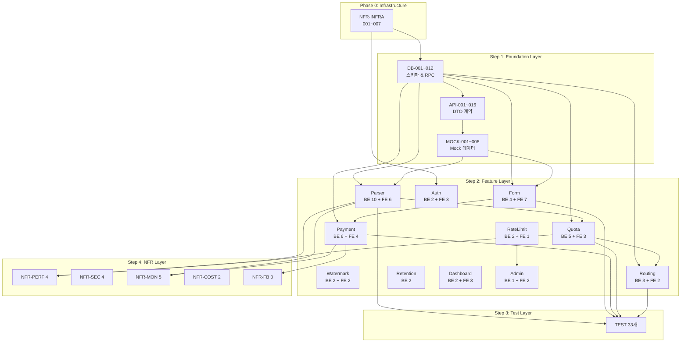
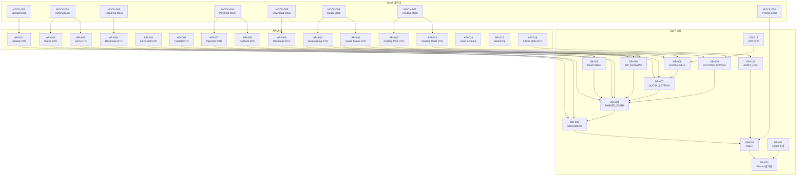
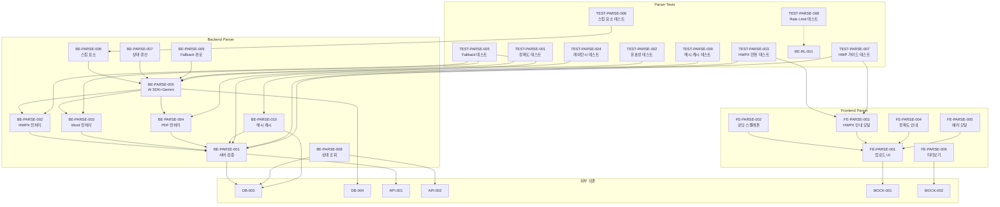
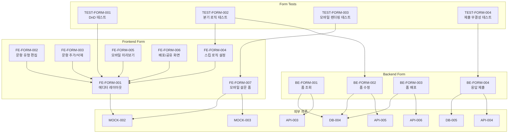
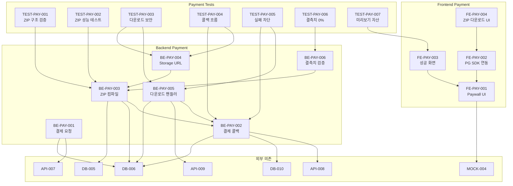
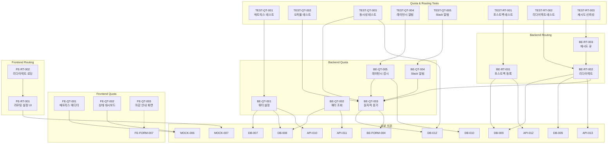
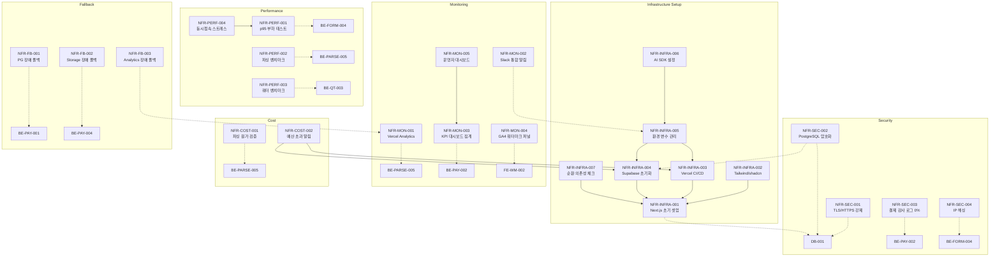
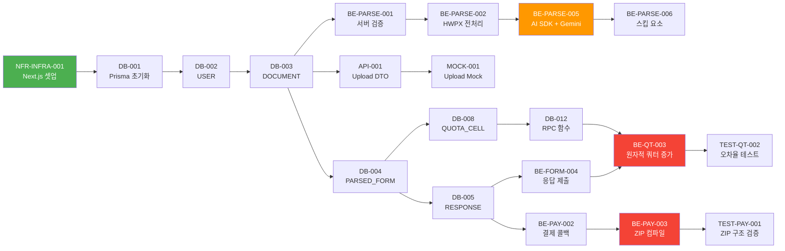

# 🔗 태스크 의존성 상세 다이어그램 (Dependency Graph)

**문서 ID:** DEP-001  
**원천 문서:** 06_TASK_LIST_v2.md (166개 태스크)  
**작성일:** 2026-04-24  

---

## 1. 전체 파이프라인 개요 (Epic 수준)

---

## 2. Foundation Layer 상세 (DB → API → MOCK)

---

## 3. Document Parser 도메인 상세

---

## 4. Form Management 도메인 상세

---

## 5. DataMap & Paywall 도메인 상세

---

## 6. Quota & Panel Routing 도메인 상세

---

## 7. Watermark · Auth · Dashboard · Admin · Retention 상세

```mermaid
flowchart TD
    subgraph WM["Watermark"]
        BWM001["BE-WM-001\nURL 생성"] -.-> BP005w["BE-PARSE-005"]
        BWM002["BE-WM-002\n클릭 로깅"] -.-> DB010w["DB-010"]
        FWM001["FE-WM-001\n배너 렌더링"] -.-> FF007w["FE-FORM-007"]
        FWM002["FE-WM-002\n리다이렉션"] --> FWM001
        TWM001["TEST-WM-001\n렌더링 테스트"] --> FWM001
        TWM002["TEST-WM-002\n바이럴 테스트"] --> FWM002
    end

    subgraph AUTH["Authentication"]
        FAUTH001["FE-AUTH-001\n로그인 UI"] -.-> INFRA004a["NFR-INFRA-004"]
        FAUTH002["FE-AUTH-002\n프로필 설정"] --> FAUTH001
        FAUTH003["FE-AUTH-003\nAuth Guard"] --> FAUTH001
        BAUTH001["BE-AUTH-001\nSupabase Auth"] -.-> INFRA004a
        BAUTH002["BE-AUTH-002\n세션 핸들러"] --> BAUTH001
    end

    subgraph DASH["Dashboard"]
        FDASH001["FE-DASH-001\n설문 목록 UI"] -.-> MOCK002d["MOCK-002"]
        FDASH002["FE-DASH-002\n통계 차트"] --> FDASH001
        FDASH003["FE-DASH-003\n데이터 테이블"] --> FDASH001
        BDASH001["BE-DASH-001\n통계 집계"] -.-> DB005d["DB-005"]
        BDASH002["BE-DASH-002\n대시보드 조회"] -.-> DB004d["DB-004"]
    end

    subgraph ADMIN["Admin"]
        FADM001["FE-ADMIN-001\n관리자 레이아웃"] -.-> BRL002a["BE-RL-002"]
        FADM002["FE-ADMIN-002\n통계 화면"] --> FADM001
        BADM001["BE-ADMIN-001\n통계 집계 로직"] -.-> DB010a["DB-010"]
        TADM001["TEST-ADMIN-001\n접근 제어"] --> BRL002a & FADM001
    end

    subgraph RL["Rate Limit & Auth"]
        BRL001["BE-RL-001\nRate Limit"] -.-> DB002r["DB-002"]
        BRL002["BE-RL-002\nRBAC"] -.-> DB002r
        FRL001["FE-RL-001\n한도 초과 안내"] -.-> FP001r["FE-PARSE-001"]
    end

    subgraph RET["Data Retention"]
        BRET001["BE-RET-001\n삭제 스케줄러"] -.-> DB003r["DB-003"] & DB010r["DB-010"]
        BRET002["BE-RET-002\nCron 설정"] --> BRET001
        TRET001["TEST-RET-001\n자동 삭제 테스트"] --> BRET001
        TRET002["TEST-RET-002\n암호화 테스트"] --> BRET001
    end
```

---

## 8. NFR & Infrastructure 도메인 상세

---

## 9. Critical Path (핵심 경로)

> 프로젝트의 **최장 의존 체인**을 나타냅니다. 이 경로상의 태스크가 지연되면 전체 일정에 직접 영향을 줍니다.

---

## 범례

| 선 유형 | 의미 |
|---|---|
| `A --> B` | B는 A에 의존 (A가 완료되어야 B 시작 가능) |
| `A -.-> B` | B는 A에 약한 의존 (A의 일부만 필요하거나 Mock으로 대체 가능) |

| 색상 (Critical Path) | 의미 |
|---|---|
| 🟢 초록 | 시작점 (의존성 없음) |
| 🟠 주황 | 핵심 기술 의존 (AI SDK) |
| 🔴 빨강 | 최고 리스크 노드 (동시성/결제) |

---

*End of Document — DEP-001*
