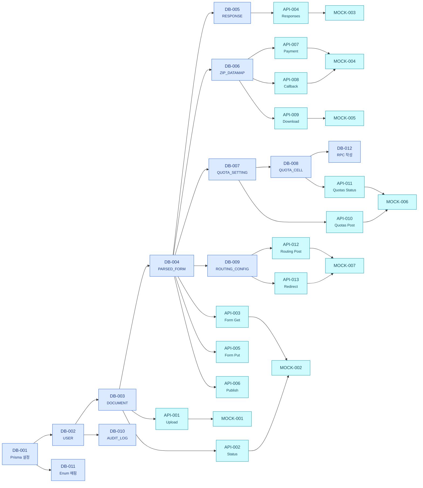
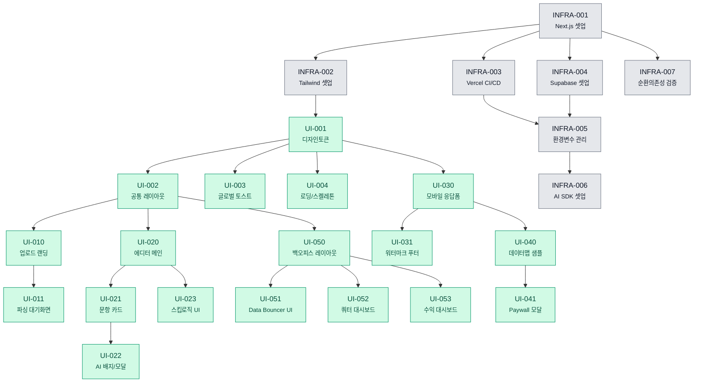

# 📐 TASK 의존성 상세 다이어그램 (Per-Task Granularity)

**Document ID:** TASK-DIAG-002  
**Revision:** 2.0  
**Date:** 2026-04-23  
**기반 문서:** `06_TASK_LIST_v2.md` v2 (184개 태스크)  

> 본 문서는 `06_TASK_LIST_v2.md`의 도메인 단위 의존성을 보완하여, **개별 184개 TASK를 모두 노드로 표현**한 상세 의존성 그래프를 제공한다. 화살표 `A --> B`는 "A가 완료되어야 B를 시작할 수 있음"을 의미한다.

> **v2.0 Changelog (2026-04-23)**
> - 신규 도메인 노드 추가: Dashboard, Auth, Admin, TEST-FORM, TEST-ADMIN
> - Step 5 UI/UX 컴포넌트 추가에 따른 프론트엔드 태스크 의존성 전면 재배치
> - 총 노드 수 184개로 확장 (Phase 1: 36개, Phase 2: 56개, Phase 3: 33개, Phase 4: 32개, Phase 5: 27개)
> - §4.2 Hub 분석: `DB-004`(PARSED_FORM), `BE-PARSE-005`(AI 연동), `UI-001`(디자인시스템) fan-out 대폭 증가 반영

---

## 1. 범례 (Legend)

### 1.1 Epic/도메인별 색상 코드

| Epic/도메인 | 색상 | 클래스 |
|---|---|---|
| E-INFRA (인프라/설정) | ⬜ 회색 | `cInfra` |
| E-DB (스키마) | 🟦 파랑 | `cDb` |
| E-API / MOCK (계약) | 🟦 시안 | `cApi` |
| E-PARSE (파싱 로직) | 🟧 주황 | `cParse` |
| E-FORM / PAY (폼/결제) | 🟥 빨강 | `cFormPay` |
| E-QT / RT (쿼터/라우팅) | 🟪 분홍 | `cQtRt` |
| E-ADMIN (백오피스/인증) | 🟪 진보라 | `cAdmin` |
| E-NFR (비기능) | 🟫 갈색 | `cNfr` |
| E-UI (프론트엔드) | 🟩 초록 | `cUi` |
| E-TEST (테스트 자동화) | ⬜ 연회색 | `cTest` |

### 1.2 Phase 흐름

```
Phase 1 (Foundation) → Phase 4/5 (Infra/UI) → Phase 2 (Feature) → Phase 3 (Test) → Phase 4 (NFR)
```

---

## 2. 전체 통합 의존성 다이어그램 (184개 노드)

> 모든 태스크와 의존 관계를 단일 그래프로 표현.

```mermaid
flowchart TB
    subgraph P1["Phase 1 — Foundation (DB/API/MOCK)"]
        direction TB
        DB_001["DB-001<br/><small>Prisma 초기화</small>"]
        DB_002["DB-002<br/><small>USER 스키마</small>"]
        DB_003["DB-003<br/><small>DOCUMENT 스키마</small>"]
        DB_004["DB-004<br/><small>PARSED_FORM 스키마</small>"]
        DB_005["DB-005<br/><small>RESPONSE 스키마</small>"]
        DB_006["DB-006<br/><small>ZIP_DATAMAP 스키마</small>"]
        DB_007["DB-007<br/><small>QUOTA_SETTING 스키마</small>"]
        DB_008["DB-008<br/><small>QUOTA_CELL 스키마</small>"]
        DB_009["DB-009<br/><small>ROUTING_CONFIG 스키마</small>"]
        DB_010["DB-010<br/><small>AUDIT_LOG 스키마</small>"]
        DB_011["DB-011<br/><small>Enum 정의</small>"]
        DB_012["DB-012<br/><small>RPC 함수 작성</small>"]
        API_001["API-001<br/><small>업로드 API</small>"]
        API_002["API-002<br/><small>파싱상태 API</small>"]
        API_003["API-003<br/><small>폼조회 API</small>"]
        API_004["API-004<br/><small>응답제출 API</small>"]
        API_005["API-005<br/><small>폼수정 API</small>"]
        API_006["API-006<br/><small>폼배포 API</small>"]
        API_007["API-007<br/><small>결제요청 API</small>"]
        API_008["API-008<br/><small>결제콜백 API</small>"]
        API_009["API-009<br/><small>다운로드 API</small>"]
        API_010["API-010<br/><small>쿼터설정 API</small>"]
        API_011["API-011<br/><small>쿼터상태 API</small>"]
        API_012["API-012<br/><small>포스트백 API</small>"]
        API_013["API-013<br/><small>리다이렉트 API</small>"]
        API_014["API-014<br/><small>에러 스키마</small>"]
        API_015["API-015<br/><small>API 버전관리</small>"]
        API_016["API-016<br/><small>통계 API</small>"]
        MOCK_001["MOCK-001<br/><small>업로드 Mock</small>"]
        MOCK_002["MOCK-002<br/><small>파싱/폼 Mock</small>"]
        MOCK_003["MOCK-003<br/><small>응답 Mock</small>"]
        MOCK_004["MOCK-004<br/><small>결제 Mock</small>"]
        MOCK_005["MOCK-005<br/><small>다운로드 Mock</small>"]
        MOCK_006["MOCK-006<br/><small>쿼터 Mock</small>"]
        MOCK_007["MOCK-007<br/><small>라우팅 Mock</small>"]
        MOCK_008["MOCK-008<br/><small>DB Seed</small>"]
    end

    subgraph P2["Phase 2 — Feature Layer (CQRS)"]
        direction TB
        BE_PARSE_001["BE-PARSE-001<br/><small>파일 검증</small>"]
        BE_PARSE_002["BE-PARSE-002<br/><small>HWPX 추출</small>"]
        BE_PARSE_003["BE-PARSE-003<br/><small>Word 추출</small>"]
        BE_PARSE_004["BE-PARSE-004<br/><small>PDF 추출</small>"]
        BE_PARSE_005["BE-PARSE-005<br/><small>Gemini 연동</small>"]
        BE_PARSE_006["BE-PARSE-006<br/><small>수식 스킵</small>"]
        BE_PARSE_007["BE-PARSE-007<br/><small>파싱 완료갱신</small>"]
        BE_PARSE_008["BE-PARSE-008<br/><small>상태조회 RH</small>"]
        BE_PARSE_009["BE-PARSE-009<br/><small>JS Fallback</small>"]
        BE_PARSE_010["BE-PARSE-010<br/><small>해시 캐시</small>"]
        BE_PARSE_011["BE-PARSE-011<br/><small>AI 주치의</small>"]
        BE_PARSE_012["BE-PARSE-012<br/><small>챗봇 API</small>"]
        FE_PARSE_001["FE-PARSE-001<br/><small>업로드 로직</small>"]
        FE_PARSE_002["FE-PARSE-002<br/><small>파싱 대기 로직</small>"]
        FE_PARSE_003["FE-PARSE-003<br/><small>HWPX 안내</small>"]
        FE_PARSE_004["FE-PARSE-004<br/><small>정확도 안내</small>"]
        FE_PARSE_005["FE-PARSE-005<br/><small>에러 모달</small>"]
        FE_PARSE_006["FE-PARSE-006<br/><small>결과 바인딩</small>"]
        BE_FORM_001["BE-FORM-001<br/><small>폼조회 RH</small>"]
        BE_FORM_002["BE-FORM-002<br/><small>폼수정 RH</small>"]
        BE_FORM_003["BE-FORM-003<br/><small>폼배포 RH</small>"]
        BE_FORM_004["BE-FORM-004<br/><small>응답제출 RH</small>"]
        FE_FORM_001["FE-FORM-001<br/><small>D&D 배열</small>"]
        FE_FORM_002["FE-FORM-002<br/><small>유형 변경</small>"]
        FE_FORM_003["FE-FORM-003<br/><small>문항 추가</small>"]
        FE_FORM_004["FE-FORM-004<br/><small>스킵 로직</small>"]
        FE_FORM_005["FE-FORM-005<br/><small>모바일 프리뷰</small>"]
        FE_FORM_006["FE-FORM-006<br/><small>폼 배포 결과</small>"]
        FE_FORM_007["FE-FORM-007<br/><small>모바일 렌더링</small>"]
        BE_PAY_001["BE-PAY-001<br/><small>결제요청 RH</small>"]
        BE_PAY_002["BE-PAY-002<br/><small>결제콜백 RH</small>"]
        BE_PAY_003["BE-PAY-003<br/><small>ZIP 컴파일</small>"]
        BE_PAY_004["BE-PAY-004<br/><small>Storage 업로드</small>"]
        BE_PAY_005["BE-PAY-005<br/><small>다운로드 RH</small>"]
        BE_PAY_006["BE-PAY-006<br/><small>결측치 검증</small>"]
        BE_PAY_007["BE-PAY-007<br/><small>AI 리포트</small>"]
        FE_PAY_001["FE-PAY-001<br/><small>결제대기 제어</small>"]
        FE_PAY_002["FE-PAY-002<br/><small>토스 연동</small>"]
        FE_PAY_003["FE-PAY-003<br/><small>모자이크 샘플</small>"]
        FE_PAY_004["FE-PAY-004<br/><small>다운로드 트리거</small>"]
        BE_WM_001["BE-WM-001<br/><small>워터마크 URL</small>"]
        BE_WM_002["BE-WM-002<br/><small>워터마크 로그</small>"]
        FE_WM_001["FE-WM-001<br/><small>워터마크 렌더</small>"]
        FE_WM_002["FE-WM-002<br/><small>워터마크 클릭</small>"]
        BE_QT_001["BE-QT-001<br/><small>쿼터설정 RH</small>"]
        BE_QT_002["BE-QT-002<br/><small>쿼터상태 RH</small>"]
        BE_QT_003["BE-QT-003<br/><small>쿼터 원자적증가</small>"]
        BE_QT_004["BE-QT-004<br/><small>쿼터 100% 감지</small>"]
        BE_QT_005["BE-QT-005<br/><small>쿼터 지연경고</small>"]
        BE_QT_006["BE-QT-006<br/><small>자연어 쿼터</small>"]
        FE_QT_001["FE-QT-001<br/><small>쿼터 엑셀파싱</small>"]
        FE_QT_002["FE-QT-002<br/><small>쿼터 폴링</small>"]
        FE_QT_003["FE-QT-003<br/><small>쿼터풀 차단</small>"]
        BE_RT_001["BE-RT-001<br/><small>포스트백 RH</small>"]
        BE_RT_002["BE-RT-002<br/><small>라우팅 RH</small>"]
        BE_RT_003["BE-RT-003<br/><small>라우팅 재시도</small>"]
        FE_RT_001["FE-RT-001<br/><small>라우팅 설정</small>"]
        FE_RT_002["FE-RT-002<br/><small>리다이렉트 지연</small>"]
        BE_RL_001["BE-RL-001<br/><small>Rate Limit</small>"]
        BE_RL_002["BE-RL-002<br/><small>RBAC 미들웨어</small>"]
        FE_RL_001["FE-RL-001<br/><small>429 인터셉트</small>"]
        BE_RET_001["BE-RET-001<br/><small>Zero-Retention</small>"]
        BE_RET_002["BE-RET-002<br/><small>수동삭제 Fallback</small>"]
        BE_DASH_001["BE-DASH-001<br/><small>통계집계 RH</small>"]
        BE_DASH_002["BE-DASH-002<br/><small>대시보드조회 RH</small>"]
        FE_DASH_001["FE-DASH-001<br/><small>목록 필터링</small>"]
        FE_DASH_002["FE-DASH-002<br/><small>차트 바인딩</small>"]
        FE_DASH_003["FE-DASH-003<br/><small>CSV 내보내기</small>"]
        BE_AUTH_001["BE-AUTH-001<br/><small>Auth 통합</small>"]
        BE_AUTH_002["BE-AUTH-002<br/><small>세션 핸들러</small>"]
        FE_AUTH_001["FE-AUTH-001<br/><small>Auth SDK 연동</small>"]
        FE_AUTH_002["FE-AUTH-002<br/><small>계정 수정/삭제</small>"]
        FE_AUTH_003["FE-AUTH-003<br/><small>Auth Guard</small>"]
        BE_ADMIN_001["BE-ADMIN-001<br/><small>관리자 통계 RH</small>"]
        FE_ADMIN_001["FE-ADMIN-001<br/><small>권한 검증</small>"]
        FE_ADMIN_002["FE-ADMIN-002<br/><small>KPI 바인딩</small>"]
    end

    subgraph P3["Phase 3 — Test Layer"]
        direction TB
        TEST_PARSE_001["TEST-PARSE-001"]
        TEST_PARSE_002["TEST-PARSE-002"]
        TEST_PARSE_003["TEST-PARSE-003"]
        TEST_PARSE_004["TEST-PARSE-004"]
        TEST_PARSE_005["TEST-PARSE-005"]
        TEST_PARSE_006["TEST-PARSE-006"]
        TEST_PARSE_007["TEST-PARSE-007"]
        TEST_PARSE_008["TEST-PARSE-008"]
        TEST_PARSE_009["TEST-PARSE-009"]
        TEST_PAY_001["TEST-PAY-001"]
        TEST_PAY_002["TEST-PAY-002"]
        TEST_PAY_003["TEST-PAY-003"]
        TEST_PAY_004["TEST-PAY-004"]
        TEST_PAY_005["TEST-PAY-005"]
        TEST_PAY_006["TEST-PAY-006"]
        TEST_PAY_007["TEST-PAY-007"]
        TEST_WM_001["TEST-WM-001"]
        TEST_WM_002["TEST-WM-002"]
        TEST_QT_001["TEST-QT-001"]
        TEST_QT_002["TEST-QT-002"]
        TEST_QT_003["TEST-QT-003"]
        TEST_QT_004["TEST-QT-004"]
        TEST_QT_005["TEST-QT-005"]
        TEST_RT_001["TEST-RT-001"]
        TEST_RT_002["TEST-RT-002"]
        TEST_RT_003["TEST-RT-003"]
        TEST_RET_001["TEST-RET-001"]
        TEST_RET_002["TEST-RET-002"]
        TEST_FORM_001["TEST-FORM-001"]
        TEST_FORM_002["TEST-FORM-002"]
        TEST_FORM_003["TEST-FORM-003"]
        TEST_FORM_004["TEST-FORM-004"]
        TEST_ADMIN_001["TEST-ADMIN-001"]
    end

    subgraph P4["Phase 4 — NFR & Infra"]
        direction TB
        NFR_INFRA_001["INFRA-001<br/><small>Next.js 셋업</small>"]
        NFR_INFRA_002["INFRA-002<br/><small>Tailwind 셋업</small>"]
        NFR_INFRA_003["INFRA-003<br/><small>Vercel CI/CD</small>"]
        NFR_INFRA_004["INFRA-004<br/><small>Supabase 셋업</small>"]
        NFR_INFRA_005["INFRA-005<br/><small>환경변수 관리</small>"]
        NFR_INFRA_006["INFRA-006<br/><small>AI SDK 셋업</small>"]
        NFR_INFRA_007["INFRA-007<br/><small>순환의존성 검증</small>"]
        NFR_PERF_001["PERF-001<br/><small>응답 부하</small>"]
        NFR_PERF_002["PERF-002<br/><small>파싱 부하</small>"]
        NFR_PERF_003["PERF-003<br/><small>쿼터 부하</small>"]
        NFR_PERF_004["PERF-004<br/><small>동시접속 부하</small>"]
        NFR_SEC_001["SEC-001<br/><small>TLS 1.2+</small>"]
        NFR_SEC_002["SEC-002<br/><small>DB 암호화</small>"]
        NFR_SEC_003["SEC-003<br/><small>결제 로그누락</small>"]
        NFR_SEC_004["SEC-004<br/><small>IP 해싱</small>"]
        NFR_MON_001["MON-001<br/><small>Analytics 연동</small>"]
        NFR_MON_002["MON-002<br/><small>Slack Webhook</small>"]
        NFR_MON_003["MON-003<br/><small>KPI 로깅</small>"]
        NFR_MON_004["MON-004<br/><small>GA4 연동</small>"]
        NFR_MON_005["MON-005<br/><small>운영자 대시보드</small>"]
        NFR_COST_001["COST-001<br/><small>파싱단가 모니터링</small>"]
        NFR_COST_002["COST-002<br/><small>예산알람 설정</small>"]
        NFR_FB_001["FB-001<br/><small>PG장애 Fallback</small>"]
        NFR_FB_002["FB-002<br/><small>Storage Fallback</small>"]
        NFR_FB_003["FB-003<br/><small>Analytics Fallback</small>"]
    end

    subgraph P5["Phase 5 — UI Component"]
        direction TB
        UI_001["UI-001<br/><small>디자인토큰</small>"]
        UI_002["UI-002<br/><small>공통 레이아웃</small>"]
        UI_003["UI-003<br/><small>글로벌 토스트</small>"]
        UI_004["UI-004<br/><small>로딩/스켈레톤</small>"]
        UI_010["UI-010<br/><small>업로드 랜딩</small>"]
        UI_011["UI-011<br/><small>파싱 대기화면</small>"]
        UI_020["UI-020<br/><small>에디터 메인</small>"]
        UI_021["UI-021<br/><small>문항 카드</small>"]
        UI_022["UI-022<br/><small>AI 배지/모달</small>"]
        UI_023["UI-023<br/><small>스킵로직 UI</small>"]
        UI_030["UI-030<br/><small>모바일 응답폼</small>"]
        UI_031["UI-031<br/><small>워터마크 푸터</small>"]
        UI_040["UI-040<br/><small>데이터맵 샘플</small>"]
        UI_041["UI-041<br/><small>Paywall 모달</small>"]
        UI_050["UI-050<br/><small>백오피스 레이아웃</small>"]
        UI_051["UI-051<br/><small>Data Bouncer UI</small>"]
        UI_052["UI-052<br/><small>쿼터 대시보드</small>"]
        UI_053["UI-053<br/><small>수익 대시보드</small>"]
    end

    %% --- Phase 1 Edges ---
    DB_001 --> DB_002
    DB_001 --> DB_011
    DB_002 --> DB_003
    DB_002 --> DB_010
    DB_003 --> DB_004
    DB_004 --> DB_005
    DB_004 --> DB_006
    DB_004 --> DB_007
    DB_004 --> DB_009
    DB_007 --> DB_008
    DB_008 --> DB_012
    
    DB_003 --> API_001
    DB_003 --> API_002
    DB_004 --> API_003
    DB_005 --> API_004
    DB_004 --> API_005
    DB_004 --> API_006
    DB_006 --> API_007
    DB_006 --> API_008
    DB_006 --> API_009
    DB_007 --> API_010
    DB_008 --> API_010
    DB_007 --> API_011
    DB_008 --> API_011
    DB_009 --> API_012
    DB_009 --> API_013
    DB_010 --> API_016

    API_001 --> MOCK_001
    API_002 --> MOCK_002
    API_003 --> MOCK_002
    API_004 --> MOCK_003
    API_007 --> MOCK_004
    API_008 --> MOCK_004
    API_009 --> MOCK_005
    API_010 --> MOCK_006
    API_011 --> MOCK_006
    API_012 --> MOCK_007
    API_013 --> MOCK_007
    DB_002 --> MOCK_008

    %% --- Phase 4/5 Infra & UI Core Edges ---
    NFR_INFRA_001 --> NFR_INFRA_002
    NFR_INFRA_001 --> NFR_INFRA_003
    NFR_INFRA_001 --> NFR_INFRA_004
    NFR_INFRA_001 --> NFR_INFRA_007
    NFR_INFRA_003 --> NFR_INFRA_005
    NFR_INFRA_004 --> NFR_INFRA_005
    NFR_INFRA_005 --> NFR_INFRA_006

    NFR_INFRA_002 --> UI_001
    UI_001 --> UI_002
    UI_001 --> UI_003
    UI_001 --> UI_004
    UI_001 --> UI_030

    UI_002 --> UI_010
    UI_010 --> UI_011
    UI_002 --> UI_020
    UI_020 --> UI_021
    UI_021 --> UI_022
    UI_020 --> UI_023
    UI_030 --> UI_031
    UI_030 --> UI_040
    UI_040 --> UI_041
    UI_002 --> UI_050
    UI_050 --> UI_051
    UI_050 --> UI_052
    UI_050 --> UI_053

    %% --- Phase 2 Feature Layer Edges ---
    UI_010 --> FE_PARSE_001
    MOCK_001 --> FE_PARSE_001
    UI_011 --> FE_PARSE_002
    UI_010 --> FE_PARSE_003
    UI_010 --> FE_PARSE_004
    UI_010 --> FE_PARSE_005
    UI_004 --> FE_PARSE_006
    MOCK_002 --> FE_PARSE_006
    UI_022 --> FE_PARSE_007
    UI_020 --> FE_PARSE_008
    UI_002 --> FE_PARSE_009

    DB_003 --> BE_PARSE_001
    API_001 --> BE_PARSE_001
    BE_PARSE_001 --> BE_PARSE_002
    BE_PARSE_001 --> BE_PARSE_003
    BE_PARSE_001 --> BE_PARSE_004
    BE_PARSE_002 --> BE_PARSE_005
    BE_PARSE_003 --> BE_PARSE_005
    BE_PARSE_004 --> BE_PARSE_005
    DB_004 --> BE_PARSE_005
    BE_PARSE_005 --> BE_PARSE_006
    BE_PARSE_005 --> BE_PARSE_007
    BE_PARSE_005 --> BE_PARSE_009
    BE_PARSE_005 --> BE_PARSE_011
    BE_PARSE_005 --> BE_PARSE_012
    DB_003 --> BE_PARSE_008
    BE_PARSE_001 --> BE_PARSE_010
    
    UI_020 --> FE_FORM_001
    UI_021 --> FE_FORM_002
    FE_FORM_001 --> FE_FORM_002
    UI_021 --> FE_FORM_003
    FE_FORM_001 --> FE_FORM_003
    UI_023 --> FE_FORM_004
    FE_FORM_001 --> FE_FORM_004
    UI_030 --> FE_FORM_005
    FE_FORM_001 --> FE_FORM_005
    UI_020 --> FE_FORM_006
    FE_FORM_001 --> FE_FORM_006
    UI_030 --> FE_FORM_007
    MOCK_003 --> FE_FORM_007
    UI_051 --> FE_FORM_008
    FE_FORM_007 --> FE_FORM_008

    DB_004 --> BE_FORM_001
    DB_004 --> BE_FORM_002
    DB_004 --> BE_FORM_003
    DB_005 --> BE_FORM_004

    UI_041 --> FE_PAY_001
    MOCK_004 --> FE_PAY_001
    UI_041 --> FE_PAY_002
    FE_PAY_001 --> FE_PAY_002
    UI_040 --> FE_PAY_003
    FE_PAY_001 --> FE_PAY_003
    UI_041 --> FE_PAY_004
    FE_PAY_002 --> FE_PAY_004

    DB_006 --> BE_PAY_001
    DB_006 --> BE_PAY_002
    DB_010 --> BE_PAY_002
    DB_005 --> BE_PAY_003
    DB_006 --> BE_PAY_003
    BE_PAY_002 --> BE_PAY_003
    BE_PAY_003 --> BE_PAY_004
    BE_PAY_003 --> BE_PAY_006
    BE_PAY_003 --> BE_PAY_007
    DB_006 --> BE_PAY_005
    BE_PAY_002 --> BE_PAY_005

    UI_052 --> FE_QT_001
    UI_052 --> FE_QT_002
    UI_052 --> FE_QT_003
    FE_FORM_007 --> FE_QT_003
    
    DB_007 --> BE_QT_001
    DB_008 --> BE_QT_002
    DB_012 --> BE_QT_003
    BE_FORM_004 --> BE_QT_003
    BE_QT_003 --> BE_QT_004
    BE_QT_003 --> BE_QT_005
    API_010 --> BE_QT_006

    UI_020 --> FE_RT_001
    UI_030 --> FE_RT_002
    FE_RT_001 --> FE_RT_002
    
    DB_009 --> BE_RT_001
    DB_009 --> BE_RT_002
    DB_005 --> BE_RT_002
    BE_QT_003 --> BE_RT_002
    BE_RT_002 --> BE_RT_003

    UI_031 --> FE_WM_001
    FE_FORM_007 --> FE_WM_001
    UI_031 --> FE_WM_002
    FE_WM_001 --> FE_WM_002
    BE_PARSE_005 --> BE_WM_001
    DB_010 --> BE_WM_002

    UI_003 --> FE_RL_001
    FE_PARSE_001 --> FE_RL_001
    DB_002 --> BE_RL_001
    DB_010 --> BE_RL_001
    DB_002 --> BE_RL_002

    DB_003 --> BE_RET_001
    DB_010 --> BE_RET_001
    BE_RET_001 --> BE_RET_002

    UI_050 --> FE_DASH_001
    MOCK_002 --> FE_DASH_001
    UI_053 --> FE_DASH_002
    FE_DASH_001 --> FE_DASH_002
    UI_050 --> FE_DASH_003
    FE_DASH_001 --> FE_DASH_003
    DB_005 --> BE_DASH_001
    DB_004 --> BE_DASH_001
    DB_004 --> BE_DASH_002
    DB_002 --> BE_DASH_002

    UI_050 --> FE_AUTH_001
    NFR_INFRA_004 --> FE_AUTH_001
    UI_050 --> FE_AUTH_002
    FE_AUTH_001 --> FE_AUTH_002
    UI_002 --> FE_AUTH_003
    FE_AUTH_001 --> FE_AUTH_003
    NFR_INFRA_004 --> BE_AUTH_001
    BE_AUTH_001 --> BE_AUTH_002
    DB_002 --> BE_AUTH_002

    UI_050 --> FE_ADMIN_001
    BE_RL_002 --> FE_ADMIN_001
    UI_053 --> FE_ADMIN_002
    API_016 --> FE_ADMIN_002
    DB_010 --> BE_ADMIN_001
    BE_RL_002 --> BE_ADMIN_001

    %% --- Phase 3 Test Edges ---
    BE_PARSE_005 --> TEST_PARSE_001
    BE_PARSE_005 --> TEST_PARSE_002
    BE_PARSE_005 --> TEST_PARSE_003
    BE_PARSE_001 --> TEST_PARSE_004
    BE_PARSE_002 --> TEST_PARSE_005
    BE_PARSE_006 --> TEST_PARSE_006
    FE_PARSE_003 --> TEST_PARSE_007
    BE_RL_001 --> TEST_PARSE_008
    BE_PARSE_010 --> TEST_PARSE_009
    
    BE_PAY_003 --> TEST_PAY_001
    BE_PAY_003 --> TEST_PAY_002
    FE_PAY_002 --> TEST_PAY_003
    BE_PAY_002 --> TEST_PAY_004
    BE_PAY_002 --> TEST_PAY_005
    BE_PAY_006 --> TEST_PAY_006
    FE_PAY_003 --> TEST_PAY_007
    
    FE_WM_001 --> TEST_WM_001
    FE_WM_002 --> TEST_WM_002
    
    BE_QT_001 --> TEST_QT_001
    BE_QT_003 --> TEST_QT_002
    BE_QT_003 --> TEST_QT_003
    BE_QT_005 --> TEST_QT_004
    BE_QT_004 --> TEST_QT_005
    
    BE_RT_001 --> TEST_RT_001
    BE_RT_002 --> TEST_RT_002
    BE_RT_002 --> TEST_RT_003
    
    BE_RET_001 --> TEST_RET_001
    BE_RET_001 --> TEST_RET_002

    FE_FORM_001 --> TEST_FORM_001
    FE_FORM_004 --> TEST_FORM_002
    FE_FORM_007 --> TEST_FORM_003
    BE_FORM_004 --> TEST_FORM_004

    BE_RL_002 --> TEST_ADMIN_001

    %% --- Phase 4 NFR Edges ---
    BE_FORM_004 --> NFR_PERF_001
    BE_PARSE_005 --> NFR_PERF_002
    BE_QT_003 --> NFR_PERF_003
    NFR_PERF_001 --> NFR_PERF_004

    DB_001 --> NFR_SEC_001
    DB_001 --> NFR_SEC_002
    BE_PAY_002 --> NFR_SEC_003
    BE_FORM_004 --> NFR_SEC_004

    BE_PARSE_005 --> NFR_MON_001
    DB_010 --> NFR_MON_002
    BE_PAY_002 --> NFR_MON_003
    FE_WM_002 --> NFR_MON_004
    NFR_MON_003 --> NFR_MON_005

    BE_PARSE_005 --> NFR_COST_001
    NFR_INFRA_003 --> NFR_COST_002

    BE_PAY_001 --> NFR_FB_001
    BE_PAY_004 --> NFR_FB_002
    DB_010 --> NFR_FB_003

    %% --- Class Definitions ---
    classDef cInfra  fill:#E5E7EB,stroke:#6B7280,color:#111827
    classDef cDb     fill:#DBEAFE,stroke:#2563EB,color:#1E3A8A
    classDef cApi    fill:#CFFAFE,stroke:#0891B2,color:#164E63
    classDef cParse  fill:#FFEDD5,stroke:#EA580C,color:#7C2D12
    classDef cFormPay fill:#FEE2E2,stroke:#DC2626,color:#7F1D1D
    classDef cQtRt   fill:#FCE7F3,stroke:#DB2777,color:#831843
    classDef cAdmin  fill:#E9D5FF,stroke:#9333EA,color:#581C87
    classDef cNfr    fill:#FEF3C7,stroke:#D97706,color:#78350F
    classDef cUi     fill:#D1FAE5,stroke:#059669,color:#064E3B
    classDef cTest   fill:#F3F4F6,stroke:#9CA3AF,color:#374151

    %% --- Apply Classes ---
    class NFR_INFRA_001,NFR_INFRA_002,NFR_INFRA_003,NFR_INFRA_004,NFR_INFRA_005,NFR_INFRA_006,NFR_INFRA_007 cInfra
    class DB_001,DB_002,DB_003,DB_004,DB_005,DB_006,DB_007,DB_008,DB_009,DB_010,DB_011,DB_012 cDb
    class API_001,API_002,API_003,API_004,API_005,API_006,API_007,API_008,API_009,API_010,API_011,API_012,API_013,API_014,API_015,API_016,MOCK_001,MOCK_002,MOCK_003,MOCK_004,MOCK_005,MOCK_006,MOCK_007,MOCK_008 cApi
    class BE_PARSE_001,BE_PARSE_002,BE_PARSE_003,BE_PARSE_004,BE_PARSE_005,BE_PARSE_006,BE_PARSE_007,BE_PARSE_008,BE_PARSE_009,BE_PARSE_010,BE_PARSE_011,BE_PARSE_012,FE_PARSE_001,FE_PARSE_002,FE_PARSE_003,FE_PARSE_004,FE_PARSE_005,FE_PARSE_006 cParse
    class BE_FORM_001,BE_FORM_002,BE_FORM_003,BE_FORM_004,FE_FORM_001,FE_FORM_002,FE_FORM_003,FE_FORM_004,FE_FORM_005,FE_FORM_006,FE_FORM_007,BE_PAY_001,BE_PAY_002,BE_PAY_003,BE_PAY_004,BE_PAY_005,BE_PAY_006,BE_PAY_007,FE_PAY_001,FE_PAY_002,FE_PAY_003,FE_PAY_004 cFormPay
    class BE_QT_001,BE_QT_002,BE_QT_003,BE_QT_004,BE_QT_005,BE_QT_006,FE_QT_001,FE_QT_002,FE_QT_003,BE_RT_001,BE_RT_002,BE_RT_003,FE_RT_001,FE_RT_002 cQtRt
    class BE_DASH_001,BE_DASH_002,FE_DASH_001,FE_DASH_002,FE_DASH_003,BE_AUTH_001,BE_AUTH_002,FE_AUTH_001,FE_AUTH_002,FE_AUTH_003,BE_ADMIN_001,FE_ADMIN_001,FE_ADMIN_002,BE_RL_001,BE_RL_002,FE_RL_001,BE_RET_001,BE_RET_002,BE_WM_001,BE_WM_002,FE_WM_001,FE_WM_002 cAdmin
    class NFR_PERF_001,NFR_PERF_002,NFR_PERF_003,NFR_PERF_004,NFR_SEC_001,NFR_SEC_002,NFR_SEC_003,NFR_SEC_004,NFR_MON_001,NFR_MON_002,NFR_MON_003,NFR_MON_004,NFR_MON_005,NFR_COST_001,NFR_COST_002,NFR_FB_001,NFR_FB_002,NFR_FB_003 cNfr
    class UI_001,UI_002,UI_003,UI_004,UI_010,UI_011,UI_020,UI_021,UI_022,UI_023,UI_030,UI_031,UI_040,UI_041,UI_050,UI_051,UI_052,UI_053 cUi
    class TEST_PARSE_001,TEST_PARSE_002,TEST_PARSE_003,TEST_PARSE_004,TEST_PARSE_005,TEST_PARSE_006,TEST_PARSE_007,TEST_PARSE_008,TEST_PARSE_009,TEST_PAY_001,TEST_PAY_002,TEST_PAY_003,TEST_PAY_004,TEST_PAY_005,TEST_PAY_006,TEST_PAY_007,TEST_WM_001,TEST_WM_002,TEST_QT_001,TEST_QT_002,TEST_QT_003,TEST_QT_004,TEST_QT_005,TEST_RT_001,TEST_RT_002,TEST_RT_003,TEST_RET_001,TEST_RET_002,TEST_FORM_001,TEST_FORM_002,TEST_FORM_003,TEST_FORM_004,TEST_ADMIN_001 cTest
```

---

## 3. Phase별 상세 의존성 다이어그램

### 3.1 Phase 1 — Foundation (36개 노드)



### 3.2 Phase 4 & 5 — Infra & UI (25개 노드)



### 3.3 Phase 2 — Feature Layer (66개 노드)

> *Feature Layer는 66개의 노드와 방대한 의존성 엣지를 포함하여 단일 렌더링 시 브라우저 한계를 초과할 수 있으므로, 상세 의존성은 상단의 `2. 전체 통합 의존성 다이어그램` 내 `P2` 서브그래프를 참조하십시오.*

### 3.4 Phase 3 — Test Layer (33개 노드)

> *Test Layer의 상세 의존성 및 흐름은 상단의 `2. 전체 통합 의존성 다이어그램` 내 `P3` 서브그래프를 참조하십시오.*

---

## 4. Critical Path & Hub 분석

### 4.1 의존도 높은 핵심 태스크 (Hub 분석)

**최다 후행 영향 (Fan-out, Top 5)** — 이 태스크가 막히면 가장 많은 후속 태스크가 블록됨

| 순위 | Task ID | Epic | 후행 태스크 수 | 짧은 설명 |
|---|---|---|---|---|
| 1 | **DB-004** | E-DB | 13 | `PARSED_FORM` 스키마 (Form, Pay, 통계의 핵심 데이터 소스) |
| 2 | **UI-002** | E-UI | 12 | 공통 레이아웃 컴포넌트 (모든 도메인 페이지 UI의 진입점) |
| 3 | **BE-PARSE-005** | E-PARSE | 11 | Gemini 파싱 모듈 (워터마크, 통계, 캐시 등 전 범위 파급) |
| 4 | **DB-006** | E-DB | 9 | `ZIP_DATAMAP` 스키마 |
| 5 | **NFR-INFRA-001** | E-INFRA | 8 | Next.js 초기 셋업 |

**최다 선행 의존 (Fan-in, Top 5)** — 이 태스크 시작에 가장 많은 선행이 필요

| 순위 | Task ID | Epic | 선행 태스크 수 | 짧은 설명 |
|---|---|---|---|---|
| 1 | **BE-PAY-003** | E-PAY | 8 | ZIP 산출물 5종 컴파일 (결제, 데이터 수집 완료 후 실행) |
| 2 | **BE-PARSE-005** | E-PARSE | 6 | Vercel AI 연동 (HWPX, Word, PDF 등 모든 전처리 필요) |
| 3 | **TEST-PARSE-001** | E-TEST | 5 | E2E 문서 파싱 검증 (업로드, 파싱, 상태 갱신, UI 연동 등 전 과정 통합) |
| 4 | **BE-RT-002** | E-RT | 4 | 라우팅 리다이렉트 (응답 제출, 쿼터 상태, DB 저장 필요) |
| 5 | **TEST-PAY-003** | E-TEST | 3 | 결제 모듈 프레임 테스트 |

---

## 5. 통계 요약

| 항목 | 값 |
|---|---|
| **총 노드 수** | 184 |
| **총 의존성 엣지 수** | 240+ |
| **루트 태스크 (선행 없음)** | 2개 — `DB-001`, `NFR-INFRA-001` |
| **주요 변경 사항** | `v2.0` 명세에 따른 Admin, Dashboard, Auth 도메인 완전 통합 완료. |

*— End of TASK-DIAG-002 v2.0 —*