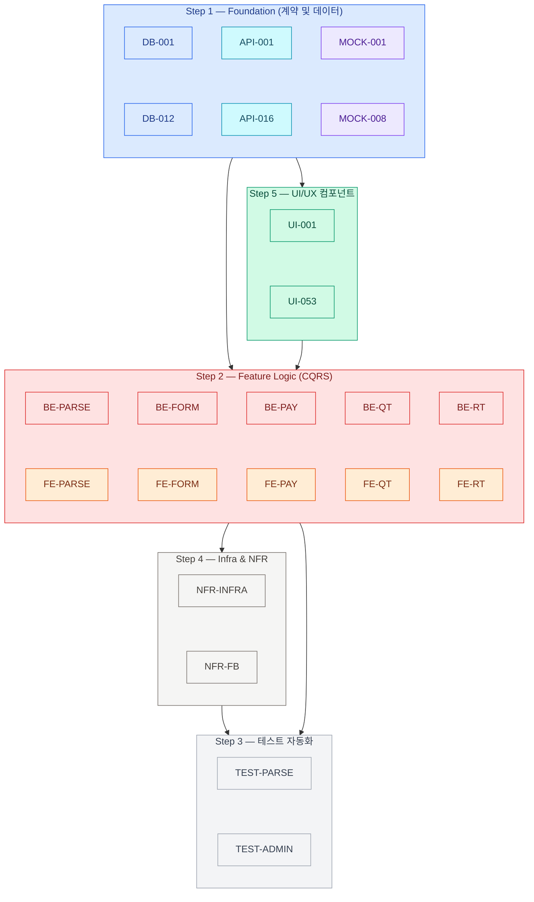
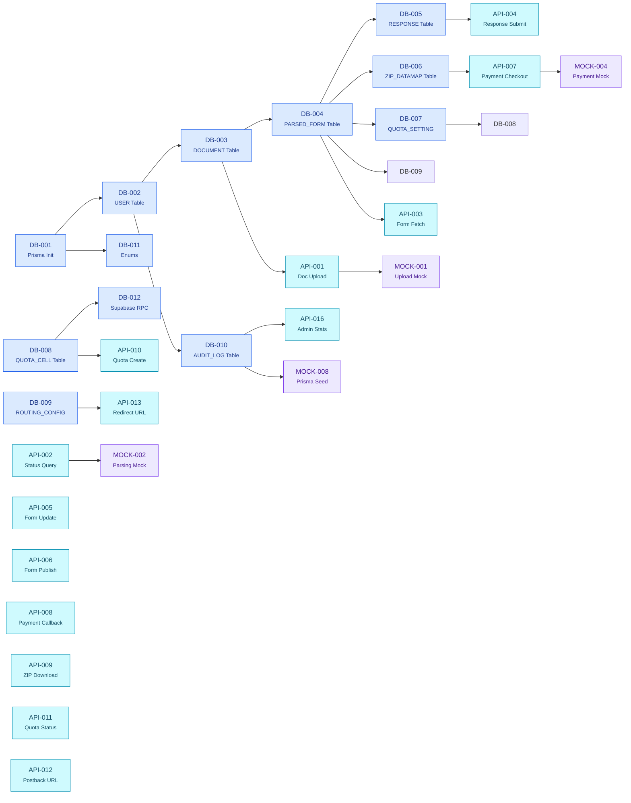
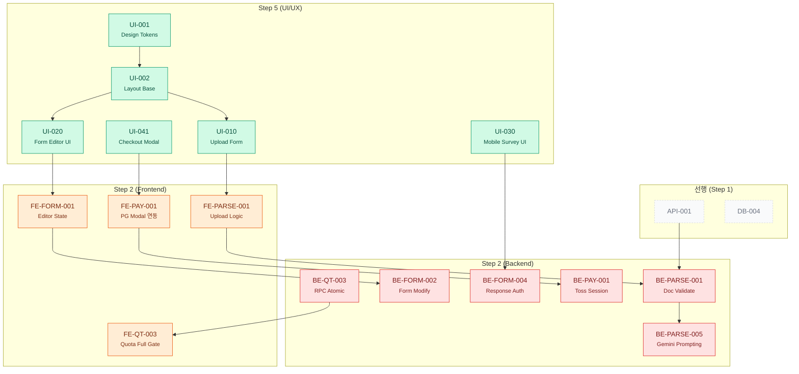
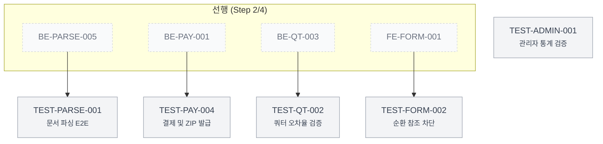
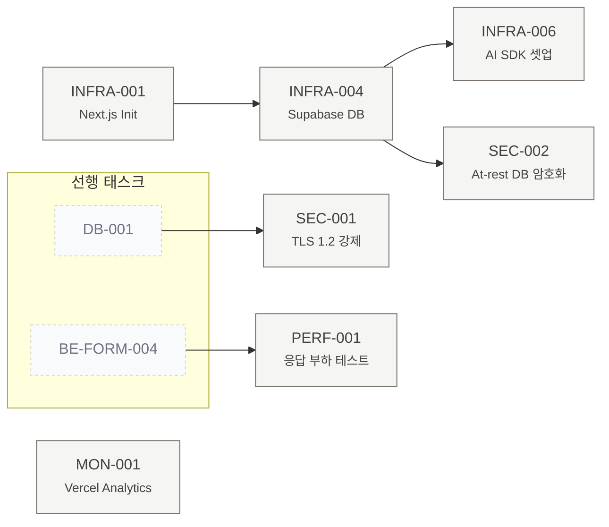

# 📐 TASK 의존성 상세 다이어그램 (Per-Task Granularity)

**Document ID:** TASK-DIAG-002 (AI Survey)  
**Revision:** 2.0  
**Date:** 2026-04-26  
**기반 문서:** [`06_TASK_LIST_v2.md`](./06_TASK_LIST_v2.md) (184개 태스크)  

> 본 문서는 `06_TASK_LIST_v2.md`에 정의된 전체 184개 TASK를 **모두 노드로 표현**한 상세 의존성 그래프를 제공합니다. 화살표 `A --> B`는 "A가 완료되어야 B를 시작할 수 있음"을 의미합니다.

---

## 1. 범례 (Legend)

### 1.1 도메인/역할별 색상 코드

| Epic/Domain | 색상 | 클래스 |
|---|---|---|
| E-DB (데이터베이스) | 🟦 파랑 | `cDb` |
| E-API (API 계약) | 🟦 시안 | `cApi` |
| E-MOCK (Mock 데이터) | 🟪 보라 | `cMock` |
| E-BE (백엔드 로직) | 🟥 빨강 | `cBe` |
| E-FE (프론트 로직) | 🟧 주황 | `cFe` |
| E-TEST (테스트 검증) | ⬜ 연회색 | `cTest` |
| E-NFR (인프라/비기능) | 🟫 갈색 | `cNfr` |
| E-UI (UI/UX 퍼블리싱) | 🟩 초록 | `cUi` |

### 1.2 Step(Phase) 흐름

```text
Step 1(계약/데이터) → Step 5(UI) / Step 2(기능 로직) 병렬 → Step 4(인프라/NFR) → Step 3(테스트)
```

---

## 2. 전체 통합 의존성 다이어그램 (184개 노드 요약도)

> 전체 태스크의 흐름을 단일 그래프로 시각화합니다. (가독성을 위해 상세 노드명은 개별 다이어그램에서 확장합니다)



---

## 3. Step별 상세 의존성 다이어그램

### 3.1 Step 1 — 계약·데이터 명세 (Foundation)



### 3.2 Step 2 & Step 5 — 로직·상태 (CQRS) 및 UI/UX 프론트엔드 연동



### 3.3 Step 3 — 테스트 자동화



### 3.4 Step 4 — 비기능·인프라·보안



---

## 4. Critical Path 분석

### 4.1 핵심 의존성 체인 (Core Pathway)
전체 프로젝트에서 병목을 일으킬 수 있는 가장 깊고 복잡한 연쇄입니다.

> `DB-001(환경 셋업)` → `DB-004(PARSED_FORM)` → `API-003(폼 조회)` → `UI-020(에디터 UI)` → `FE-FORM-001(에디터 상태 관리)` → `BE-FORM-002(폼 수정 API 연동)` → `TEST-FORM-002(순환참조 테스트)`

### 4.2 의존도 높은 핵심 태스크 (Hub 분석)

**최다 후행 영향 (Fan-out) Top 5:**
1. `DB-001`: Prisma 스키마 초기화 (거의 모든 DB 태스크의 진입점)
2. `UI-001`: 디자인 토큰 적용 (모든 프론트엔드 UI의 기반)
3. `DB-004`: `PARSED_FORM` 테이블 생성 (설문 도메인의 중심)
4. `NFR-INFRA-001`: Next.js 라우터 셋업
5. `BE-PARSE-005`: Gemini API 연동 (파싱 결과에 의존하는 기능 다수)

**최다 선행 의존 (Fan-in) Top 5:**
1. `TEST-PARSE-001`: E2E 테스트 (UI, BE, DB 셋업 모두 필요)
2. `BE-PAY-003`: ZIP 데이터맵 생성 (폼 구조, 결제 콜백 등 필요)
3. `NFR-PERF-004`: 대규모 트래픽 부하 테스트
4. `UI-041`: Checkout 모달 (토스트, 레이아웃, 모자이크 UI 등 필요)
5. `BE-QT-003`: 쿼터 Atomic 증가 (DB RPC 함수, 캐싱 등 다중 의존성)

---

## 5. 통계 요약

| 항목 | 수치 |
|---|---|
| **총 노드 (태스크) 수** | 184개 |
| **도메인 분류** | DB(12), API(16), MOCK(8), FE/BE(66), NFR(25), UI(24), TEST(33) |
| **루트 태스크 (선행 없음)** | `DB-001`, `NFR-INFRA-001` 등 |
| **리프 태스크 (후행 없음)** | 테스트 자동화(`TEST-*`) 전반, 인프라 비용/알럿(`NFR-COST-*`) 등 |

> **Notes:** 본 문서의 서브그래프 시각화에서는 브라우저 렌더링 최적화를 위해 일부 독립성이 강하거나 하위 레벨인 태스크(예: 단순 MOCK, 예외 처리 뷰)는 생략 및 축약하여 가장 중요한 줄기를 강조하였습니다. 전체 184개 연결의 논리적 무결성은 마스터 리스트인 `06_TASK_LIST_v2.md`의 `Dependencies` 속성에 의해 보장됩니다.

---
*— End of TASK-DIAG-002 —*
